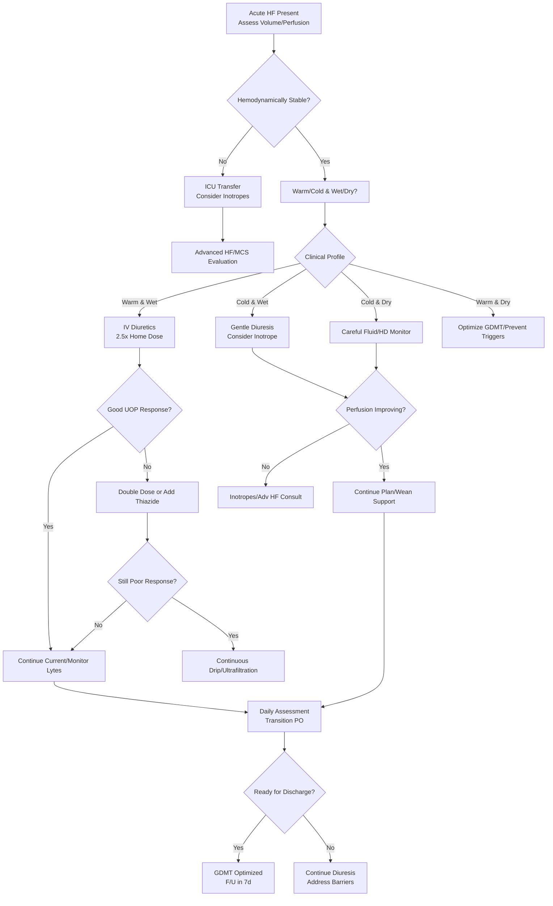

# Acute Decompensated Left Heart Failure – Clinical Call Protocol

**Guidelines Referenced:**  
AHA/ACC/HFSA 2022 Guideline for the Management of Heart Failure, 2021 ESC Guidelines for the Diagnosis and Treatment of Acute and Chronic Heart Failure

## CARD INTERFACE LAYOUT

### Card 0 – Dynamic Action Card (Node Dependent)

```
ACUTE HEART FAILURE EXACERBATION
───────────────────────────────────────

┌─────────────────────────────────────────┐
│        IMMEDIATE ORDERS                 │
│                                         │
│ ☑ Sit patient upright                   │
│ ☑ O2 titrate to SpO2 >92%             │
│ ☑ IV access if not present            │
│ ☑ STAT: BNP, BMP, troponin            │
│ ☑ CXR portable                         │
│ ☑ Strict I&O, daily weights           │
│ ☐ Foley if severe                     │
│                                         │
│ BNP: 1,850 pg/mL (↑↑)                 │
│ Cr: 1.8 mg/dL (baseline 1.2)          │
└─────────────────────────────────────────┘

VOLUME STATUS:
• JVD to angle of jaw
• Bilateral rales to mid-lung
• 2+ pitting edema to knees

🚨 Consider BiPAP if worsening
```

**Example - Diuretic Management Node:**

```
DIURETIC OPTIMIZATION
───────────────────────────────────────

HOME REGIMEN:
• Furosemide 40mg PO BID

CURRENT STATUS:
• Last dose: >24 hours ago
• Creatinine: 1.8 (↑ from 1.2)
• K: 3.8 mEq/L
• HCO3: 28 mEq/L

┌─────────────────────────────────────────┐
│      IV DIURETIC CALCULATOR             │
│                                         │
│ Acute IV Dose = 2.5 x Home PO           │
│ Home: 80mg/day PO                       │
│ Initial IV: 80mg IV x 1                 │
│                                         │
│ ☑ Furosemide 80mg IV NOW               │
│ ☐ Add metolazone 5mg if resistant     │
│ ☐ Consider drip if poor response      │
│                                         │
│ Goal UOP: >100 mL/hr x 2 hrs           │
│ Net negative: 1-2L/day                 │
└─────────────────────────────────────────┘

DIURETIC RESISTANCE FLAGS:
□ Poor response to initial dose
□ Cr rising >0.3 mg/dL
□ Significant RV failure
□ Severe hyponatremia

MONITORING PLAN:
• Strict I&O q2h x 6h
• BMP in AM
• Daily weights (same scale)
• Orthostatics if hypotensive

⚠️ Hold ACE-I if Cr ↑ >30% or K >5.5
```

### Card 1 – Static Assessment/Clinical Profiles

```
HEART FAILURE CLASSIFICATION

TYPES & PHENOTYPES:

HFrEF (EF <40%): Systolic dysfunction, better evidence for therapies  
HFmrEF (EF 40-49%): Mixed, treat like HFrEF  
HFpEF (EF ≥50%): Diastolic dysfunction, limited therapies

PRECIPITANTS:
• ACS/ischemia
• Arrhythmia (AF w/ RVR)
• Medication nonadherence (#1)
• Diet indiscretion, infection, anemia, thyroid disturbance

CLINICAL PROFILES:
• Warm & Wet: Most common, good perfusion, congestion (diuresis)
• Cold & Wet: Poor perfusion, congestion (inotropes + diuresis)
• Cold & Dry: Poor perfusion, no congestion (fluid challenge)
• Warm & Dry: Stable/compensated

HISTORY:
• Symptom onset/duration, orthopnea, PND
• Weight gain/trends, medication compliance, infection screen
```

### Card 2 – Physical Exam, Meds, Orders

```
PHYSICAL EXAM

VOLUME ASSESSMENT:
• JVD: >10cm = congested
• Hepatojugular reflux: >4cm = RV failure
• Edema: Degree, distribution, progression

PERFUSION:
• Cool extremities, narrow pulse pressure, altered mentation, decreased urine output

KEY MEDICATIONS:

💊 DIURETICS:
• Furosemide: IV 2.5x PO home dose, repeat in 2hr if <100mL/hr UOP
• Switch to bumetanide/torsemide if poor GI absorption
• Add metolazone (2.5-5mg PO) if loop resistant
• Continuous infusion: start at 5-10mg/hr
• Monitor electrolytes, renal, UOP

💊 VASODILATORS:
• Nitroglycerin (if SBP >110): Start 10-20 mcg/min
• Nitroprusside for severe HTN/crisis with ICU monitoring

💊 GDMT OPTIMIZATION:
• Continue/adjust beta-blockers (hold/reduce if shock, bradycardic)
• Hold ACE-I/ARB/ARNI if deterioration or K >5.5
• Start/continue SGLT2i if not contraindicated

⚠️ AVOID: NSAIDs, thiazolidinediones, non-essential fluids
```

## Algorithm Flow



## Interactive Elements

### Diuretic Response Tracker

```
┌─────────────────────────────────────────┐
│      DIURETIC RESPONSE TRACKER          │
├─────────────────────────────────────────┤
│ Furosemide 80mg IV @ 10:00              │
│                                         │
│ UOP:                                    │
│ 10-11am: 250 mL ✓                       │
│ 11-12pm: 200 mL ✓                       │
│ 12-1pm: 150 mL                          │
│ 1-2pm: 75 mL ⚠️                         │
│                                         │
│ Total Output: 675 mL                    │
│ Net Balance: -425 mL                    │
│ RESPONSE: Suboptimal                    │
│                                         │
│ Recommendations: Double dose to 160mg IV│
│ Add metolazone 5mg PO                   │
│ Check BMP for renal function            │
│ Consider continuous infusion next        │
└─────────────────────────────────────────┘
```

### GDMT Optimization Checklist

```
┌─────────────────────────────────────────┐
│ GUIDELINE-DIRECTED MEDICAL THERAPY      │
├─────────────────────────────────────────┤
│ HFrEF (EF 35%) – Current Rx:            │
│ ☑ Beta-blocker  (Carvedilol 6.25mg BID) │
│ ☑ ACE-I/ARB/ARNI (Lisinopril 10mg QD)   │
│ ☐ MRA pending (K/Cr permitting)         │
│ ☐ SGLT2i (Empagliflozin 10mg QD)        │
│ [CALCULATE DOSES] [PRINT PLAN]          │
└─────────────────────────────────────────┘
```

### Volume Status Monitor

```
┌─────────────────────────────────────────┐
│        VOLUME STATUS TRENDS             │
├─────────────────────────────────────────┤
│ Admission: 198 lbs  |  Day 1: 196 lbs  │
│ Day 2: 193 lbs      |  Target: 190 lbs │
│ JVP:   12cm → 8cm   |  Goal: <8cm      │
│ Edema:  2+ → 1+     |  Goal: trace     │
│ Rales: Bilateral → clear                │
│ BNP:   1850 → 520 pg/mL                 │
│ Cr:    1.2 → 1.8 → 1.6                  │
│ [UPDATE] [TREND CHART]                  │
└─────────────────────────────────────────┘
```

## VIRTUA VOORHEES HEART FAILURE ADDENDA

- **Inpatient Cardiology Consults:** 24/7 via Transfer Center 856-886-5111.
- **Heart Failure Nursing Protocols:** Strict I&O, daily standard scale weights, nursing documentation of JVP, rales, edema.
- **Pharmacy Support:** GDMT optimization, IV/PO diuretic conversion, SGLT2i initiation.
- **Physical Therapy:** Early mobilization and falls prevention.
- **Quality Metrics:** Time to IV diuretic, net negative fluid goal, discharge follow-up within 7 days.

## REFERENCES

- AHA/ACC/HFSA. 2022 Guideline for the Management of Heart Failure.
- ESC 2021 Guidelines for Diagnosis and Treatment of Acute and Chronic Heart Failure.

**All steps follow current guideline-directed heart failure management with integrated diuretic resistance tracking, volume status monitoring, and optimization of GDMT.**
