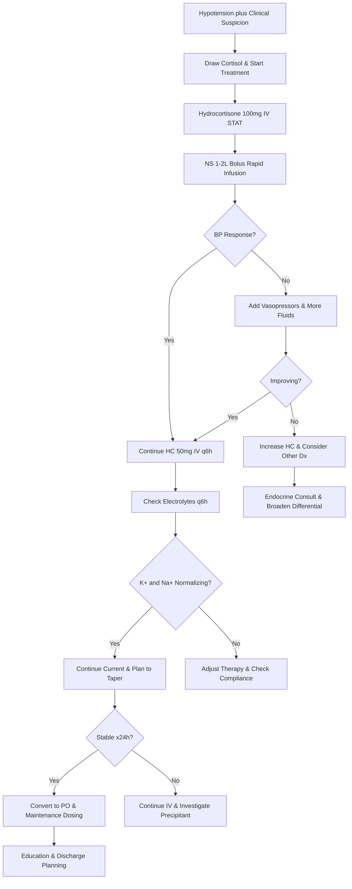

# Adrenal Crisis – Clinical Call Protocol

**Guidelines Referenced:**  
Endocrine Society Clinical Practice Guideline for Diagnosis and Treatment of Primary Adrenal Insufficiency 2016, Society for Endocrinology Clinical Committee Guidance on the Management of Adrenal Crisis 2020

**Official Sources:**  
https://academic.oup.com/jcem/article/101/2/364/2810222  
https://www.endocrinology.org/media/3066/society-for-endocrinology-adrenal-crisis-guidance.pdf

## CARD INTERFACE LAYOUT

### Card 0 – Dynamic Action Card (Node Dependent)

```
┌─────────────────────────────────────────────────────────────┐
│ ADRENAL CRISIS SUSPECTED                                    │
├─────────────────────────────────────────────────────────────┤
│ ┌─────────────────────────────────┐                        │
│ │     IMMEDIATE ACTIONS           │                        │
│ │ ☑ IV fluid bolus NS 1L STAT     │ [Running wide open]    │
│ │ ☑ Hydrocortisone 100mg IV PUSH  │ [Given 14:32]          │
│ │ ☑ Send cortisol (before steroids!)│ [Drawn at 14:30]    │
│ │ ☑ Basic metabolic panel STAT    │ [Results below]        │
│ │ ☑ Blood cultures x2             │ [Sent]                 │
│ │ ☐ Second liter NS running       │ [Start now]            │
│ │ ☐ Vasopressors if needed        │ [Norepi ready]         │
│ │                                │                        │
│ │ DO NOT DELAY STEROIDS           │                        │
│ └─────────────────────────────────┘                        │
│                                                           │
│ VITALS: BP 78/45, HR 124, RR 22, T 38.1°C, SpO2 96%       │
│                                                           │
│ LAB RESULTS:                                               │
│ • Na: 128 mEq/L (low)  • K: 5.8 mEq/L (high)              │
│ • Glucose: 68 mg/dL    • Cortisol: Pending                 │
│                                                           │
│ ⚠️ Classic electrolyte pattern for adrenal insufficiency   │
│ Continue aggressive treatment - DO NOT wait for labs        │
└─────────────────────────────────────────────────────────────┘
```

### Card 1 – Static Assessment/Types & Causes

```
┌─────────────────────────────────────────────────────────────┐
│ ADRENAL INSUFFICIENCY TYPES & CAUSES                       │
├─────────────────────────────────────────────────────────────┤
│ PRIMARY (ADDISON'S):                                       │
│ • Adrenal gland destruction → ↓Cortisol, ↓Aldosterone      │
│ • ↑ACTH (hyperpigmentation)                                │
│ • Hyponatremia + Hyperkalemia                              │
│ • Causes: Autoimmune (80%), TB, hemorrhage, metastases     │
│                                                           │
│ SECONDARY:                                                 │
│ • Pituitary dysfunction → ↓Cortisol, Normal Aldosterone    │
│ • ↓ACTH (no pigmentation), No hyperkalemia                 │
│ • Causes: Chronic steroids (#1), pituitary tumor/surgery   │
│                                                           │
│ TERTIARY:                                                  │
│ • Hypothalamic dysfunction, steroid withdrawal             │
│ • Similar presentation to secondary                        │
│                                                           │
│ CRISIS PRECIPITANTS:                                       │
│ • Infection/sepsis, surgery/trauma, steroid withdrawal     │
│ • GI illness (poor absorption), thyroid hormone initiation │
│ • Medications (azoles), dehydration                        │
│                                                           │
│ CLINICAL FEATURES - Classic Triad:                         │
│ 1. Hypotension/shock  2. Hyponatremia + Hyperkalemia      │
│ 3. Hypoglycemia                                            │
│                                                           │
│ DIAGNOSTIC CLUES:                                          │
│ • Morning cortisol <3 μg/dL (diagnostic)                   │
│ • 3-15 μg/dL (indeterminate), >15 μg/dL (crisis unlikely) │
│ • ACTH: High (primary), Low (secondary/tertiary)          │
│                                                           │
│ HIGH-RISK PATIENTS: Chronic steroid use >3 weeks,         │
│ autoimmune disease, HIV/AIDS, cancer, checkpoint inhibitors│
└─────────────────────────────────────────────────────────────┘
```

### Card 2 – Static Treatment Protocols

```
┌─────────────────────────────────────────────────────────────┐
│ TREATMENT PROTOCOLS & MEDICATIONS                           │
├─────────────────────────────────────────────────────────────┤
│ 💉 IMMEDIATE STEROIDS:                                      │
│ • Hydrocortisone: 100mg IV push STAT, then 50mg IV q6h     │
│ • Alternative: Dexamethasone 4mg IV (won't interfere with   │
│   cortisol testing), then hydrocortisone                   │
│ • Stress dose: 200-300mg/day, taper as improving           │
│                                                           │
│ 💧 FLUID RESUSCITATION:                                     │
│ • NS 1-2L first hour, then 150-250 mL/hr                  │
│ • May need 3-4L total, monitor for overload               │
│ • Add dextrose if hypoglycemic (D5NS once euvolemic)       │
│ • Vasopressors if no response (norepinephrine first-line)  │
│                                                           │
│ 🧪 ELECTROLYTE MANAGEMENT:                                  │
│ • Hyperkalemia: Usually resolves with steroids + fluids    │
│ • Treat if K >6.5 or ECG changes, avoid Kayexalate        │
│ • Hyponatremia: Improves with cortisol, avoid rapid correction│
│ • Hypoglycemia: D50 if symptomatic, D5 in maintenance fluids│
│                                                           │
│ 💊 MAINTENANCE THERAPY (when stable):                       │
│ • Hydrocortisone: 15-25mg daily (10mg AM, 5mg PM)         │
│ • Fludrocortisone: 0.05-0.2mg daily (primary AI only)     │
│ • Sick day rules: Double dose for illness, triple for severe│
│                                                           │
│ MONITORING: BP/HR q15min initially, BMP q6h, glucose q2-4h,│
│ strict I&O, daily weights, mental status assessment        │
│                                                           │
│ DISCHARGE: Medical alert bracelet, emergency injection kit,│
│ stress dosing instructions, endocrinology follow-up        │
└─────────────────────────────────────────────────────────────┘
```

## FLOWCHART (Bottom Panel – Mermaid Algorithm)



## INTERACTIVE ELEMENTS

### Stress Dose Calculator
```
┌─────────────────────────────────────────┐
│      STRESS DOSE STEROID GUIDE          │
├─────────────────────────────────────────┤
│ Clinical Scenario Selected:              │
│ ☑ Major Surgery/Adrenal Crisis          │
│                                         │
│ RECOMMENDATION:                         │
│ • Hydrocortisone 100mg IV STAT          │
│ • Then 50mg IV q6h x 24-48h             │
│ • Equivalent to 5-10x maintenance dose  │
│                                         │
│ Current Home Regimen:                   │
│ Prednisone 10mg daily                   │
│                                         │
│ Conversion Calculations:                │
│ • Prednisone 10mg = HC 40mg             │
│ • Crisis dose = 5-10x maintenance       │
│ • HC 200-400mg/day in divided doses     │
│                                         │
│ Taper Schedule (when stable):           │
│ Day 1-2: 50mg q6h                       │
│ Day 3-4: 25mg q8h                       │
│ Day 5+: Convert to PO maintenance       │
│                                         │
│ [CALCULATE DOSE] [PRINT PROTOCOL]        │
└─────────────────────────────────────────┘
```

### Adrenal Crisis Response Tracker
```
┌─────────────────────────────────────────┐
│    ADRENAL CRISIS RESPONSE MONITOR      │
├─────────────────────────────────────────┤
│ Time    BP        HR   Na   K   Glucose │
│ 14:30   78/45    124  128  5.8   68    │
│ 14:45   82/50    118  --   --    92    │
│ 15:00   88/58    110  130  5.4   98    │
│ 15:30   96/62    102  131  5.2   105   │
│ 16:00   108/68   94   133  4.9   112   │
│                                         │
│ INTERVENTIONS:                          │
│ 14:30 - Cortisol drawn                 │
│ 14:32 - HC 100mg IV push               │
│ 14:30 - NS 1L bolus started            │
│ 15:00 - Second liter NS                │
│ 15:30 - HC 50mg IV (next q6h)          │
│                                         │
│ RESPONSE: IMPROVING ✓                   │
│ • BP responding to treatment            │
│ • K+ trending down                      │
│ • Glucose normalized                    │
│ • Mental status clearing                │
│                                         │
│ Next HC dose due: 21:30                 │
│                                         │
│ [UPDATE DATA] [SET REMINDER]            │
└─────────────────────────────────────────┘
```

### Maintenance Dosing Calculator
```
┌─────────────────────────────────────────┐
│     STEROID REPLACEMENT CALCULATOR      │
├─────────────────────────────────────────┤
│ Type: ● Primary AI (Addison's)          │
│ Weight: [75] kg | BSA: 1.8 m²           │
│                                         │
│ HYDROCORTISONE DOSING:                  │
│ Total daily: 20mg (15-25mg range)       │
│ Schedule:                               │
│ • 6-8 AM: 15mg (60-70% of dose)        │
│ • 2-4 PM: 5mg (30-40% of dose)         │
│                                         │
│ FLUDROCORTISONE (Primary AI only):      │
│ Starting dose: 0.1mg daily              │
│ Titrate based on:                       │
│ • Orthostatic vital signs               │
│ • Serum K+ (goal 3.5-5.0)              │
│ • Plasma renin activity                 │
│                                         │
│ SICK DAY RULES:                         │
│ • Fever >100°F: Double dose             │
│ • Vomiting: IM injection                │
│ • Major stress: Triple dose              │
│ • Surgery: IV stress dosing              │
│                                         │
│ DISCHARGE CHECKLIST:                    │
│ ☑ Emergency injection kit prescribed    │
│ ☑ Medical alert bracelet ordered        │
│ ☑ Written stress dosing instructions    │
│ ☑ Endocrinology follow-up scheduled     │
│                                         │
│ [PRINT PRESCRIPTIONS] [PATIENT ED]       │
└─────────────────────────────────────────┘
```

## VIRTUA VOORHEES ADRENAL CRISIS ADDENDA

- **Endocrinology Consultation:** 24/7 availability via Transfer Center 856-886-5111 for complex cases and long-term management
- **Emergency Department Protocol:** Immediate steroid administration for suspected adrenal crisis without waiting for lab confirmation
- **Pharmacy Support:** Emergency hydrocortisone availability, stress dose calculations, medication reconciliation
- **Quality Metrics:** Time to steroid administration, appropriate fluid resuscitation, endocrine follow-up rates

## REFERENCE (GUIDELINE & SOURCE)
Endocrine Society. Clinical Practice Guideline for Diagnosis and Treatment of Primary Adrenal Insufficiency. 2016.  
https://academic.oup.com/jcem/article/101/2/364/2810222

**Additional References:**  
Society for Endocrinology Clinical Committee. Guidance on the Management of Adrenal Crisis. 2020.  
https://www.endocrinology.org/media/3066/society-for-endocrinology-adrenal-crisis-guidance.pdf

European Society of Endocrinology Clinical Practice Guidelines on the Management of Adrenocortical Carcinoma. 2018.  
https://eje.bioscientifica.com/view/journals/eje/179/4/EJE-18-0608.xml

**All steps follow current evidence-based guidelines for adrenal crisis management with integrated stress dosing protocols, electrolyte monitoring, and optimized transition to maintenance therapy with comprehensive patient education.**
