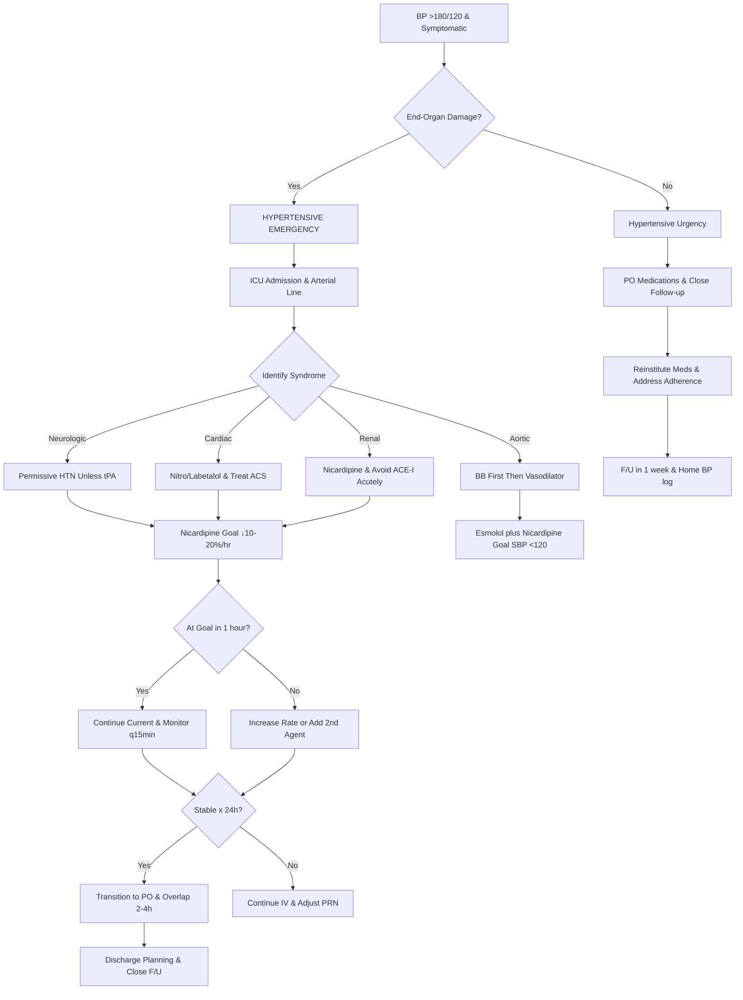

# Hypertensive Emergency – Clinical Call Protocol

**Guidelines Referenced:**  
AHA/ACC 2017 High Blood Pressure Clinical Practice Guideline, ESC/ESH 2018 Guidelines for the Management of Arterial Hypertension, AHA 2019 Scientific Statement on Treatment of Hypertensive Crises

**Official Sources:**  
https://www.ahajournals.org/doi/10.1161/HYP.0000000000000065  
https://academic.oup.com/eurheartj/article/39/33/3021/5079119  
https://www.ahajournals.org/doi/10.1161/HYP.0000000000000099

## CARD INTERFACE LAYOUT

### Card 0 – Dynamic Action Card (Node Dependent)

```
┌─────────────────────────────────────────────────────────────┐
│ HYPERTENSIVE EMERGENCY                                      │
├─────────────────────────────────────────────────────────────┤
│                                                            │
│ ┌─────────────────────────────────┐                        │
│ │     IMMEDIATE ACTIONS           │                        │
│ │ ☑ Confirm BP (both arms)        │ [L: 236/138, R: 232/140]│
│ │ ☑ IV access x2                 │ [18G bilateral]        │
│ │ ☑ Continuous BP monitoring      │ [Q5min initially]      │
│ │ ☑ STAT: BMP, troponin, UA      │ [Labs pending]         │
│ │ ☑ ECG - evaluate LVH/ischemia  │ [LVH present]          │
│ │ ☑ Fundoscopic exam             │ [Papilledema noted]    │
│ │ ☐ CT head if neuro symptoms    │ [Order STAT]           │
│ │ ☐ CXR for pulmonary edema      │ [Assess CHF]           │
│ │                                │                        │
│ │ Target MAP: 137-154 (↓10-20%)  │                        │
│ └─────────────────────────────────┘                        │
│                                                           │
│ VITALS: BP 236/138 (MAP 171), HR 96, RR 20, SpO2 97%, T 37.2°C│
│                                                           │
│ END-ORGAN DAMAGE ASSESSMENT:                               │
│ ☑ Neurologic: Confusion, severe headache                  │
│ ☑ Cardiac: Chest pain, troponin pending                   │
│ ☑ Renal: Cr 2.1 (baseline 1.0)                           │
│ ☑ Retinal: Papilledema present                            │
│                                                           │
│ 🚨 TRUE EMERGENCY - Requires ICU                          │
│ Goal: ↓ MAP by 10-20% in first hour                       │
└─────────────────────────────────────────────────────────────┘
```

**Example - IV Antihypertensive Management Node:**

```
┌─────────────────────────────────────────────────────────────┐
│ IV ANTIHYPERTENSIVE MANAGEMENT                              │
├─────────────────────────────────────────────────────────────┤
│ CURRENT STATUS: BP 236/138 → 218/128 (after 30 min)        │
│ MAP: 171 → 158 (↓ 7.6%) | Symptoms: Persistent headache     │
│                                                           │
│ ┌─────────────────────────────────┐                        │
│ │     NICARDIPINE INFUSION        │                        │
│ │                                │                        │
│ │ Starting dose: 5 mg/hr IV       │ [▲▼ Titrate]          │
│ │ Current rate: 7.5 mg/hr         │ [Increase q5-15min]   │
│ │ Maximum rate: 15 mg/hr          │ [Safety limit]        │
│ │                                │                        │
│ │ Time    BP        MAP   Rate    │                        │
│ │ 10:00   236/138   171   Start 5 │                        │
│ │ 10:15   228/132   164   ↑ to 7.5│                        │
│ │ 10:30   218/128   158   ↑ to 10 │                        │
│ │ 10:45   206/118   147   Hold    │                        │
│ │                                │                        │
│ │ Target MAP: 137-154 (↓20% from 171)│                     │
│ │ Status: ON TARGET ✓             │                        │
│ │                                │                        │
│ │ [TITRATE] [SWITCH AGENT] [ADD 2ND]│                      │
│ └─────────────────────────────────┘                        │
│                                                           │
│ TRANSITION PLANNING:                                       │
│ • Once stable x 24h on IV                                 │
│ • Start long-acting PO agents                             │
│ • Overlap x 2-4 hours before stopping IV                  │
│                                                           │
│ ⚠️ Avoid excessive BP reduction                            │
│ Risk of stroke if MAP ↓ >25% acutely                      │
└─────────────────────────────────────────────────────────────┘
```

### Card 1 – Static Assessment/Classification

```
┌─────────────────────────────────────────────────────────────┐
│ HYPERTENSIVE CRISIS CLASSIFICATION                          │
├─────────────────────────────────────────────────────────────┤
│ EMERGENCY vs URGENCY:                                      │
│ • Emergency: BP >180/120 + acute end-organ damage          │
│   Requires IV therapy, ICU admission, ↓10-20% in 1st hour  │
│ • Urgency: BP >180/120 + NO end-organ damage              │
│   PO therapy acceptable, outpatient possible, ↓over 24-48h  │
│                                                           │
│ END-ORGAN MANIFESTATIONS:                                  │
│ • Neurologic: Encephalopathy, ICH, ischemic stroke, PRES   │
│ • Cardiovascular: ACS, acute HF, aortic dissection        │
│ • Renal: Acute kidney injury, hematuria, proteinuria      │
│ • Ophthalmologic: Papilledema, flame hemorrhages          │
│ • Obstetric: Preeclampsia/eclampsia, HELLP syndrome       │
│                                                           │
│ PRECIPITATING FACTORS:                                     │
│ • Medication non-adherence (#1 cause)                     │
│ • Rebound (clonidine), drug interactions                  │
│ • Cocaine/amphetamines, OTC sympathomimetics              │
│ • Renovascular disease, pheochromocytoma                  │
│                                                           │
│ CRITICAL HISTORY:                                          │
│ Prior BP control, current medications, adherence, substance │
│ use, pregnancy status, prior strokes/MI, CKD, home readings│
│                                                           │
│ RED FLAGS: Severe headache, vision changes, chest pain,    │
│ altered mental status, seizures, dyspnea, oliguria        │
└─────────────────────────────────────────────────────────────┘
```

### Card 2 – Static Physical Exam/Medications

```
┌─────────────────────────────────────────────────────────────┐
│ PHYSICAL EXAM & MEDICATIONS                                 │
├─────────────────────────────────────────────────────────────┤
│ FOCUSED EXAMINATION:                                       │
│ • Vitals: BP both arms, orthostatic if safe, HR/rhythm     │
│ • Neurologic: Mental status, focal deficits, fundoscopy    │
│ • Cardiovascular: JVD, S3/S4, murmurs, peripheral pulses   │
│ • Pulmonary: Rales (pulmonary edema), work of breathing    │
│ • Abdominal: Bruits (RAS), pulsatile mass (AAA)           │
│                                                           │
│ 💊 IV ANTIHYPERTENSIVES:                                   │
│ • Nicardipine (1st line): 5 mg/hr, ↑2.5 mg/hr q5-15min   │
│   Max 15 mg/hr, onset 5-10min, no rebound                │
│ • Labetalol: 20mg IV q10min, double each dose, max 80mg   │
│   Infusion 0.5-2 mg/min, avoid in cocaine/asthma         │
│ • Esmolol: Load 500 mcg/kg/min x1, then 50-200 mcg/kg/min│
│   Ultra-short acting, good for aortic dissection         │
│                                                           │
│ 💊 SPECIFIC SCENARIOS:                                     │
│ • Acute stroke: Permissive HTN unless tPA (<185/110)      │
│ • Aortic dissection: Beta-blocker FIRST, then vasodilator │
│ • ACS/Pulmonary edema: Nitroglycerin + loop diuretic     │
│ • Preeclampsia: Labetalol or hydralazine + MgSO4         │
│ • Cocaine: Benzodiazepines first, avoid pure beta-blockers│
│                                                           │
│ 💊 ORAL TRANSITION (when stable x24h):                    │
│ Start PO 2-4h before stopping IV: Long-acting CCB         │
│ (amlodipine), ACE-I/ARB, thiazide diuretic               │
│                                                           │
│ ⚠️ AVOID: Immediate-release nifedipine, sublingual meds,   │
│ >25% reduction in 1st hour, abrupt discontinuation        │
└─────────────────────────────────────────────────────────────┘
```

## FLOWCHART (Bottom Panel – Mermaid Algorithm)



## INTERACTIVE ELEMENTS

### BP Reduction Calculator
```
┌─────────────────────────────────────────┐
│      BP REDUCTION TARGETS               │
├─────────────────────────────────────────┤
│ Initial BP: 236/138 (MAP 171)          │
│                                         │
│ HOUR 1 GOALS:                           │
│ 10-20% MAP reduction                    │
│ Target MAP: 137-154                     │
│ Target BP: ~190-210/110-125            │
│                                         │
│ CURRENT STATUS (45 min):                │
│ BP: 206/118 (MAP 147)                   │
│ MAP Reduction: 14% ✓ ON TARGET          │
│                                         │
│ Progress Timeline:                      │
│ 0 min:   236/138 (MAP 171)            │
│ 15 min:  228/132 (MAP 164) ↓4%        │
│ 30 min:  218/128 (MAP 158) ↓8%        │
│ 45 min:  206/118 (MAP 147) ↓14%       │
│                                         │
│ 24-48 HOUR GOAL: BP <160/100           │
│                                         │
│ [ADJUST TARGETS] [GRAPH TREND]          │
└─────────────────────────────────────────┘
```

### IV Antihypertensive Selection Tool
```
┌─────────────────────────────────────────┐
│    ANTIHYPERTENSIVE SELECTION           │
├─────────────────────────────────────────┤
│ Clinical Scenario Selected:              │
│ ☑ Acute kidney injury                  │
│                                         │
│ RECOMMENDED AGENTS:                     │
│                                         │
│ 1st Line: NICARDIPINE                   │
│ • No contraindications for AKI          │
│ • Predictable, titratable response      │
│ • Start 5 mg/hr, ↑2.5 mg/hr q5-15min   │
│ • Max 15 mg/hr                          │
│                                         │
│ Alternatives:                           │
│ • Labetalol (if no asthma/COPD)        │
│ • Hydralazine (less predictable)       │
│                                         │
│ AVOID in AKI:                           │
│ • ACE inhibitors (worsen acute AKI)     │
│ • ARBs (worsen acute AKI)              │
│                                         │
│ [DOSING CALCULATOR] [SWITCH SCENARIO]    │
└─────────────────────────────────────────┘
```

### IV to PO Transition Planner
```
┌─────────────────────────────────────────┐
│      IV TO PO TRANSITION PLANNER        │
├─────────────────────────────────────────┤
│ Current IV: Nicardipine 10 mg/hr x 36h  │
│ Current BP: 148/92 (stable)            │
│                                         │
│ RECOMMENDED PO REGIMEN:                 │
│ Start 2-4 hours before stopping IV:     │
│                                         │
│ ☑ Amlodipine 5mg PO daily              │
│   (Long-acting CCB equivalent)          │
│                                         │
│ ☑ Lisinopril 10mg PO daily             │
│   (Hold if Cr rising)                   │
│                                         │
│ ☑ Chlorthalidone 12.5mg PO daily       │
│   (Preferred over HCTZ)                 │
│                                         │
│ OVERLAP SCHEDULE:                       │
│ 08:00 - Give PO medications             │
│ 10:00 - Reduce nicardipine to 7.5 mg/hr│
│ 11:00 - Reduce to 5 mg/hr              │
│ 12:00 - Stop nicardipine                │
│ Monitor BP q30min x 2h after stopping   │
│                                         │
│ [CALCULATE DOSES] [PRINT ORDERS]        │
└─────────────────────────────────────────┘
```

## VIRTUA VOORHEES HYPERTENSIVE EMERGENCY ADDENDA

- **ICU Capabilities:** Arterial line monitoring, continuous nicardipine infusions, q15-minute BP monitoring protocols
- **Cardiology Consultation:** 24/7 availability via Transfer Center 856-886-5111 for complex cases or aortic dissection
- **Neurology Support:** Immediate access for hypertensive encephalopathy, stroke evaluation, and PRES syndrome
- **Quality Metrics:** Time to appropriate IV antihypertensive, goal BP achievement within 1 hour, medication reconciliation at discharge

## REFERENCE (GUIDELINE & SOURCE)
2017 ACC/AHA/AAPA/ABC/ACPM/AGS/APhA/ASH/ASPC/NMA/PCNA Guideline for the Prevention, Detection, Evaluation, and Management of High Blood Pressure in Adults.  
https://www.ahajournals.org/doi/10.1161/HYP.0000000000000065

**Additional References:**  
2018 ESC/ESH Guidelines for the Management of Arterial Hypertension  
https://academic.oup.com/eurheartj/article/39/33/3021/5079119

2019 AHA Scientific Statement on Treatment of Hypertensive Crises  
https://www.ahajournals.org/doi/10.1161/HYP.0000000000000099

**All steps follow current evidence-based guidelines for hypertensive emergency management with integrated BP reduction targets, scenario-specific antihypertensive selection, and optimized transition protocols to prevent rebound hypertension.**
