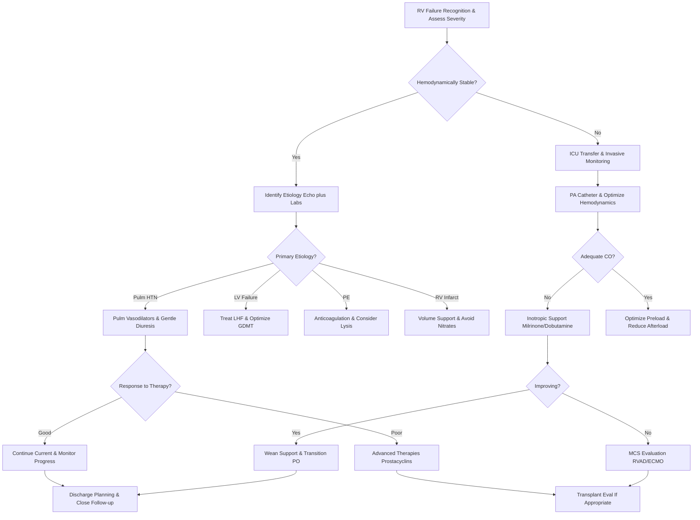

# Right Heart Failure – Clinical Call Protocol

**Guidelines Referenced:**  
AHA/ACC/HFSA 2022 Guideline for the Management of Heart Failure, 2022 ESC/ERS Guidelines for the Diagnosis and Treatment of Pulmonary Hypertension, CHEST 2019 Guidelines for Management of High-Risk Pulmonary Embolism

## CARD INTERFACE LAYOUT

### Card 0 – Dynamic Action Card (Node Dependent)

```
┌─────────────────────────────────────────────────────────────┐
│ RIGHT VENTRICULAR FAILURE                                   │
├─────────────────────────────────────────────────────────────┤
│ 📱 CALLED BY: RN Johnson, CCU                               │
│ Patient: 58yo F with PAH, worsening SOB                     │
│                                                           │
│ ┌─────────────────────────────────┐                        │
│ │     IMMEDIATE ASSESSMENT        │                        │
│ │ ☑ Elevate HOB 30-45 degrees     │ [Position optimized]   │
│ │ ☑ O2 to maintain SpO2 >92%      │ [4L NC → 94%]          │
│ │ ☑ Echo ordered (RV function)    │ [STAT portable]        │
│ │ ☑ BNP, troponin, BMP, LFTs      │ [Labs pending]         │
│ │ ☑ CXR (evaluate RV size)        │ [Completed]            │
│ │ ☐ Consider PA catheter          │ [If unstable]          │
│ │ ☐ Pulmonary consult             │ [PAH specialist]       │
│ │                                │                        │
│ │ JVP: Prominent v waves          │                        │
│ │ Hepatomegaly: 4cm below RCM     │                        │
│ └─────────────────────────────────┘                        │
│                                                           │
│ VITALS: BP 98/62, HR 105, RR 24, SpO2 94% on 4L           │
│                                                           │
│ RV FAILURE SIGNS:                                          │
│ ☑ Kussmaul's sign positive  ☑ Hepatojugular reflux +      │
│ ☑ TR murmur (3/6 holosystolic)  ☑ Ascites present         │
│                                                           │
│ ⚠️ Avoid aggressive diuresis initially - RV preload dependent│
└─────────────────────────────────────────────────────────────┘
```

**Example - RV Support Optimization Node:**

```
┌─────────────────────────────────────────────────────────────┐
│ RV FAILURE MANAGEMENT                                       │
├─────────────────────────────────────────────────────────────┤
│ HEMODYNAMICS: CVP 18, PAP 68/28 (mean 45), PCWP 12         │
│ Cardiac Output: 3.2 L/min (↓)                               │
│                                                           │
│ ┌─────────────────────────────────┐                        │
│ │     RV SUPPORT STRATEGY         │                        │
│ │                                │                        │
│ │ OPTIMIZE PRELOAD:               │                        │
│ │ Current CVP 18 (target 8-12)   │ [Gentle diuresis]      │
│ │ ☑ Furosemide 40mg IV q12h      │ [Net -500-1000mL/d]    │
│ │                                │                        │
│ │ REDUCE AFTERLOAD:               │                        │
│ │ ☐ Sildenafil 20mg PO TID       │ [PDE-5 inhibitor]      │
│ │ ☐ Inhaled NO/epoprostenol      │ [If severe]            │
│ │ ☐ Avoid hypoxia/acidosis       │ [Optimize ventilation] │
│ │                                │                        │
│ │ SUPPORT CONTRACTILITY:          │                        │
│ │ ☐ Milrinone 0.375 mcg/kg/min   │ [Inodilator]          │
│ │ ☐ Low-dose dobutamine          │ [If hypotensive]       │
│ │                                │                        │
│ │ MAINTAIN PERFUSION:             │                        │
│ │ MAP target: >65 mmHg           │ [Current: 74]          │
│ │ ☐ Norepinephrine if needed     │ [Last resort]          │
│ └─────────────────────────────────┘                        │
│                                                           │
│ RHYTHM CRITICAL: Maintain sinus, control AF rate <80       │
│                                                           │
│ 📞 Advanced HF Team: Consider RVAD evaluation if failing   │
└─────────────────────────────────────────────────────────────┘
```

### Card 1 – Static Assessment/Etiologies

```
┌─────────────────────────────────────────────────────────────┐
│ RIGHT HEART FAILURE ETIOLOGIES                             │
├─────────────────────────────────────────────────────────────┤
│ 🫁 PULMONARY CAUSES:                                        │
│ • PAH: Idiopathic, CTD-associated, HIV, portopulmonary     │
│ • Pulmonary venous HTN: Left heart failure (#1), MS/MR     │
│ • Lung disease: COPD (cor pulmonale), ILD, OSA            │
│ • Thromboembolic: Acute PE, chronic thromboembolic PH      │
│                                                           │
│ 💓 CARDIAC CAUSES:                                          │
│ • RV myocardial: RV infarction, ARVC, cardiomyopathy      │
│ • Valvular: Tricuspid regurgitation, pulmonic stenosis     │
│ • Congenital: ASD with shunt, Eisenmenger syndrome        │
│ • Pericardial: Constrictive pericarditis                  │
│                                                           │
│ PATHOPHYSIOLOGY - RV SPIRAL:                              │
│ ↑ Afterload → RV dilation → TR develops → ↑ Preload →     │
│ Septal shift → ↓ LV filling → ↓ CO → ↓ Coronary perfusion →│
│ RV ischemia → Progressive failure                          │
│                                                           │
│ ASSESSMENT PRIORITIES:                                     │
│ Volume status (CVP, JVP), evidence of low CO, precipitating│
│ factors, home O2 use, prior echo/cath data, exercise capacity│
│                                                           │
│ WHO FUNCTIONAL CLASS: I (asymptomatic) to IV (symptoms at rest)│
└─────────────────────────────────────────────────────────────┘
```

### Card 2 – Static Physical Exam/Medications

```
┌─────────────────────────────────────────────────────────────┐
│ PHYSICAL EXAM & MEDICATIONS                                 │
├─────────────────────────────────────────────────────────────┤
│ RV FAILURE SIGNS:                                          │
│ • Neck: Elevated JVP, prominent v waves (TR), Kussmaul's   │
│ • Cardiac: RV heave, loud P2, TR murmur, S3/S4 at LLSB    │
│ • Abdomen: Hepatomegaly, hepatojugular reflux, ascites     │
│ • Extremities: Pitting edema, cool, cyanotic              │
│                                                           │
│ 💊 DIURETIC STRATEGY (Start low, go slow):                 │
│ • Furosemide 20-40mg IV BID, monitor BP closely           │
│ • Add spironolactone 25mg, metolazone for resistance      │
│ • Goal: CVP 8-12 mmHg, net negative 500-1000mL/day        │
│                                                           │
│ 💊 PULMONARY VASODILATORS:                                 │
│ • PDE-5 inhibitors: Sildenafil 20mg TID, Tadalafil 40mg QD │
│ • Prostacyclins: Epoprostenol (IV), Treprostinil (SC/IV/inh)│
│ • ERA: Bosentan 125mg BID, Ambrisentan 5-10mg QD          │
│                                                           │
│ 💊 INOTROPIC SUPPORT:                                      │
│ • Milrinone 0.375-0.75 mcg/kg/min (inodilator effect)     │
│ • Dobutamine 2.5-5 mcg/kg/min (may worsen hypotension)    │
│                                                           │
│ 💊 SUPPORTIVE CARE:                                        │
│ • Oxygen: Target SpO2 >92%, consider nocturnal O2         │
│ • Anticoagulation: Warfarin INR 2-3 for PAH patients     │
│ • Iron replacement if deficient, Digoxin for AF rate control│
│                                                           │
│ ⚠️ AVOID: Excessive preload reduction, systemic vasodilators,│
│ beta-blockers (unless AF), high PEEP ventilation, NSAIDs   │
└─────────────────────────────────────────────────────────────┘
```

## FLOWCHART (Bottom Panel – Mermaid Algorithm)



## INTERACTIVE ELEMENTS

### RV Function Calculator
```
┌─────────────────────────────────────────┐
│      RV FUNCTION ASSESSMENT             │
├─────────────────────────────────────────┤
│ TAPSE: [12] mm (normal >16)             │
│ RV S': [8] cm/s (normal >10)            │
│ FAC: [28]% (normal >35)                 │
│ RV/LV ratio: [1.2] (normal <0.9)        │
│                                         │
│ RV DYSFUNCTION: MODERATE                │
│                                         │
│ HEMODYNAMIC CALCULATIONS:               │
│ RAP: 18 mmHg | PAP: 68/28 (45)         │
│ PCWP: 12 mmHg | CO: 3.2 L/min          │
│                                         │
│ PVR = (45-12)/3.2 = 10.3 Wood units    │
│ (Normal <3, severe >5)                  │
│ TPG = 45-12 = 33 mmHg                   │
│ DPG = 28-12 = 16 mmHg                   │
│                                         │
│ INTERPRETATION: Pre-capillary PH        │
│                                         │
│ [CALCULATE PVR] [TREND DATA]            │
└─────────────────────────────────────────┘
```

### RV Failure Diuretic Protocol
```
┌─────────────────────────────────────────┐
│    RV FAILURE DIURETIC PROTOCOL         │
├─────────────────────────────────────────┤
│ Current: CVP 18 mmHg (target 8-12)      │
│ Cr: 1.4 mg/dL | MAP: 73 mmHg            │
│                                         │
│ DIURETIC PLAN:                          │
│ ☑ Furosemide 40mg IV BID               │
│ ☐ Add spironolactone 25mg daily        │
│ ☐ Consider metolazone if resistant      │
│                                         │
│ RESPONSE MONITORING:                    │
│ UOP trend: 120→100→80 mL/hr             │
│ Net balance: -600 mL/24h                │
│ Weight: -1.2 kg | CVP: 18→15 mmHg       │
│                                         │
│ ⚠️ CAUTION: BP dropping, rising Cr      │
│ Maintain adequate preload for RV        │
│                                         │
│ [ADJUST DOSE] [CHECK HEMODYNAMICS]      │
└─────────────────────────────────────────┘
```

### PAH Treatment Ladder
```
┌─────────────────────────────────────────┐
│    PULMONARY HTN TREATMENT LADDER       │
├─────────────────────────────────────────┤
│ WHO Class: III | 6MWD: 280m | BNP: 450  │
│                                         │
│ CURRENT THERAPY:                        │
│ ☑ Supportive: O2, diuretics, warfarin   │
│ ☑ ERA Monotherapy: Ambrisentan 10mg QD  │
│                                         │
│ NEXT STEPS:                             │
│ ➕ Add PDE-5 Inhibitor                  │
│   • Sildenafil 20mg TID                 │
│   • OR Tadalafil 40mg daily             │
│                                         │
│ IF NO IMPROVEMENT (3-6 months):         │
│ ➕ Add Prostacyclin                     │
│   • Inhaled treprostinil QID            │
│   • OR IV epoprostenol                  │
│                                         │
│ [START COMBINATION] [CALCULATE RISK]     │
└─────────────────────────────────────────┘
```

## VIRTUA VOORHEES RIGHT HEART FAILURE ADDENDA

- **Pulmonary Hypertension Specialists:** Available via Transfer Center 856-886-5111 for complex PAH cases
- **Advanced Heart Failure Team:** RVAD evaluation and mechanical circulatory support consultation
- **Hemodynamic Monitoring:** Swan-Ganz catheter capabilities with ICU hemodynamic optimization
- **Quality Metrics:** Time to echocardiogram, appropriate diuretic dosing, specialist consultation rates

## REFERENCES

- AHA/ACC/HFSA. 2022 Guideline for the Management of Heart Failure
- ESC/ERS. 2022 Guidelines for Diagnosis and Treatment of Pulmonary Hypertension  
- CHEST. 2019 Guidelines for Management of High-Risk Pulmonary Embolism

**All steps follow current evidence-based guidelines for right heart failure with integrated pulmonary vasodilator therapy, gentle diuresis protocols, and optimization of hemodynamic support.**
