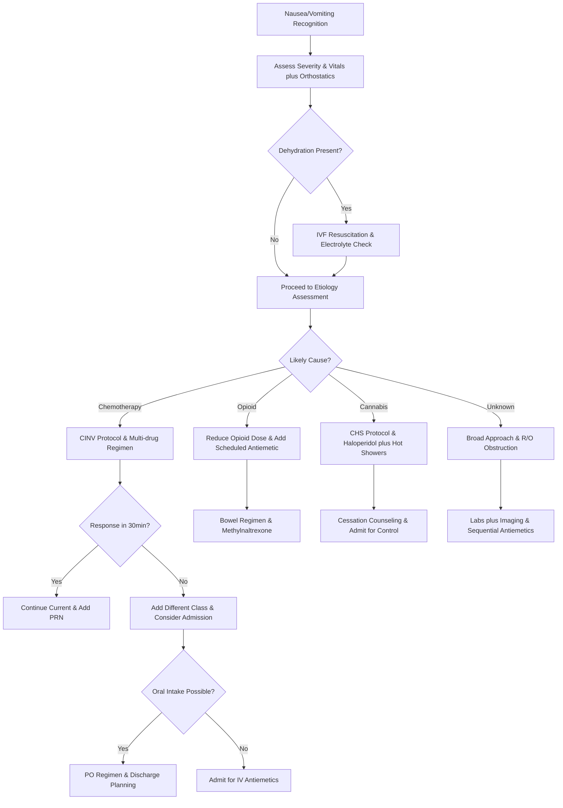

# Antiemetic Management – Clinical Call Protocol

**Guidelines Referenced:**  
American Society of Clinical Oncology (ASCO) Antiemetic Guidelines 2020, National Comprehensive Cancer Network (NCCN) Antiemesis Guidelines 2023, American Gastroenterological Association Clinical Practice Guidelines for Nausea and Vomiting 2021

**Official Sources:**  
https://ascopubs.org/doi/10.1200/JCO.20.01296  
https://www.nccn.org/professionals/physician_gls/pdf/antiemesis.pdf  
https://www.gastrojournal.org/article/S0016-5085(21)00487-1/fulltext

## CARD INTERFACE LAYOUT

### Card 0 – Dynamic Action Card (Node Dependent)

```
┌─────────────────────────────────────────────────────────────┐
│ NAUSEA/VOMITING EVALUATION                                  │
├─────────────────────────────────────────────────────────────┤
│ 📱 CALLED BY: Oncology RN, Bed 18                          │
│ Patient: 54yo F, Day 2 post-chemotherapy (AC regimen)      │
│                                                           │
│ ┌─────────────────────────────────┐                        │
│ │     IMMEDIATE ASSESSMENT        │                        │
│ │ ☑ Vital signs obtained          │ [BP 108/68, HR 96]     │
│ │ ☑ Orthostatic vitals checked    │ [Positive orthostatics]│
│ │ ☑ Last antiemetic dose noted    │ [Ondansetron 2h ago]   │
│ │ ☑ Vomitus characteristics       │ [Bilious, no blood]    │
│ │ ☐ IV access verified           │ [18G left AC patent]   │
│ │ ☐ Hydration status assessed    │ [Mild dehydration]     │
│ │ ☐ Breakthrough protocol        │ [Initiate per CINV]    │
│ │                                │                        │
│ │ Current regimen: Ondansetron 8mg│                        │
│ │ IV q8h (inadequate control)     │                        │
│ └─────────────────────────────────┘                        │
│                                                           │
│ VITALS: BP 108/68, HR 96, RR 18, T 37.1°C                 │
│ Orthostatics: ↓ 16 mmHg SBP, ↑ 24 bpm HR                  │
│                                                           │
│ PRESENTATION:                                              │
│ • 6 episodes vomiting since midnight                       │
│ • Unable to tolerate PO fluids                            │
│ • Bilious vomitus, no hematemesis                          │
│ • Last bowel movement yesterday                            │
│                                                           │
│ 🚨 CINV BREAKTHROUGH - High emetogenic chemotherapy        │
│ Requires multimodal antiemetic approach with hydration     │
└─────────────────────────────────────────────────────────────┘
```

**Example - CINV Breakthrough Management Node:**

```
┌─────────────────────────────────────────────────────────────┐
│ CINV BREAKTHROUGH PROTOCOL ACTIVATED                        │
├─────────────────────────────────────────────────────────────┤
│ CHEMOTHERAPY REGIMEN: AC (Adriamycin + Cyclophosphamide)    │
│ Day 2 post-infusion, high emetogenic potential             │
│                                                           │
│ ┌─────────────────────────────────┐                        │
│ │     BREAKTHROUGH STRATEGY       │                        │
│ │ ☑ Metoclopramide 10mg IV STAT   │ [Given 14:30]          │
│ │ ☑ Dexamethasone 8mg IV x1       │ [Anti-inflammatory]    │
│ │ ☑ Lorazepam 0.5mg IV q6h PRN    │ [Anticipatory anxiety] │
│ │ ☐ NS bolus 500mL                │ [For dehydration]      │
│ │ ☐ If refractory (>30min):       │                        │
│ │   Haloperidol 0.5-1mg IV        │ [Different mechanism]  │
│ │   Consider olanzapine 10mg       │ [Broad spectrum]       │
│ │                                │                        │
│ │ Avoid ondansetron x 4 hours     │                        │
│ └─────────────────────────────────┘                        │
│                                                           │
│ ADDITIONAL SUPPORTIVE CARE:                                │
│ • IV fluids: NS 125mL/hr continuous                        │
│ • Electrolyte panel in AM (hypokalemia risk)               │
│ • Strict input/output monitoring                           │
│ • Anti-acid therapy: Famotidine 20mg IV BID                │
│                                                           │
│ REASSESSMENT PLAN:                                         │
│ • Evaluate response in 30 minutes                          │
│ • Next scheduled dose options in 4-6 hours                 │
│ • Consider admission if no improvement                      │
│                                                           │
│ PREVENTION FOR NEXT CYCLE:                                 │
│ • Add NK-1 antagonist (aprepitant)                         │
│ • Increase steroid dose pre-treatment                      │
│ • Consider prophylactic olanzapine                         │
└─────────────────────────────────────────────────────────────┘
```

**Example - Cannabinoid Hyperemesis Syndrome Node:**

```
┌─────────────────────────────────────────────────────────────┐
│ CANNABINOID HYPEREMESIS SYNDROME SUSPECTED                  │
├─────────────────────────────────────────────────────────────┤
│ CLINICAL PRESENTATION CONSISTENT:                           │
│ • Chronic daily cannabis use confirmed (5+ years)           │
│ • Cyclic vomiting episodes                                  │
│ • Compulsive hot shower behavior                            │
│ • Resolution with cannabis cessation previously             │
│                                                           │
│ ┌─────────────────────────────────┐                        │
│ │     SPECIFIC CHS TREATMENT      │                        │
│ │ ☑ Haloperidol 5mg IV/IM        │ [Most effective agent] │
│ │ ☑ Capsaicin cream 0.1%         │ [Apply to abdomen]     │
│ │ ☑ Hot shower privileges        │ [Patient preference]   │
│ │ ☐ Lorazepam 1mg IV PRN         │ [Anxiety component]    │
│ │                                │                        │
│ │ AVOID (ineffective in CHS):    │                        │
│ │ • Opioids (worsen symptoms)    │                        │
│ │ • Standard 5-HT3 antagonists   │                        │
│ └─────────────────────────────────┘                        │
│                                                           │
│ SUPPORTIVE MEASURES:                                       │
│ • Aggressive IV fluid resuscitation (often severely dehydrated)│
│ • Electrolyte monitoring and repletion                     │
│ • Thiamine 100mg IV (nutritional deficiency risk)          │
│ • Cannabis cessation counseling                            │
│                                                           │
│ DISPOSITION:                                               │
│ • Admission likely required for symptom control            │
│ • Psychiatry/addiction medicine consultation               │
│ • Discharge planning with cannabis cessation resources     │
│                                                           │
│ PATIENT EDUCATION:                                         │
│ • CHS diagnosis explanation                                │
│ • Cannabis cessation as definitive treatment              │
│ • Symptom recurrence with continued use                   │
└─────────────────────────────────────────────────────────────┘
```

### Card 1 – Static Assessment/Causes & Risk Factors

```
┌─────────────────────────────────────────────────────────────┐
│ NAUSEA/VOMITING CAUSES & RISK FACTORS                      │
├─────────────────────────────────────────────────────────────┤
│ GASTROINTESTINAL CAUSES:                                   │
│ • Gastroparesis (diabetes, post-viral)                     │
│ • Small bowel obstruction/ileus                            │
│ • Pancreatitis, cholecystitis, hepatitis                   │
│ • GERD, peptic ulcer disease                               │
│                                                           │
│ MEDICATION-INDUCED (#1 cause):                             │
│ • Opioids (most common), antibiotics, digoxin             │
│ • Chemotherapy (high/moderate emetogenic)                  │
│ • Iron supplements, metformin, NSAIDs                      │
│                                                           │
│ METABOLIC/ENDOCRINE:                                       │
│ • Uremia, hypercalcemia, DKA, pregnancy                    │
│ • Adrenal insufficiency, thyroid disorders                │
│                                                           │
│ NEUROLOGIC/PSYCHIATRIC:                                    │
│ • Increased ICP, migraine, vestibular disorders            │
│ • Motion sickness, anxiety disorders                       │
│ • Cannabinoid hyperemesis syndrome                         │
│                                                           │
│ RED FLAG FEATURES:                                         │
│ • Projectile vomiting (increased ICP)                      │
│ • Hematemesis (upper GI bleeding)                          │
│ • Severe dehydration with hemodynamic compromise           │
│ • Altered mental status, focal neurologic signs            │
│ • Bilious vomiting with abdominal distension               │
│                                                           │
│ HIGH-RISK PATIENT GROUPS:                                  │
│ • Post-operative patients (anesthesia, opioids)            │
│ • Chemotherapy recipients (CINV)                           │
│ • Elderly (polypharmacy, dehydration risk)                │
│ • Pregnancy (hyperemesis gravidarum)                      │
│ • Chronic pain patients (opioid-induced)                  │
│                                                           │
│ ASSESSMENT PRIORITIES:                                     │
│ Medication history, recent procedures, associated symptoms, │
│ dehydration status, neurological examination               │
└─────────────────────────────────────────────────────────────┘
```

### Card 2 – Static Physical Exam/Medications & Selection

```
┌─────────────────────────────────────────────────────────────┐
│ PHYSICAL EXAM & ANTIEMETIC MEDICATIONS                     │
├─────────────────────────────────────────────────────────────┤
│ FOCUSED EXAMINATION:                                       │
│ • Vitals: Orthostatic changes, tachycardia, hypotension    │
│ • General: Dehydration signs, nutritional status           │
│ • Abdominal: Distension, bowel sounds, tenderness, masses  │
│ • Neurologic: Mental status, focal deficits, papilledema   │
│                                                           │
│ 💊 ANTIEMETIC MEDICATION CLASSES:                          │
│ 5-HT3 ANTAGONISTS (First-line):                           │
│ • Ondansetron: 4-8mg IV q8h, QTc monitoring needed        │
│ • Granisetron: 1mg IV daily, longer acting, less QTc risk  │
│                                                           │
│ DOPAMINE ANTAGONISTS:                                      │
│ • Metoclopramide: 10mg IV q6h, prokinetic effect, EPS risk │
│ • Prochlorperazine: 5-10mg IV q6h, good for migraine      │
│ • Haloperidol: 0.5-2mg IV q6h, very effective, QTc risk   │
│                                                           │
│ CORTICOSTEROIDS:                                           │
│ • Dexamethasone: 4-8mg IV daily, CINV prevention/delayed   │
│                                                           │
│ ANXIOLYTICS:                                               │
│ • Lorazepam: 0.5-1mg IV q6h, anticipatory nausea          │
│                                                           │
│ SPECIALIZED AGENTS:                                        │
│ • Scopolamine: 1.5mg patch q72h (motion sickness)         │
│ • Olanzapine: 10mg PO daily (refractory CINV)             │
│ • Aprepitant: 125mg PO day 1 (NK-1 antagonist, CINV)      │
│                                                           │
│ COMBINATION STRATEGIES:                                    │
│ • Use different receptor classes                           │
│ • Rotate agents q4-6h to avoid tachyphylaxis              │
│ • Scheduled dosing + PRN breakthrough                      │
│                                                           │
│ 💧 HYDRATION & SUPPORTIVE CARE:                           │
│ • IV fluids: NS/LR based on deficit, typically 125-250mL/hr│
│ • Electrolyte monitoring: K+, Mg2+ (hypokalemia common)    │
│ • Thiamine supplementation if chronic alcohol/malnutrition │
│                                                           │
│ MONITORING PARAMETERS: QTc interval with multiple agents,  │
│ fluid balance, electrolytes, extrapyramidal symptoms       │
└─────────────────────────────────────────────────────────────┘
```

## FLOWCHART (Bottom Panel – Mermaid Algorithm)



## INTERACTIVE ELEMENTS

### Antiemetic Rotation Scheduler
```
┌─────────────────────────────────────────┐
│     ANTIEMETIC ROTATION SCHEDULE        │
├─────────────────────────────────────────┤
│ FAILED AGENT: Ondansetron 8mg IV        │
│                                         │
│ OPTIMIZED ROTATION PLAN:                │
│                                         │
│ 14:30 - Metoclopramide 10mg IV ✓ Given │
│ 18:30 - Promethazine 12.5mg IV         │
│ 22:30 - Haloperidol 1mg IV              │
│ 02:30 - Prochlorperazine 10mg IV       │
│ 06:30 - Return to ondansetron          │
│                                         │
│ BREAKTHROUGH OPTIONS:                   │
│ • Lorazepam 0.5mg IV q6h PRN           │
│ • Dexamethasone 4mg IV q12h             │
│                                         │
│ RULES:                                  │
│ • Avoid same class within 4 hours       │
│ • Monitor QTc with multiple agents      │
│ • Document effectiveness each dose      │
│                                         │
│ [UPDATE SCHEDULE] [EFFECTIVENESS LOG]   │
└─────────────────────────────────────────┘
```

### QTc Risk Assessment Tool
```
┌─────────────────────────────────────────┐
│      QTc PROLONGATION RISK CALCULATOR   │
├─────────────────────────────────────────┤
│ BASELINE ECG: QTc 442 ms (borderline)   │
│                                         │
│ CURRENT QTc-PROLONGING AGENTS:          │
│ ☑ Ondansetron (moderate risk)           │
│ ☑ Haloperidol planned (high risk)       │
│ ☐ Methadone                             │
│ ☐ Fluoroquinolones                      │
│                                         │
│ ADDITIONAL RISK FACTORS:                │
│ ☐ Hypokalemia (K+ 3.2)                 │
│ ☐ Hypomagnesemia                       │
│ ☑ Female gender                        │
│ ☐ Age >65                              │
│                                         │
│ RISK LEVEL: 🟡 MODERATE-HIGH            │
│                                         │
│ RECOMMENDATIONS:                        │
│ • Check ECG before haloperidol          │
│ • Correct K+ to >4.0, Mg2+ >2.0        │
│ • Limit haloperidol to 1mg maximum     │
│ • Space QTc drugs by ≥4 hours          │
│ • Recheck ECG if QTc >480ms             │
│                                         │
│ [ORDER ECG] [ELECTROLYTE REPLETION]     │
└─────────────────────────────────────────┘
```

### Hydration Status Monitor
```
┌─────────────────────────────────────────┐
│      VOLUME STATUS ASSESSMENT           │
├─────────────────────────────────────────┤
│ ORTHOSTATIC VITAL SIGNS:                │
│ Supine: BP 108/68, HR 96               │
│ Standing: BP 92/56, HR 120              │
│ Changes: ↓16 mmHg SBP, ↑24 bpm HR      │
│                                         │
│ ORTHOSTATIC STATUS: 🔴 POSITIVE         │
│ (>20 bpm HR increase OR >20 mmHg SBP drop)│
│                                         │
│ ESTIMATED FLUID DEFICIT: ~1.5-2L        │
│ Based on: Clinical dehydration signs    │
│                                         │
│ RESUSCITATION PLAN:                     │
│ • NS 500mL bolus over 30 minutes        │
│ • Then NS 125mL/hr continuous           │
│ • Goal UOP >0.5mL/kg/hr (>35mL/hr)     │
│                                         │
│ MONITORING:                             │
│ • Reassess orthostatics in 4 hours      │
│ • Daily weights on same scale           │
│ • Electrolyte panel in AM               │
│                                         │
│ RESPONSE INDICATORS:                    │
│ ☐ Orthostatics resolve                  │
│ ☐ Adequate urine output                 │
│ ☐ Improved oral tolerance               │
│                                         │
│ [REASSESS VITALS] [FLUID BALANCE]       │
└─────────────────────────────────────────┘
```

## VIRTUA VOORHEES ANTIEMETIC MANAGEMENT ADDENDA

- **Pharmacy Consultation:** Clinical pharmacist available for complex antiemetic regimens, drug interactions, and QTc monitoring protocols
- **Oncology Support:** 24/7 oncology team via Transfer Center 856-886-5111 for CINV management and breakthrough protocols
- **Gastroenterology Services:** Available for refractory nausea workup including gastroparesis evaluation and endoscopic assessment
- **Quality Metrics:** Time to effective symptom control, appropriate antiemetic selection, readmission rates for inadequate symptom management

## REFERENCE (GUIDELINE & SOURCE)
American Society of Clinical Oncology. Antiemetics: ASCO Guideline Update. J Clin Oncol. 2020.  
https://ascopubs.org/doi/10.1200/JCO.20.01296

**Additional References:**  
National Comprehensive Cancer Network. NCCN Clinical Practice Guidelines in Oncology: Antiemesis. 2023.  
https://www.nccn.org/professionals/physician_gls/pdf/antiemesis.pdf

American Gastroenterological Association Clinical Practice Guidelines for the Management of Gastroparesis. 2022.  
https://www.gastrojournal.org/article/S0016-5085(22)00547-2/fulltext

Hesketh PJ, et al. Antiemetics: ASCO Guideline Update. J Clin Oncol. 2020.  
https://ascopubs.org/doi/10.1200/JCO.20.01296

Simonetto DA, et al. Cannabinoid Hyperemesis: A Case Series and Review of Prior Reports. Mayo Clin Proc. 2012.  
https://www.mayoclinicproceedings.org/article/S0025-6196(12)00568-9/fulltext

**All steps follow current evidence-based guidelines for antiemetic management with integrated medication rotation protocols, QTc risk assessment, and specialized approaches for CINV and cannabinoid hyperemesis syndrome.**
