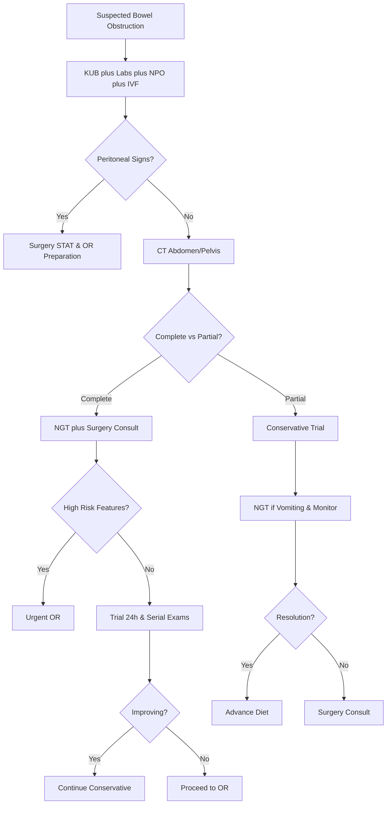

# Bowel Obstruction – Clinical Call Protocol

**Guidelines Referenced:**  
American College of Surgeons Clinical Practice Guidelines for Small Bowel Obstruction 2020, World Society of Emergency Surgery Guidelines for Management of Acute Small Bowel Obstruction 2019, American Gastroenterological Association Clinical Practice Guidelines on Small Bowel Obstruction 2021

**Official Sources:**  
https://www.facs.org/for-medical-professionals/news/news-releases/2020/small-bowel-obstruction-guidelines/  
https://wses.org/publications/guidelines/  
https://www.gastrojournal.org/article/S0016-5085(21)00756-X/fulltext

## CARD INTERFACE LAYOUT

### Card 0 – Dynamic Action Card (Node Dependent)

```
┌─────────────────────────────────────────────────────────────┐
│ BOWEL OBSTRUCTION EVALUATION                                │
├─────────────────────────────────────────────────────────────┤
│ ┌─────────────────────────────────┐                        │
│ │     IMMEDIATE ASSESSMENT        │                        │
│ │ ☑ KUB ordered STAT              │ [Multiple dilated loops]│
│ │ ☑ NPO status initiated          │ [Nothing by mouth]     │
│ │ ☑ IV access established         │ [18G left AC]          │
│ │ ☑ Basic labs sent               │ [CBC, BMP, lactate]    │
│ │ ☐ NGT placement ready           │ [If vomiting continues] │
│ │ ☐ CT abd/pelvis ordered         │ [With contrast]        │
│ │ ☐ Surgery notification          │ [If high risk features]│
│ │                                │                        │
│ │ Bowel sounds: Absent           │                        │
│ │ Last BM: 3 days ago            │                        │
│ └─────────────────────────────────┘                        │
│                                                           │
│ VITALS: BP 128/76, HR 92, RR 18, SpO2 97%, T 37.4°C       │
│                                                           │
│ PRESENTATION:                                              │
│ • No bowel movement x 3 days, abdominal distension        │
│ • Crampy abdominal pain, nausea with 2 episodes vomiting  │
│                                                           │
│ PHYSICAL EXAM:                                             │
│ • Abdomen: Distended, tympanic, diffuse tenderness        │
│ • No rebound or guarding (no peritonitis)                 │
│ • Absent bowel sounds throughout                           │
│                                                           │
│ 🚨 POST-OPERATIVE OBSTRUCTION - High adhesion risk         │
│ Monitor closely for signs of strangulation                 │
└─────────────────────────────────────────────────────────────┘
```

**Example - NGT Decompression Management Node:**

```
┌─────────────────────────────────────────────────────────────┐
│ NASOGASTRIC DECOMPRESSION PROTOCOL                         │
├─────────────────────────────────────────────────────────────┤
│ INDICATION: SBO with persistent vomiting                   │
│ Post-operative day 10 following colon resection            │
│                                                           │
│ ┌─────────────────────────────────┐                        │
│ │     NGT PLACEMENT TECHNIQUE     │                        │
│ │ ☑ 16-18 Fr Salem sump tube      │ [Dual lumen preferred] │
│ │ ☑ NEX measurement completed     │ [Nose-ear-xiphoid]     │
│ │ ☑ Water-soluble lubricant       │ [Facilitate insertion] │
│ │ ☑ CXR to confirm placement      │ [Below diaphragm]      │
│ │ ☑ Low intermittent suction      │ [Prevent mucosal injury]│
│ │                                │                        │
│ │ Initial Output: 600mL bilious   │                        │
│ │ Patient tolerance: Good         │                        │
│ └─────────────────────────────────┘                        │
│                                                           │
│ HOURLY OUTPUT TRACKING:                                    │
│ 02:30: 600mL bilious | 03:00: 200mL bilious               │
│ 03:30: 100mL bilious | 04:00: 50mL clear                  │
│                                                           │
│ PATIENT RESPONSE:                                          │
│ • Nausea: Significantly improved                           │
│ • Abdominal distension: Decreased                          │
│ • Pain score: 7/10 → 4/10                                 │
│                                                           │
│ MANAGEMENT:                                                │
│ • Continue low intermittent suction                        │
│ • Replace ½ of NGT output with IV fluids                   │
│ • Strict NPO status maintained                             │
│ • Serial abdominal exams q4h                              │
│                                                           │
│ ⚠️ Decreasing output trend suggests improving obstruction   │
└─────────────────────────────────────────────────────────────┘
```

**Example - Surgical Evaluation Node:**

```
┌─────────────────────────────────────────────────────────────┐
│ SURGICAL CONSULTATION ACTIVATED                             │
├─────────────────────────────────────────────────────────────┤
│ HIGH-RISK FEATURES PRESENT:                                │
│ ☑ Prior abdominal surgery (adhesion risk)                  │
│ ☑ Complete obstruction on imaging                          │
│ ☐ Peritoneal signs                                         │
│ ☐ Free air on imaging                                      │
│ ☐ Closed loop obstruction suspected                        │
│                                                           │
│ ┌─────────────────────────────────┐                        │
│ │     CURRENT STATUS              │                        │
│ │ Surgery Consulted: 03:45        │ [Dr. Smith notified]   │
│ │ NPO maintained: ✓               │ [Strict adherence]     │
│ │ NGT to suction: 900mL total     │ [Decreasing output]    │
│ │ IV fluids: NS @ 125mL/hr        │ [Maintenance + losses] │
│ │ Pain control: Adequate          │ [Avoid masking signs]  │
│ │                                │                        │
│ │ Plan: 24-hour conservative trial │                       │
│ │ OR preparation if no improvement │                       │
│ └─────────────────────────────────┘                        │
│                                                           │
│ MONITORING PROTOCOL:                                       │
│ • Serial abdominal examinations q4h                        │
│ • Hourly NGT output documentation                          │
│ • Daily labs: CBC, BMP, lactate                           │
│ • Strict input/output monitoring                           │
│                                                           │
│ SURGICAL DECISION POINTS:                                  │
│ • No improvement in 24-48 hours                            │
│ • Development of peritoneal signs                          │
│ • Hemodynamic instability                                  │
│ • Rising lactate or leukocytosis                           │
│                                                           │
│ 📞 Surgery Team: Available for urgent evaluation           │
│ OR availability confirmed for emergency intervention        │
└─────────────────────────────────────────────────────────────┘
```

### Card 1 – Static Assessment/Classification & Causes

```
┌─────────────────────────────────────────────────────────────┐
│ BOWEL OBSTRUCTION TYPES & CAUSES                           │
├─────────────────────────────────────────────────────────────┤
│ SMALL BOWEL OBSTRUCTION (SBO):                             │
│ • Adhesions (60-70%): Post-surgical, inflammatory          │
│ • Hernias (15-20%): Inguinal, ventral, internal           │
│ • Malignancy (10-15%): Primary or metastatic              │
│ • Other: Volvulus, intussusception, foreign body          │
│                                                           │
│ LARGE BOWEL OBSTRUCTION (LBO):                             │
│ • Malignancy (50-60%): Colorectal adenocarcinoma          │
│ • Volvulus (10-15%): Sigmoid > cecal                      │
│ • Diverticular disease (10%): Stricture formation          │
│ • Other: Fecal impaction, inflammatory strictures          │
│                                                           │
│ COMPLETE vs PARTIAL OBSTRUCTION:                           │
│ • Complete: No passage of gas or stool, more urgent       │
│ • Partial: Some gas/stool passage, may trial conservative  │
│                                                           │
│ MECHANICAL vs FUNCTIONAL:                                  │
│ • Mechanical: Physical blockage requiring intervention     │
│ • Functional (Ileus): Decreased motility, medical management│
│                                                           │
│ RED FLAG FEATURES (Require urgent surgery):               │
│ • Fever, tachycardia, hypotension                         │
│ • Peritoneal signs (rebound, guarding)                    │
│ • Leukocytosis, metabolic acidosis                        │
│ • Free air on imaging (perforation)                       │
│ • Closed loop obstruction                                  │
│                                                           │
│ COMPLICATIONS:                                             │
│ • Strangulation: Vascular compromise leading to necrosis   │
│ • Perforation: Bowel wall rupture with peritonitis        │
│ • Aspiration: From vomiting with altered mental status     │
│ • Electrolyte imbalances: From fluid losses               │
│ • Third spacing: Fluid sequestration in bowel/peritoneum   │
└─────────────────────────────────────────────────────────────┘
```

### Card 2 – Static Physical Exam/Medications & Management

```
┌─────────────────────────────────────────────────────────────┐
│ PHYSICAL EXAM & MANAGEMENT PROTOCOLS                       │
├─────────────────────────────────────────────────────────────┤
│ FOCUSED EXAMINATION:                                       │
│ • Vitals: Tachycardia (dehydration), fever (complications) │
│ • General: Signs of dehydration, distress level           │
│ • Abdomen: Distension, bowel sounds, tenderness, masses    │
│ • Hernias: Examine all potential sites (inguinal, ventral) │
│ • Rectal: Mass, impaction, occult blood                   │
│                                                           │
│ 💧 INITIAL MANAGEMENT:                                     │
│ • NPO status: Absolute nothing by mouth                    │
│ • IV fluids: NS or LR 100-150 mL/hr, replace NGT losses   │
│ • NGT decompression: If vomiting, 16-18Fr Salem sump       │
│ • Foley catheter: Monitor urine output, assess volume status│
│                                                           │
│ 📊 DIAGNOSTIC IMAGING:                                     │
│ • KUB (plain films): Dilated loops, air-fluid levels      │
│   No colonic gas in complete obstruction                   │
│ • CT abdomen/pelvis: With oral contrast if tolerated       │
│   Identify transition point, closed loop, complications    │
│                                                           │
│ 💊 PHARMACOLOGIC MANAGEMENT:                               │
│ • Anti-emetics: Ondansetron 4-8mg IV q8h PRN              │
│ • Pain control: Avoid narcotics initially (mask symptoms)  │
│   Acetaminophen 1g IV q6h, NSAIDs contraindicated         │
│ • Prokinetics: Contraindicated in mechanical obstruction   │
│                                                           │
│ 🏥 CONSERVATIVE MANAGEMENT CRITERIA:                       │
│ Appropriate for: Partial SBO, no peritonitis, stable vitals│
│ Duration: 24-48 hours maximum with close monitoring        │
│ Success indicators: Passing gas/stool, decreasing NGT output│
│                                                           │
│ ⚠️ SURGICAL INDICATIONS (Immediate):                       │
│ • Peritonitis, free air, hemodynamic instability          │
│ • Strangulation, closed loop obstruction                  │
│ • Failed conservative management (24-48 hours)             │
│                                                           │
│ MONITORING PARAMETERS:                                     │
│ • Abdominal exams q4-6h, strict I&O, daily electrolytes   │
│ • NGT output character and volume, pain assessment         │
│ • WBC trend, lactate levels, hemodynamic stability        │
│                                                           │
│ LINK TO SURGERY PROTOCOLS: Emergency laparotomy if indicated│
└─────────────────────────────────────────────────────────────┘
```

## FLOWCHART (Bottom Panel – Mermaid Algorithm)



## INTERACTIVE ELEMENTS

### NGT Output Monitoring System
```
┌─────────────────────────────────────────┐
│         NGT OUTPUT TRACKING SYSTEM      │
├─────────────────────────────────────────┤
│ Patient: 66yo M | NGT: 16Fr Salem sump  │
│                                         │
│ HOURLY OUTPUT LOG:                      │
│ Time    Output   Running Total  Character│
│ 02:00   600mL    600mL         Bilious  │
│ 03:00   200mL    800mL         Bilious  │
│ 04:00   100mL    900mL         Clear    │
│ 05:00   50mL     950mL         Clear    │
│ 06:00   25mL     975mL         Clear    │
│                                         │
│ TREND ANALYSIS: ↓ DECREASING (Positive) │
│                                         │
│ FLUID REPLACEMENT:                      │
│ Total NGT output: 975mL                 │
│ IV replacement: 500mL (½ of output)     │
│ Net fluid balance: -475mL               │
│                                         │
│ CLINICAL RESPONSE:                      │
│ • Nausea: Resolved                      │
│ • Abdominal distension: Improved        │
│ • Pain: 7/10 → 3/10                     │
│                                         │
│ STATUS: ✅ RESPONDING TO DECOMPRESSION   │
│                                         │
│ [UPDATE OUTPUT] [ADJUST IV RATE]        │
└─────────────────────────────────────────┘
```

### Obstruction Severity Assessment
```
┌─────────────────────────────────────────┐
│      BOWEL OBSTRUCTION SEVERITY SCORE   │
├─────────────────────────────────────────┤
│ CLINICAL PARAMETERS:                    │
│                                         │
│ Symptoms:                               │
│ ☑ Abdominal distension (1 point)        │
│ ☑ Vomiting (1 point)                   │
│ ☑ No bowel movement >24h (1 point)      │
│ ☐ Fever >38°C (2 points)               │
│ ☐ Peritoneal signs (3 points)          │
│                                         │
│ Laboratory:                             │
│ ☐ Leukocytosis >12K (1 point)          │
│ ☐ Lactate >2.5 (2 points)              │
│                                         │
│ Imaging:                                │
│ ☑ Multiple dilated loops (1 point)      │
│ ☑ Transition point identified (1 point) │
│ ☐ Free air (3 points)                  │
│                                         │
│ TOTAL SCORE: 5/15                      │
│ SEVERITY: MODERATE                      │
│                                         │
│ MANAGEMENT RECOMMENDATION:              │
│ Conservative trial appropriate with     │
│ close monitoring and surgery backup     │
│                                         │
│ [RECALCULATE] [TREND ANALYSIS]          │
└─────────────────────────────────────────┘
```

### Surgical Decision Support Tool
```
┌─────────────────────────────────────────┐
│    OPERATIVE DECISION SUPPORT SYSTEM    │
├─────────────────────────────────────────┤
│ Time since admission: 18 hours          │
│ Conservative management duration: 18h    │
│                                         │
│ IMPROVEMENT INDICATORS:                 │
│ ☑ NGT output decreasing trend           │
│ ☐ Passing flatus                        │
│ ☐ Return of bowel sounds                │
│ ☑ Pain improvement (7/10 → 3/10)        │
│ ☑ Decreased abdominal distension        │
│                                         │
│ CONCERNING FEATURES:                    │
│ ☐ Rising WBC count                      │
│ ☐ New onset fever                       │
│ ☐ Worsening abdominal exam              │
│ ☐ Increasing lactate                    │
│ ☐ Hemodynamic instability               │
│                                         │
│ CURRENT ASSESSMENT:                     │
│ 🟢 STABLE - Responding to conservative  │
│ management                              │
│                                         │
│ RECOMMENDATION:                         │
│ Continue conservative management        │
│ Reassess in 6 hours                     │
│ Surgery consult remains active          │
│                                         │
│ DECISION POINT: 24-hour mark (06:00)    │
│                                         │
│ [REASSESS NOW] [SET ALERT] [CALL SURGERY]│
└─────────────────────────────────────────┘
```

## VIRTUA VOORHEES BOWEL OBSTRUCTION ADDENDA

- **General Surgery Consultation:** 24/7 availability via Transfer Center 856-886-5111 for urgent evaluation and operative planning
- **Advanced Imaging:** CT enterography and MR enterography capabilities for complex cases and recurrent obstructions
- **Interventional Radiology:** Percutaneous drainage and stenting options for select cases of large bowel obstruction
- **Quality Metrics:** Time to NGT decompression, appropriate conservative management duration, surgical consultation timing

## REFERENCE (GUIDELINE & SOURCE)
American College of Surgeons. Clinical Practice Guidelines for Small Bowel Obstruction. 2020.  
https://www.facs.org/for-medical-professionals/news/news-releases/2020/small-bowel-obstruction-guidelines/

**Additional References:**  
World Society of Emergency Surgery Guidelines for Management of Acute Small Bowel Obstruction. 2019.  
https://wses.org/publications/guidelines/

American Gastroenterological Association Clinical Practice Guidelines on Small Bowel Obstruction. 2021.  
https://www.gastrojournal.org/article/S0016-5085(21)00756-X/fulltext

Ten Broek RPG, et al. Bologna guidelines for diagnosis and management of adhesive small bowel obstruction (ASBO): 2017 update of the evidence-based guidelines from the world society of emergency surgery ASBO working group. World J Emerg Surg. 2018.  
https://wjes.biomedcentral.com/articles/10.1186/s13017-018-0185-2

**All steps follow current evidence-based guidelines for bowel obstruction management with integrated severity assessment tools, NGT output monitoring, and optimized surgical decision-making protocols for both conservative and operative management approaches.**
