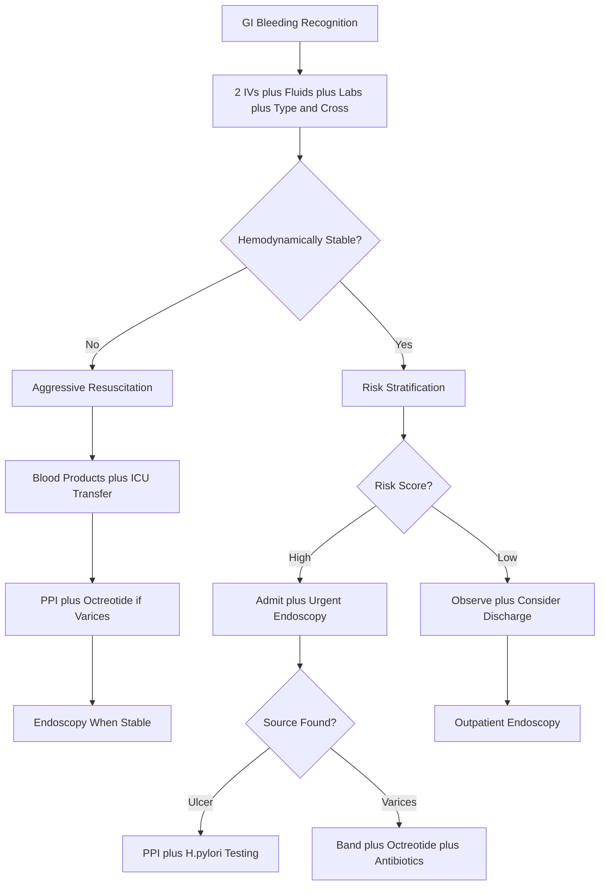

# GI Bleeding – Clinical Call Protocol

**Guidelines Referenced:**  
American College of Gastroenterology Clinical Guideline for Management of Patients with Acute Lower Gastrointestinal Bleeding 2016, AGA Institute Guidelines on the Management of Acute Diverticular Bleeding 2021, Baveno VII Consensus Workshop on Portal Hypertension 2022

**Official Sources:**  
https://journals.lww.com/ajg/fulltext/2019/03000/acg_clinical_guideline__management_of_patients.9.aspx  
https://www.gastrojournal.org/article/S0016-5085(21)00883-7/fulltext  
https://www.journal-of-hepatology.eu/article/S0168-8278(21)02108-4/fulltext

## CARD INTERFACE LAYOUT

### Card 0 – Dynamic Action Card (Node Dependent)

```
┌─────────────────────────────────────────────────────────────┐
│ GI BLEEDING ASSESSMENT                                      │
├─────────────────────────────────────────────────────────────┤
│ 📱 CALLED BY: Med-Surg RN, Room 312                        │
│ Patient: 68yo M with cirrhosis, melena x3 episodes today   │
│                                                           │
│ ┌─────────────────────────────────┐                        │
│ │     IMMEDIATE ACTIONS           │                        │
│ │ ☑ 2 large bore IVs placed       │ [18G bilateral]        │
│ │ ☑ NS bolus 500mL running        │ [Wide open]            │
│ │ ☑ Type & cross 4 units          │ [Blood bank notified]  │
│ │ ☑ CBC, coags, BMP sent          │ [STAT labs]            │
│ │ ☐ GI consult called             │ [For endoscopy]        │
│ │ ☐ Pantoprazole 80mg IV          │ [High-dose PPI]        │
│ │ ☐ Octreotide if varices         │ [50mcg bolus ready]    │
│ │                                │                        │
│ │ Cirrhosis → High variceal risk  │                        │
│ └─────────────────────────────────┘                        │
│                                                           │
│ VITALS: BP 96/58, HR 112, RR 20, SpO2 97%, T 37.1°C       │
│ Orthostatic changes: +20 HR increase standing              │
│                                                           │
│ PRESENTATION:                                              │
│ • 3 episodes melena today, no hematemesis                  │
│ • Lightheaded when standing, takes warfarin                │
│                                                           │
│ LABS:                                                      │
│ • Hgb: 6.8 g/dL (baseline 10.2) • INR: 3.4                │
│ • Platelets: 89K • BUN: 48 mg/dL                          │
│                                                           │
│ 🚨 Glasgow-Blatchford Score: 12 (HIGH RISK)               │
│ Urgent endoscopy and ICU monitoring indicated              │
└─────────────────────────────────────────────────────────────┘
```

**Example - Variceal Bleeding Management Node:**

```
┌─────────────────────────────────────────────────────────────┐
│ VARICEAL BLEEDING PROTOCOL                                  │
├─────────────────────────────────────────────────────────────┤
│ CONFIRMED VARICEAL SOURCE                                  │
│ Child-Pugh Class B cirrhosis, MELD score 16               │
│                                                           │
│ ┌─────────────────────────────────┐                        │
│ │     SPECIFIC INTERVENTIONS      │                        │
│ │ ☑ Octreotide 50mcg IV bolus     │ [Given 16:32]          │
│ │ ☑ Octreotide 50mcg/hr infusion  │ [Running x 3-5 days]   │
│ │ ☑ Ceftriaxone 1g IV daily      │ [SBP prophylaxis]      │
│ │ ☑ PPI 40mg IV BID               │ [Ulcer prophylaxis]    │
│ │ ☐ Endoscopic banding            │ [Completed - 3 bands]  │
│ │ ☐ TIPS evaluation               │ [If refractory]        │
│ │                                │                        │
│ │ Balloon tamponade ready if failure│                       │
│ └─────────────────────────────────┘                        │
│                                                           │
│ HEMODYNAMIC TARGETS:                                       │
│ • MAP >65 mmHg (current: 71)                              │
│ • Hgb >7 g/dL but avoid overtransfusion                   │
│ • SBP <100-120 mmHg (prevent rebleeding)                  │
│                                                           │
│ POST-BANDING STATUS:                                       │
│ • 3 bands applied to esophageal varices                    │
│ • No active bleeding observed                              │
│ • Continue octreotide x 72 hours                           │
│                                                           │
│ MONITORING:                                                │
│ • ICU level care, q4h Hgb checks                          │
│ • Watch for hepatic encephalopathy                         │
│ • Lactulose 30mL PO TID if altered MS                      │
│                                                           │
│ 📞 Hepatology consult: TIPS evaluation if rebleeds         │
│ Transfer Center: 856-886-5111                              │
└─────────────────────────────────────────────────────────────┘
```

### Card 1 – Static Assessment/Classification & Risk Factors

```
┌─────────────────────────────────────────────────────────────┐
│ GI BLEEDING CLASSIFICATION & ASSESSMENT                     │
├─────────────────────────────────────────────────────────────┤
│ UPPER GI BLEEDING (proximal to ligament of Treitz):        │
│ • Presentation: Melena, hematemesis, coffee grounds        │
│ • BUN/Creatinine ratio >30:1 (upper GI protein absorption) │
│ • Causes: PUD (40%), varices (10%), Mallory-Weiss (5%)     │
│                                                           │
│ LOWER GI BLEEDING (distal to ligament of Treitz):          │
│ • Presentation: Hematochezia, maroon stools                │
│ • Normal BUN/Creatinine ratio                              │
│ • Causes: Diverticular (40%), angiodysplasia, hemorrhoids  │
│                                                           │
│ RISK STRATIFICATION TOOLS:                                 │
│ Glasgow-Blatchford Score (0-23): BUN elevation, low Hgb,   │
│ hypotension, tachycardia, melena, syncope                  │
│ Score >6 = High risk for intervention                      │
│                                                           │
│ Rockall Score: Age, shock, comorbidities, diagnosis,       │
│ endoscopic stigmata (bleeding, clot, visible vessel)       │
│                                                           │
│ HIGH-RISK FEATURES:                                        │
│ • Hemodynamic instability (SBP <100, HR >100)             │
│ • Active bleeding or stigmata of recent bleeding           │
│ • Esophageal/gastric varices                               │
│ • Coagulopathy (INR >1.5, platelets <50K)                 │
│ • Age >60, significant comorbidities                       │
│ • Recurrent bleeding during admission                      │
│                                                           │
│ VARICEAL BLEEDING PREDICTORS:                              │
│ • Known cirrhosis/portal hypertension                      │
│ • Splenomegaly, thrombocytopenia                           │
│ • Massive bleeding with hemodynamic compromise             │
│ • Child-Pugh Class B/C                                     │
│                                                           │
│ MEDICATION HISTORY: Anticoagulants, NSAIDs, corticosteroids,│
│ bisphosphonates, recent procedure/trauma                    │
└─────────────────────────────────────────────────────────────┘
```

### Card 2 – Static Physical Exam/Medications & Management

```
┌─────────────────────────────────────────────────────────────┐
│ PHYSICAL EXAM & MEDICATIONS                                 │
├─────────────────────────────────────────────────────────────┤
│ FOCUSED EXAMINATION:                                       │
│ • Vitals: Orthostatic changes, tachycardia, hypotension    │
│ • General: Pallor, jaundice, confusion, signs of shock     │
│ • Abdominal: Hepatosplenomegaly, ascites, masses, tenderness│
│ • Rectal: Melena, bright red blood, hemorrhoids, masses    │
│ • Stigmata of liver disease: Spider angiomata, palmar erythema│
│                                                           │
│ 💧 RESUSCITATION PROTOCOLS:                                │
│ • IV access: 2 large bore (18G or larger)                  │
│ • Fluids: NS/LR boluses, target MAP >65 mmHg               │
│ • Avoid over-resuscitation (worsens portal pressure)       │
│                                                           │
│ 🩸 BLOOD PRODUCT MANAGEMENT:                               │
│ Hemoglobin targets: Stable patients >7 g/dL, cardiac       │
│ disease >8 g/dL, active bleeding >9 g/dL                   │
│ • FFP: If INR >1.5 and active bleeding                     │
│ • Platelets: If <50K and active bleeding                   │
│ • Cryoprecipitate: If fibrinogen <150 mg/dL                │
│                                                           │
│ 💊 PHARMACOLOGIC MANAGEMENT:                               │
│ • PPIs: Pantoprazole 80mg IV bolus, then 40mg IV BID       │
│   (Pre-endoscopy for suspected peptic ulcer disease)       │
│ • Octreotide: 50mcg IV bolus, then 50mcg/hr x 3-5 days     │
│   (Suspected variceal bleeding, reduces portal pressure)    │
│ • Antibiotics: Ceftriaxone 1g IV daily (cirrhotic patients)│
│   Reduces bacterial translocation and rebleeding risk      │
│                                                           │
│ 🚫 ANTICOAGULATION REVERSAL:                               │
│ • Hold all anticoagulants and antiplatelet agents          │
│ • Warfarin: Vitamin K 10mg IV + 4-factor PCC if urgent     │
│ • DOACs: Specific reversal agents when available           │
│ • Aspirin: Consider platelet transfusion if severe bleeding│
│                                                           │
│ ENDOSCOPY TIMING: Urgent (<12h) if unstable, early (<24h)  │
│ if stable high-risk, delayed if low-risk                   │
│                                                           │
│ LINK TO MASSIVE TRANSFUSION PROTOCOL: If ongoing bleeding  │
└─────────────────────────────────────────────────────────────┘
```

## FLOWCHART (Bottom Panel – Mermaid Algorithm)



## INTERACTIVE ELEMENTS

### Blood Product Calculator
```
┌─────────────────────────────────────────┐
│      TRANSFUSION DECISION SUPPORT       │
├─────────────────────────────────────────┤
│ Current Hgb: 6.8 g/dL                   │
│ Baseline Hgb: 10.2 g/dL                 │
│ Patient factors: No cardiac disease      │
│ Bleeding status: Active bleeding         │
│                                         │
│ HEMOGLOBIN TARGETS:                     │
│ ● Active bleeding: >7-9 g/dL            │
│ ○ Stable patient: >7 g/dL               │
│ ○ Cardiac disease: >8 g/dL              │
│                                         │
│ BLOOD PRODUCT NEEDS:                    │
│ PRBCs: 2-3 units recommended            │
│ Expected rise: 1 g/dL per unit          │
│                                         │
│ COAGULOPATHY CORRECTION:                │
│ ☑ FFP: 2-4 units (INR 3.4 → goal <1.5) │
│ ☑ Platelets: 1 dose (89K → goal >50K)   │
│ ☑ Vitamin K: 10mg IV for warfarin       │
│                                         │
│ ESTIMATED BLOOD LOSS: ~1500-2000 mL     │
│ (Based on Hgb drop from 10.2 to 6.8)    │
│                                         │
│ [ORDER BLOOD PRODUCTS] [MASSIVE TRANSFUSION]│
└─────────────────────────────────────────┘
```

### Glasgow-Blatchford Score Calculator
```
┌─────────────────────────────────────────┐
│    GLASGOW-BLATCHFORD RISK SCORE        │
├─────────────────────────────────────────┤
│ CLINICAL PARAMETERS:                    │
│                                         │
│ BUN (mg/dL):                            │
│ ● ≥25: [48] = 4 points                  │
│                                         │
│ Hemoglobin (g/dL):                      │
│ ● Male <10.0: [6.8] = 6 points          │
│                                         │
│ Systolic BP (mmHg):                     │
│ ● 90-99: [96] = 1 point                 │
│                                         │
│ Heart Rate (bpm):                       │
│ ● >100: [112] = 1 point                 │
│                                         │
│ Presentation:                           │
│ ● Melena: Yes = 0 points                │
│ ○ Syncope: No = 0 points                │
│                                         │
│ TOTAL SCORE: 12/23                      │
│                                         │
│ RISK STRATIFICATION:                    │
│ 🔴 HIGH RISK (Score >6)                 │
│ Need for intervention: >75%              │
│ Mortality risk: Moderate                │
│                                         │
│ RECOMMENDATIONS:                        │
│ • Urgent endoscopy within 12-24 hours   │
│ • ICU or telemetry monitoring           │
│ • Blood products readily available      │
│                                         │
│ [RECALCULATE] [ENDOSCOPY CONSULT]       │
└─────────────────────────────────────────┘
```

### GI Bleeding Medication Manager
```
┌─────────────────────────────────────────┐
│       GI BLEEDING MEDICATION GUIDE      │
├─────────────────────────────────────────┤
│ CLINICAL SCENARIO: Cirrhotic patient    │
│ with suspected variceal bleeding        │
│                                         │
│ VARICEAL BLEEDING PROTOCOL:             │
│ ☑ Octreotide 50mcg IV bolus NOW         │
│ ☑ Octreotide 50mcg/hr continuous x3-5d  │
│ ☑ Ceftriaxone 1g IV daily x7 days       │
│   (SBP prophylaxis, mortality benefit)  │
│                                         │
│ ACID SUPPRESSION:                       │
│ ☑ Pantoprazole 40mg IV BID              │
│   (Ulcer prophylaxis, not primary tx)   │
│                                         │
│ ANTICOAGULATION MANAGEMENT:             │
│ ☑ Hold warfarin immediately             │
│ ☑ Vitamin K 10mg IV slow push           │
│ ☐ 4-Factor PCC 25-50 units/kg          │
│   (Consider if urgent procedure needed)  │
│                                         │
│ HEPATIC SUPPORT:                        │
│ ☐ Lactulose 30mL PO TID                │
│   (If hepatic encephalopathy develops)  │
│                                         │
│ MEDICATION INTERACTIONS:                │
│ ⚠️ Avoid NSAIDs, check drug levels      │
│ Adjust doses for hepatic impairment     │
│                                         │
│ [PLACE ORDERS] [DRUG INTERACTION CHECK]  │
└─────────────────────────────────────────┘
```

## VIRTUA VOORHEES GI BLEEDING ADDENDA

- **Gastroenterology Consultation:** 24/7 availability via Transfer Center 856-886-5111 for urgent endoscopy and complex cases
- **Interventional Radiology:** TIPS procedures and angiographic intervention for refractory bleeding
- **Blood Bank Services:** Massive transfusion protocol activation, rapid blood product delivery
- **Quality Metrics:** Time to endoscopy for high-risk patients, appropriate PPI use, 30-day rebleeding rates

## REFERENCE (GUIDELINE & SOURCE)
American College of Gastroenterology Clinical Guideline: Management of Patients with Acute Lower Gastrointestinal Bleeding. 2016.  
https://journals.lww.com/ajg/fulltext/2019/03000/acg_clinical_guideline__management_of_patients.9.aspx

**Additional References:**  
AGA Institute Guidelines on the Management of Acute Diverticular Bleeding. 2021.  
https://www.gastrojournal.org/article/S0016-5085(21)00883-7/fulltext

Baveno VII Consensus Workshop: Personalized Care in Portal Hypertension. 2022.  
https://www.journal-of-hepatology.eu/article/S0168-8278(21)02108-4/fulltext

Gralnek IM, et al. Diagnosis and management of nonvariceal upper gastrointestinal hemorrhage: European Society of Gastrointestinal Endoscopy (ESGE) Guideline. Endoscopy. 2015.  
https://www.thieme-connect.com/products/ejournals/abstract/10.1055/s-0034-1393172

**All steps follow current evidence-based guidelines for GI bleeding management with integrated risk stratification tools, blood product protocols, and optimized endoscopic intervention timing with seamless links to massive transfusion protocols for severe cases.**
