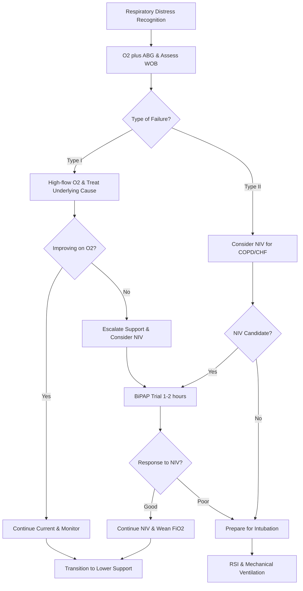

# Acute Respiratory Failure – Clinical Call Protocol

**Guidelines Referenced:**  
American Thoracic Society/European Respiratory Society Clinical Practice Guidelines for Acute Respiratory Failure 2017, British Thoracic Society Guidelines for Non-Invasive Ventilation in Acute Respiratory Failure 2016, GOLD Global Strategy for COPD 2023

**Official Sources:**  
https://www.atsjournals.org/doi/10.1164/rccm.201610-2058ST  
https://www.brit-thoracic.org.uk/quality-improvement/guidelines/emergency-oxygen/  
https://goldcopd.org/2023-gold-report-2/

## CARD INTERFACE LAYOUT

### Card 0 – Dynamic Action Card (Node Dependent)

```
┌─────────────────────────────────────────────────────────────┐
│ ACUTE RESPIRATORY FAILURE                                   │
├─────────────────────────────────────────────────────────────┤
│ 📱 CALLED BY: Step-down RN, Bed 14                         │
│ Patient: 71yo F with COPD, increased work of breathing      │
│                                                           │
│ ┌─────────────────────────────────┐                        │
│ │     IMMEDIATE ACTIONS           │                        │
│ │ ☑ High-flow O2 started          │ [15L NRB → SpO2 90%]   │
│ │ ☑ ABG sent                      │ [Results below]        │
│ │ ☑ CXR ordered portable          │ [Pending]              │
│ │ ☑ RT at bedside                │ [BiPAP setup ready]    │
│ │ ☐ BiPAP trial started          │ [Consider based on ABG] │
│ │ ☐ Intubation kit ready         │ [If NIV fails]         │
│ │                                │                        │
│ │ Bronchodilators: Continuous albuterol│                   │
│ │ Steroids: Methylpred 125mg IV   │                        │
│ └─────────────────────────────────┘                        │
│                                                           │
│ VITALS: BP 158/92, HR 112, RR 32, SpO2 90% on 15L, T 37.9°C│
│                                                           │
│ ABG RESULTS:                                               │
│ • pH: 7.22 (acidotic)  • PaCO2: 78 (↑↑)                   │
│ • PaO2: 58 (hypoxemic) • HCO3: 30 (compensated)           │
│                                                           │
│ 🚨 TYPE II RESPIRATORY FAILURE                             │
│ Acute on chronic hypercapnia - BiPAP candidate             │
└─────────────────────────────────────────────────────────────┘
```

**Example - BiPAP Management Node:**

```
┌─────────────────────────────────────────────────────────────┐
│ BiPAP TRIAL INITIATED                                       │
├─────────────────────────────────────────────────────────────┤
│ CURRENT SETTINGS:                                          │
│ IPAP: 14 cmH2O | EPAP: 6 cmH2O | FiO2: 60% | Rate: 12     │
│                                                           │
│ ┌─────────────────────────────────┐                        │
│ │     30-MINUTE ASSESSMENT        │                        │
│ │                                │                        │
│ │ IMPROVEMENT NOTED:              │                        │
│ │ • RR: 32 → 24 (↓ 8/min) ✓      │ [Target <25]           │
│ │ • SpO2: 84% → 91% ✓            │ [Target 88-92%]        │
│ │ • Accessory muscle use: ↓       │ [Less prominent]       │
│ │ • Speaking: 2-3 → 5-6 words     │ [Improved]             │
│ │                                │                        │
│ │ PATIENT TOLERANCE:              │                        │
│ │ • Mask seal: Good               │ [No air leaks]         │
│ │ • Comfort: 7/10                 │ [Acceptable]           │
│ │ • Synchrony: Good               │ [No fighting vent]     │
│ └─────────────────────────────────┘                        │
│                                                           │
│ REPEAT ABG IN 1 HOUR:                                      │
│ Expect: pH >7.30, PaCO2 <70, improved oxygenation         │
│                                                           │
│ SUCCESS CRITERIA:                                          │
│ • pH >7.30 within 2 hours                                 │
│ • RR <25, improved mental status                           │
│ • SpO2 88-92% on reduced FiO2                             │
│                                                           │
│ ⚠️ FAILURE → Prepare for intubation                        │
└─────────────────────────────────────────────────────────────┘
```

### Card 1 – Static Assessment/Types & Causes

```
┌─────────────────────────────────────────────────────────────┐
│ RESPIRATORY FAILURE TYPES & CAUSES                         │
├─────────────────────────────────────────────────────────────┤
│ TYPE I (HYPOXEMIC FAILURE):                                │
│ • PaO2 <60 mmHg on room air                                │
│ • Normal or low PaCO2                                       │
│ • V/Q mismatch or shunt physiology                         │
│ • Causes: Pneumonia, ARDS, pulmonary edema, PE, atelectasis│
│                                                           │
│ TYPE II (HYPERCAPNIC FAILURE):                             │
│ • PaCO2 >45 mmHg with pH <7.35                             │
│ • ± Hypoxemia                                              │
│ • Ventilatory pump failure                                 │
│ • Causes: COPD exacerbation, severe asthma, neuromuscular, │
│   overdose, chest wall deformity                          │
│                                                           │
│ MIXED TYPE:                                                │
│ • Both hypoxemia + hypercapnia                             │
│ • Severe pneumonia, ARDS, end-stage lung disease          │
│                                                           │
│ WORK OF BREATHING ASSESSMENT:                              │
│ • RR >30/min, accessory muscle use, tripod positioning     │
│ • Paradoxical breathing, speaking ability (<5 words)       │
│ • Mental status: Confusion (hypoxia), somnolence (CO2)     │
│                                                           │
│ P/F RATIO (PaO2/FiO2):                                     │
│ • >300: Normal  • 200-300: Mild ARDS                      │
│ • 100-200: Moderate ARDS  • <100: Severe ARDS             │
│                                                           │
│ PRECIPITATING FACTORS:                                     │
│ • Infection (pneumonia, sepsis)                           │
│ • Heart failure exacerbation                              │
│ • Medication non-compliance                                │
│ • Environmental factors (pollution, allergens)             │
│                                                           │
│ RED FLAGS: pH <7.25, altered mental status, hemodynamic    │
│ instability, inability to protect airway, cardiac arrest   │
└─────────────────────────────────────────────────────────────┘
```

### Card 2 – Static Physical Exam/Medications

```
┌─────────────────────────────────────────────────────────────┐
│ PHYSICAL EXAM & MEDICATIONS                                 │
├─────────────────────────────────────────────────────────────┤
│ FOCUSED EXAMINATION:                                       │
│ • Vitals: RR >30, SpO2 <90%, tachycardia, hypertension     │
│ • General: Accessory muscle use, tripod position, cyanosis  │
│ • Pulmonary: Wheeze (COPD), rales (CHF), decreased sounds   │
│ • Cardiac: S3 gallop, irregular rhythm, JVD                │
│ • Neurologic: Confusion, somnolence, asterixis             │
│                                                           │
│ 💨 OXYGEN DELIVERY SYSTEMS:                                │
│ Target SpO2: 88-92% (COPD), >92% (non-COPD)               │
│ • Nasal cannula: 1-6L/min (FiO2 24-44%)                   │
│ • Simple mask: 5-10L/min (FiO2 35-60%)                    │
│ • Non-rebreather: 15L/min (FiO2 85-95%)                   │
│ • High-flow nasal cannula: Up to 60L/min, heated/humidified│
│                                                           │
│ 💨 NON-INVASIVE VENTILATION:                               │
│ BiPAP Indications: COPD/CHF exacerbation, pH 7.25-7.35,   │
│ cooperative patient, intact airway reflexes                │
│ Initial settings: IPAP 10-12, EPAP 5, FiO2 100% then wean │
│ Contraindications: Altered mental status, vomiting risk,   │
│ facial trauma, hemodynamic instability                     │
│                                                           │
│ 💊 PHARMACOLOGIC TREATMENT:                                │
│ • Bronchodilators: Albuterol 2.5-5mg nebx3, then q20min   │
│   Ipratropium 0.5mg neb q6h, consider continuous albuterol │
│ • Corticosteroids: Methylprednisolone 125mg IV q6h or      │
│   Prednisone 40-60mg PO daily x 5 days                    │
│ • Antibiotics: If bacterial infection suspected            │
│   (Azithromycin 500mg + Ceftriaxone 1g IV)                │
│                                                           │
│ INTUBATION CRITERIA:                                       │
│ Failed NIV trial, pH <7.25, altered mental status,        │
│ respiratory arrest, inability to protect airway            │
│                                                           │
│ LINK TO RSI PROTOCOL: Seamless transition if NIV fails     │
└─────────────────────────────────────────────────────────────┘
```

## FLOWCHART (Bottom Panel – Mermaid Algorithm)



## INTERACTIVE ELEMENTS

### ABG Quick Interpreter
```
┌─────────────────────────────────────────┐
│         ABG RAPID ANALYSIS              │
├─────────────────────────────────────────┤
│ pH: [7.22]     (7.35-7.45)             │
│ PaCO2: [78]    (35-45 mmHg)            │
│ PaO2: [58]     (80-100 mmHg)           │
│ HCO3: [30]     (22-28 mEq/L)           │
│ SaO2: [87]%    (>95%)                  │
│                                         │
│ PRIMARY DISORDER:                       │
│ 🔴 Respiratory Acidosis                 │
│                                         │
│ COMPENSATION:                           │
│ Partial metabolic compensation          │
│ Expected HCO3: 29-31 (actual: 30) ✓    │
│                                         │
│ OXYGENATION STATUS:                     │
│ Hypoxemia - moderate                    │
│ P/F Ratio: 97 (severe, on 60% FiO2)    │
│ A-a Gradient: 45 (elevated)            │
│                                         │
│ INTERPRETATION:                         │
│ → Acute on chronic Type II failure      │
│ → COPD exacerbation likely              │
│ → BiPAP candidate                       │
│                                         │
│ [CALCULATE P/F] [TREND VALUES]          │
└─────────────────────────────────────────┘
```

### BiPAP Optimization Guide
```
┌─────────────────────────────────────────┐
│      BiPAP SETTINGS OPTIMIZER           │
├─────────────────────────────────────────┤
│ CURRENT SETTINGS:                       │
│ IPAP: 14 cmH2O [▲▼ Adjust]             │
│ EPAP: 6 cmH2O  [▲▼ Adjust]             │
│ FiO2: 60%      [▲▼ Titrate]            │
│ Backup Rate: 12/min                     │
│                                         │
│ PATIENT RESPONSE (30 min):              │
│ • RR: 32 → 24 ✓ Improving               │
│ • SpO2: 84% → 91% ✓ Target range        │
│ • Mental status: Alert                  │
│ • Mask tolerance: Good                  │
│                                         │
│ RECOMMENDATIONS:                        │
│ ✓ Current settings appropriate          │
│ • Wean FiO2 to 50% if SpO2 stable      │
│ • Recheck ABG in 1 hour                 │
│                                         │
│ ESCALATION CRITERIA:                    │
│ • pH <7.25 after 2 hours               │
│ • Worsening mental status               │
│ • Inability to maintain SpO2 >88%      │
│                                         │
│ SUCCESS MARKERS:                        │
│ pH >7.30, RR <25, improved comfort      │
│                                         │
│ [ADJUST SETTINGS] [RECHECK ABG]         │
└─────────────────────────────────────────┘
```

### Intubation Decision Support
```
┌─────────────────────────────────────────┐
│     INTUBATION READINESS CHECKER        │
├─────────────────────────────────────────┤
│ CLINICAL INDICATIONS:                   │
│ ☐ pH <7.25 despite optimal NIV         │
│ ☑ Worsening mental status               │
│ ☐ Hemodynamic instability               │
│ ☐ Inability to protect airway           │
│ ☐ Respiratory arrest                    │
│                                         │
│ NIV TRIAL STATUS:                       │
│ Duration: 2 hours                       │
│ Response: Partial improvement            │
│ pH trend: 7.22 → 7.28                   │
│ Mental status: Alert but anxious        │
│                                         │
│ EQUIPMENT READY:                        │
│ ☑ ETT 7.5 available                    │
│ ☑ RSI medications drawn                 │
│ ☑ BVM with PEEP valve                  │
│ ☑ Suction setup                        │
│                                         │
│ TEAM ASSEMBLY:                          │
│ ☑ Respiratory therapist present         │
│ ☑ Second provider available             │
│ ☐ Anesthesia backup called              │
│                                         │
│ RECOMMENDATION:                         │
│ Continue NIV trial x 1 more hour        │
│ If no improvement → Proceed with RSI     │
│                                         │
│ [CONTINUE NIV] [PROCEED RSI] [CALL BACKUP]│
└─────────────────────────────────────────┘
```

## VIRTUA VOORHEES ACUTE RESPIRATORY FAILURE ADDENDA

- **Respiratory Therapy Services:** 24/7 RT coverage with BiPAP/CPAP expertise, high-flow nasal cannula capabilities, and ventilator management
- **RSI Protocol Integration:** Seamless transition to rapid sequence intubation if non-invasive ventilation fails
- **Critical Care Support:** ICU beds available for mechanical ventilation with pulmonology consultation via Transfer Center 856-886-5111
- **Quality Metrics:** Time to BiPAP initiation, non-invasive ventilation success rates, intubation avoidance, length of stay

## REFERENCE (GUIDELINE & SOURCE)
American Thoracic Society/European Respiratory Society Clinical Practice Guidelines for Acute Respiratory Failure 2017.  
https://www.atsjournals.org/doi/10.1164/rccm.201610-2058ST

**Additional References:**  
British Thoracic Society Guidelines for Non-Invasive Ventilation in Acute Respiratory Failure 2016  
https://www.brit-thoracic.org.uk/quality-improvement/guidelines/emergency-oxygen/

GOLD Global Strategy for Prevention, Diagnosis and Management of COPD 2023  
https://goldcopd.org/2023-gold-report-2/

Rochwerg B, et al. Official ERS/ATS Clinical Practice Guidelines: Non-invasive Ventilation for Acute Respiratory Failure. Eur Respir J. 2017.  
https://erj.ersjournals.com/content/50/2/1602426

**All steps follow current evidence-based guidelines for acute respiratory failure management with integrated ABG interpretation, BiPAP optimization protocols, and seamless transition to mechanical ventilation via RSI protocol when non-invasive approaches fail.**
