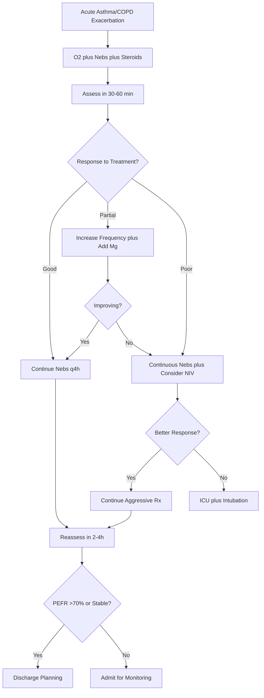

# Asthma & COPD Exacerbation – Clinical Call Protocol

**Guidelines Referenced:**  
Global Initiative for Asthma (GINA) 2023 Guidelines, Global Initiative for Chronic Obstructive Lung Disease (GOLD) 2023 Report, British Thoracic Society/Scottish Intercollegiate Guidelines Network (BTS/SIGN) 2019 British Guideline on the Management of Asthma

**Official Sources:**  
https://ginasthma.org/2023-gina-main-report/  
https://goldcopd.org/2023-gold-report-2/  
https://www.brit-thoracic.org.uk/quality-improvement/guidelines/asthma/

## CARD INTERFACE LAYOUT

### Card 0 – Dynamic Action Card (Node Dependent)

```
┌─────────────────────────────────────────────────────────────┐
│ SEVERE ASTHMA EXACERBATION                                  │
├─────────────────────────────────────────────────────────────┤
│ 📱 CALLED BY: ED RN, Room 12                               │
│ Patient: 28yo F with known asthma, worsening SOB           │
│                                                           │
│ ┌─────────────────────────────────┐                        │
│ │     IMMEDIATE TREATMENT         │                        │
│ │ ☑ Albuterol 5mg neb x3 started │ [q20min x3 doses]      │
│ │ ☑ Ipratropium 0.5mg added      │ [Synergistic effect]   │
│ │ ☑ Methylpred 125mg IV given    │ [Anti-inflammatory]    │
│ │ ☑ O2 applied - SpO2 95%        │ [4L NC titrated]       │
│ │ ☐ Magnesium 2g ordered         │ [For severe cases]     │
│ │ ☐ ABG if not improving         │ [Assess ventilation]   │
│ │ ☐ Continuous albuterol         │ [If poor response]     │
│ │                                │                        │
│ │ Reassess in 30 minutes          │                        │
│ └─────────────────────────────────┘                        │
│                                                           │
│ VITALS: BP 138/84, HR 118, RR 28, SpO2 95% on 4L, T 37.2°C│
│                                                           │
│ SEVERITY ASSESSMENT:                                       │
│ • PEFR: 180 L/min (40% predicted) - SEVERE                │
│ • Speaking: Phrases only                                   │
│ • Pulsus paradoxus: >15 mmHg                              │
│ • Accessory muscle use: Present                           │
│                                                           │
│ 🚨 SEVERE EXACERBATION - Monitor closely for deterioration │
│ Previous ICU admission 2 years ago for status asthmaticus  │
└─────────────────────────────────────────────────────────────┘
```

**Example - COPD Exacerbation Node:**

```
┌─────────────────────────────────────────────────────────────┐
│ COPD EXACERBATION (AECOPD)                                  │
├─────────────────────────────────────────────────────────────┤
│ Patient: 68yo M with severe COPD (FEV1 35%), increased SOB  │
│                                                           │
│ ┌─────────────────────────────────┐                        │
│ │     COPD-SPECIFIC TREATMENT     │                        │
│ │ ☑ O2 target SpO2 88-92%         │ [Controlled O2 therapy]│
│ │ ☑ Albuterol/Ipratropium neb     │ [Dual bronchodilator]  │
│ │ ☑ Prednisolone 30mg PO          │ [5-day course]         │
│ │ ☑ Antibiotics if purulent       │ [Azithromycin 500mg]   │
│ │ ☐ NIV consideration             │ [If pH 7.25-7.35]     │
│ │ ☐ Aminophylline if severe       │ [Loading dose]         │
│ │                                │                        │
│ │ Home O2: 2L continuous          │                        │
│ │ Smoking: 45 pack-year history   │                        │
│ └─────────────────────────────────┘                        │
│                                                           │
│ VITALS: BP 148/88, HR 102, RR 26, SpO2 89% on 2L          │
│                                                           │
│ ANTHONISEN CRITERIA (2/3 present):                        │
│ ☑ Increased dyspnea                                       │
│ ☑ Increased sputum purulence                              │
│ ☐ Increased sputum volume                                 │
│                                                           │
│ TYPE I EXACERBATION → Antibiotics indicated               │
│ Consider NIV if acidotic (pH <7.35) but alert             │
└─────────────────────────────────────────────────────────────┘
```

### Card 1 – Static Assessment/Severity Classification

```
┌─────────────────────────────────────────────────────────────┐
│ SEVERITY CLASSIFICATION & ASSESSMENT                        │
├─────────────────────────────────────────────────────────────┤
│ ASTHMA SEVERITY (GINA 2023):                               │
│ • Mild: PEFR >70%, normal speech, mild wheeze              │
│ • Moderate: PEFR 40-69%, phrases only, loud wheeze         │
│ • Severe: PEFR <40%, words only, accessory muscles         │
│ • Life-threatening: PEFR <25%, silent chest, cyanosis      │
│                                                           │
│ COPD EXACERBATION TYPES (Anthonisen Criteria):            │
│ • Type I: All 3 symptoms (dyspnea, purulence, volume)      │
│ • Type II: 2 of 3 symptoms                                │
│ • Type III: 1 symptom + URI/fever/wheeze                  │
│                                                           │
│ COMMON TRIGGERS:                                           │
│ • Viral upper respiratory infections (#1 cause)            │
│ • Allergens (pollen, dust mites, pets)                    │
│ • Environmental factors (cold air, pollution, smoke)       │
│ • Medications (NSAIDs, beta-blockers, ACE inhibitors)     │
│ • Exercise, stress, GERD                                   │
│                                                           │
│ RED FLAGS (High-Risk Features):                            │
│ • Previous ICU admission or intubation                     │
│ • ≥3 ED visits or ≥2 hospitalizations in past year        │
│ • Current/recent oral steroid use                          │
│ • Poor medication compliance or technique                  │
│ • Psychiatric comorbidities                               │
│ • Food allergy (especially nuts, shellfish)               │
│                                                           │
│ COPD vs ASTHMA DIFFERENTIATION:                            │
│ • COPD: Older, smoking history, daily symptoms, less reversible│
│ • Asthma: Younger, allergic history, episodic, more reversible│
│ • Mixed: Asthma-COPD overlap (ACO) - treat as both        │
│                                                           │
│ HYPERCAPNIC RESPIRATORY FAILURE: pH <7.35, PaCO2 >45 mmHg │
│ Consider NIV (BiPAP) before intubation in appropriate patients│
└─────────────────────────────────────────────────────────────┘
```

### Card 2 – Static Physical Exam/Medications

```
┌─────────────────────────────────────────────────────────────┐
│ PHYSICAL EXAM & MEDICATIONS                                 │
├─────────────────────────────────────────────────────────────┤
│ FOCUSED EXAMINATION:                                       │
│ • Vitals: Tachypnea >25, tachycardia, pulsus paradoxus >10mmHg│
│ • General: Accessory muscle use, unable to lie flat        │
│ • Pulmonary: Wheeze (loud early, quiet late), decreased    │
│   air movement, prolonged expiratory phase                │
│ • Cardiac: Tachycardia, distant heart sounds if hyperinflated│
│                                                           │
│ 💨 BRONCHODILATORS:                                        │
│ • Albuterol: 2.5-5mg nebulized q20min x3, then q1-4h      │
│   Continuous: 10-15mg/hr for severe exacerbations         │
│ • Ipratropium: 0.5mg nebulized q20min x3 (with albuterol) │
│   Then q4-6h, synergistic effect with beta-agonists       │
│ • Levalbuterol: 1.25-2.5mg neb (if tachycardia concern)   │
│                                                           │
│ 💊 CORTICOSTEROIDS:                                        │
│ • Methylprednisolone: 125mg IV initially, then 40-60mg q6h │
│ • Prednisolone: 40-50mg PO daily x 5-7 days (oral option) │
│ • No taper required for courses <2 weeks                   │
│                                                           │
│ 💊 ADJUNCTIVE TREATMENTS:                                  │
│ • Magnesium sulfate: 2g IV over 20 minutes (severe asthma) │
│   Monitor for hypotension, respiratory depression          │
│ • Heliox: 70:30 or 80:20 mix (if available)               │
│   Reduces work of breathing, buys time                     │
│                                                           │
│ 💊 COPD-SPECIFIC TREATMENTS:                               │
│ • Controlled oxygen: Target SpO2 88-92% (not 94-98%)      │
│ • Antibiotics (Type I/II exacerbations): Azithromycin     │
│   500mg daily x 3 days OR Amoxicillin-clavulanate         │
│ • Aminophylline: Loading 5mg/kg IV, then 0.5mg/kg/hr      │
│   (Only if severe, monitor levels and toxicity)           │
│                                                           │
│ MONITORING: Peak flow q2-4h, continuous SpO2, cardiac     │
│ monitoring, reassess response q30min initially            │
│                                                           │
│ ESCALATION: NIV for hypercapnic failure, intubation for   │
│ exhaustion, altered mental status, silent chest, arrest   │
└─────────────────────────────────────────────────────────────┘
```

## FLOWCHART (Bottom Panel – Mermaid Algorithm)



## INTERACTIVE ELEMENTS

### Peak Flow Response Tracker
```
┌─────────────────────────────────────────┐
│       PEAK FLOW MONITORING SYSTEM       │
├─────────────────────────────────────────┤
│ Patient: 28yo F | Baseline: 450 L/min   │
│                                         │
│ TIME    PEFR   % PREDICTED  TREATMENT   │
│ 14:00   180    40% (Severe) Initial nebs│
│ 14:30   220    49%          2nd round   │
│ 15:00   280    62%          Continue    │
│ 15:30   320    71% ✓        Improving   │
│ 16:00   350    78% ✓        Stable      │
│                                         │
│ TREND: ↗ CONSISTENTLY IMPROVING          │
│                                         │
│ DISCHARGE CRITERIA:                     │
│ ☑ PEFR >70% predicted (320 L/min)       │
│ ☑ O2 saturation >92% on room air        │
│ ☑ Speaking in full sentences            │
│ ☐ No accessory muscle use               │
│ ☐ Minimal/no wheeze                     │
│                                         │
│ STATUS: Meeting criteria for discharge   │
│                                         │
│ [UPDATE PEFR] [ASSESS SYMPTOMS]         │
└─────────────────────────────────────────┘
```

### Severity Score Calculator
```
┌─────────────────────────────────────────┐
│    ASTHMA EXACERBATION SEVERITY SCORE   │
├─────────────────────────────────────────┤
│ INITIAL ASSESSMENT:                     │
│                                         │
│ Speech pattern:                         │
│ ● Phrases only (2 points)               │
│                                         │
│ Position preference:                    │
│ ● Sitting upright (1 point)             │
│                                         │
│ Wheeze character:                       │
│ ● Loud bilateral wheeze (2 points)      │
│                                         │
│ Accessory muscle use:                   │
│ ● Present throughout (2 points)         │
│                                         │
│ Peak flow (% predicted):                │
│ ● 40% predicted (2 points)              │
│                                         │
│ TOTAL INITIAL SCORE: 9/10 (SEVERE)      │
│                                         │
│ AFTER TREATMENT (1 hour):               │
│ Speech: Full sentences (0 pts)          │
│ Position: Can lie back (0 pts)          │
│ Wheeze: Mild expiratory (1 pt)          │
│ Accessory muscles: Minimal (1 pt)       │
│ Peak flow: 71% predicted (0 pts)        │
│                                         │
│ POST-TREATMENT SCORE: 2/10 (MILD)       │
│                                         │
│ RESPONSE: EXCELLENT                     │
│ Plan: Transition to discharge planning   │
│                                         │
│ [RECALCULATE] [TREND ANALYSIS]          │
└─────────────────────────────────────────┘
```

### COPD Exacerbation Assessment
```
┌─────────────────────────────────────────┐
│    COPD EXACERBATION CLASSIFICATION     │
├─────────────────────────────────────────┤
│ ANTHONISEN CRITERIA:                    │
│                                         │
│ Major Symptoms:                         │
│ ☑ Increased dyspnea (baseline → severe) │
│ ☑ Increased sputum purulence (yellow)   │
│ ☐ Increased sputum volume               │
│                                         │
│ Minor Symptoms:                         │
│ ☑ Upper respiratory infection           │
│ ☐ Fever >38°C                          │
│ ☑ Increased wheeze                      │
│ ☐ Increased cough                       │
│                                         │
│ CLASSIFICATION: TYPE I (2+ major)       │
│                                         │
│ ANTIBIOTIC INDICATION: YES              │
│ Recommended: Azithromycin 500mg x 3d    │
│ Alternative: Amoxicillin-clavulanate    │
│                                         │
│ SEVERITY MARKERS:                       │
│ • Home O2 dependent: Yes                │
│ • FEV1 <50%: Yes (35% predicted)        │
│ • Frequent exacerbations: 3/year        │
│                                         │
│ PROGNOSIS: Moderate-high risk           │
│ Consider NIV if pH 7.25-7.35            │
│                                         │
│ [ANTIBIOTIC ORDERS] [NIV ASSESSMENT]    │
└─────────────────────────────────────────┘
```

### Discharge Readiness Checklist
```
┌─────────────────────────────────────────┐
│      ASTHMA DISCHARGE CRITERIA          │
├─────────────────────────────────────────┤
│ CLINICAL STABILITY:                     │
│ ☑ PEFR >70% personal best (350/450)     │
│ ☑ O2 saturation >92% on room air        │
│ ☑ No accessory muscle use               │
│ ☑ Speaking in full sentences            │
│ ☑ Minimal/no wheeze on exam             │
│                                         │
│ MEDICATION OPTIMIZATION:                │
│ ☑ Prednisolone 40mg PO x 5 days         │
│ ☑ Albuterol MDI + spacer demonstrated   │
│ ☑ Controller therapy restarted          │
│   (Fluticasone/salmeterol 250/25 BID)   │
│                                         │
│ PATIENT EDUCATION COMPLETED:            │
│ ☑ Trigger identification and avoidance  │
│ ☑ Written asthma action plan reviewed   │
│ ☑ Proper inhaler technique confirmed    │
│ ☑ When to seek emergency care           │
│                                         │
│ FOLLOW-UP ARRANGEMENTS:                 │
│ ☑ Primary care in 48-72 hours           │
│ ☑ Pulmonology within 2 weeks            │
│ ☑ Return precautions given              │
│                                         │
│ OVERALL STATUS: ✅ READY FOR DISCHARGE   │
│                                         │
│ [PRINT DISCHARGE SUMMARY] [Rx ORDERS]   │
└─────────────────────────────────────────┘
```

## VIRTUA VOORHEES ASTHMA/COPD EXACERBATION ADDENDA

- **Respiratory Therapy Services:** 24/7 RT coverage with nebulizer protocols, BiPAP initiation, and continuous albuterol capabilities
- **Pulmonology Consultation:** Available via Transfer Center 856-886-5111 for severe exacerbations and discharge planning
- **Pharmacy Integration:** Medication reconciliation, inhaler technique education, and adherence counseling
- **Quality Metrics:** Time to first bronchodilator, appropriate steroid use, readmission rates within 30 days

## REFERENCE (GUIDELINE & SOURCE)
Global Initiative for Asthma (GINA). Global Strategy for Asthma Management and Prevention, 2023.  
https://ginasthma.org/2023-gina-main-report/

**Additional References:**  
Global Initiative for Chronic Obstructive Lung Disease (GOLD). Global Strategy for the Diagnosis, Management, and Prevention of COPD, 2023 Report.  
https://goldcopd.org/2023-gold-report-2/

British Thoracic Society/Scottish Intercollegiate Guidelines Network. 2019 British Guideline on the Management of Asthma.  
https://www.brit-thoracic.org.uk/quality-improvement/guidelines/asthma/

Anthonisen NR, et al. Antibiotic therapy in exacerbations of chronic obstructive pulmonary disease. Ann Intern Med. 1987.  
https://www.acpjournals.org/doi/10.7326/0003-4819-106-2-196

**All steps follow current evidence-based guidelines for asthma and COPD exacerbation management with integrated severity assessment tools, peak flow monitoring, and optimized bronchodilator and corticosteroid protocols for both conditions.**
