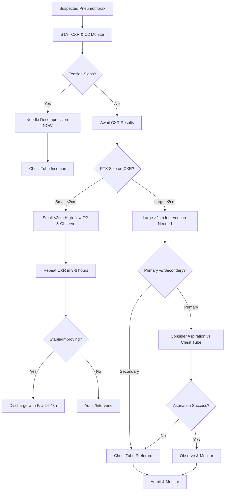

# Pneumothorax Recognition – Clinical Call Protocol

**Guidelines Referenced:**  
British Thoracic Society Pleural Disease Guideline 2010, American College of Chest Physicians Consensus Statement on Management of Spontaneous Pneumothorax 2001, ACEP Clinical Policy for Emergency Department Management of Pneumothorax 2018

**Official Sources:**  
https://www.brit-thoracic.org.uk/quality-improvement/guidelines/pleural-disease/  
https://journal.chestnet.org/article/S0012-3692(15)52843-4/fulltext  
https://www.acep.org/clinical-policies/

## CARD INTERFACE LAYOUT

### Card 0 – Dynamic Action Card (Node Dependent)

```
┌─────────────────────────────────────────────────────────────┐
│ PNEUMOTHORAX EVALUATION                                     │
├─────────────────────────────────────────────────────────────┤
│ ┌─────────────────────────────────┐                        │
│ │     IMMEDIATE ASSESSMENT        │                        │
│ │ ☑ STAT portable CXR ordered     │ [Completed 15:32]      │
│ │ ☑ O2 applied - SpO2 now 98%     │ [4L NC → improved]     │
│ │ ☑ Continuous monitoring         │ [Telemetry active]     │
│ │ ☑ IV access obtained           │ [18G left AC]          │
│ │ ☐ Chest tube tray at bedside   │ [Prepare if large]     │
│ │ ☐ Surgery notified             │ [If intervention needed]│
│ │                                │                        │
│ │ CXR Result: 4.5cm apex to cupola│                        │
│ │ Classification: LARGE PTX        │                        │
│ └─────────────────────────────────┘                        │
│                                                           │
│ VITALS: BP 118/76, HR 102, RR 24, SpO2 98% on 4L, T 37.0°C│
│                                                           │
│ PHYSICAL EXAM:                                             │
│ • Decreased breath sounds right side                       │
│ • Hyperresonant to percussion                              │
│ • No subcutaneous emphysema                                │
│ • Trachea midline (hemodynamically stable)                 │
│                                                           │
│ ⚠️ LARGE PTX (≥3cm) → Intervention required                │
│ Primary spontaneous - consider aspiration vs chest tube    │
└─────────────────────────────────────────────────────────────┘
```

**Example - Tension Pneumothorax Emergency Node:**

```
┌─────────────────────────────────────────────────────────────┐
│ 🚨 TENSION PNEUMOTHORAX - EMERGENCY                        │
├─────────────────────────────────────────────────────────────┤
│ CRITICAL SIGNS PRESENT:                                    │
│ • BP: 78/45 mmHg (hypotensive)                             │
│ • Tracheal deviation to left                               │
│ • Distended neck veins                                     │
│ • Absent breath sounds right side                          │
│                                                           │
│ ┌─────────────────────────────────┐                        │
│ │  IMMEDIATE DECOMPRESSION        │                        │
│ │                                │                        │
│ │ ☐ 14G needle ready             │ [STAT to bedside]      │
│ │ ☐ 2nd ICS midclavicular line   │ [Landmark identified]  │
│ │ ☐ Insert perpendicular to skin │ [Do NOT wait for CXR]  │
│ │ ☐ Listen for air rush          │ [Confirms placement]   │
│ │ ☐ Chest tube setup             │ [Follow immediately]   │
│ │                                │                        │
│ │ DO NOT DELAY - LIFE THREATENING │                        │
│ └─────────────────────────────────┘                        │
│                                                           │
│ POST-DECOMPRESSION:                                        │
│ • Expect immediate BP improvement                           │
│ • Place definitive chest tube 4th-5th ICS                  │
│ • ICU admission for monitoring                             │
│                                                           │
│ 📞 Surgery STAT: Via Transfer Center 856-886-5111          │
└─────────────────────────────────────────────────────────────┘
```

### Card 1 – Static Assessment/Classification

```
┌─────────────────────────────────────────────────────────────┐
│ PNEUMOTHORAX TYPES & CLASSIFICATION                        │
├─────────────────────────────────────────────────────────────┤
│ PRIMARY SPONTANEOUS:                                       │
│ • No underlying lung disease                               │
│ • Tall, thin males (classic patient)                       │
│ • Smokers, age 20-30 years                                 │
│ • Rupture of subpleural bleb/bulla                         │
│                                                           │
│ SECONDARY SPONTANEOUS:                                     │
│ • Underlying lung disease present                          │
│ • COPD/emphysema, cystic fibrosis, lung cancer            │
│ • PCP pneumonia (HIV), tuberculosis                       │
│ • Higher morbidity/mortality than primary                  │
│                                                           │
│ TRAUMATIC:                                                 │
│ • Penetrating injury, blunt trauma, rib fractures         │
│ • Iatrogenic: Central line, thoracentesis, biopsy         │
│                                                           │
│ TENSION PNEUMOTHORAX - EMERGENCY:                          │
│ • Hypotension, tracheal deviation, distended neck veins   │
│ • Absent breath sounds, immediate decompression needed     │
│                                                           │
│ SIZE CLASSIFICATION (BTS Guidelines):                      │
│ • Small: <2cm gap between lung edge and chest wall        │
│ • Large: ≥2cm gap between lung edge and chest wall        │
│                                                           │
│ CLINICAL PRESENTATION:                                     │
│ • Sudden onset sharp chest pain (90%)                     │
│ • Dyspnea (80%), dry cough                                │
│ • Shoulder tip pain (referred)                            │
│                                                           │
│ RED FLAGS: Hypotension, severe dyspnea, subcutaneous      │
│ emphysema, bilateral PTX, underlying lung disease         │
└─────────────────────────────────────────────────────────────┘
```

### Card 2 – Static Treatment Protocols

```
┌─────────────────────────────────────────────────────────────┐
│ TREATMENT PROTOCOLS & PROCEDURES                            │
├─────────────────────────────────────────────────────────────┤
│ 🔵 SMALL PRIMARY PTX (<2cm):                               │
│ • Stable patient: High-flow O2, observe 3-6 hours         │
│ • Repeat CXR, discharge if stable with 24-48h follow-up    │
│                                                           │
│ 🔴 LARGE PRIMARY PTX (≥2cm):                               │
│ • Needle aspiration (first-line): 14-16G catheter,         │
│   2nd ICS midclavicular line, aspirate with syringe        │
│ • Success rate: 50-80%                                     │
│ • If aspiration fails: chest tube insertion                │
│                                                           │
│ 🟠 SECONDARY PTX (any size):                               │
│ • Higher risk population                                   │
│ • Consider chest tube for all but smallest, stable cases   │
│ • Admit for observation even after successful aspiration   │
│                                                           │
│ ⚠️ TENSION PTX - IMMEDIATE DECOMPRESSION:                  │
│ • 14G needle, 2nd ICS midclavicular line                  │
│ • Don't wait for CXR confirmation                         │
│ • Follow immediately with chest tube placement             │
│                                                           │
│ CHEST TUBE MANAGEMENT:                                     │
│ • Size: 14-24 Fr tube, 4th-5th ICS midaxillary line       │
│ • Water seal system, suction if lung doesn't expand       │
│ • Monitor for air leak, tidaling, drainage output         │
│                                                           │
│ REMOVAL CRITERIA:                                          │
│ • Lung fully expanded on CXR                              │
│ • No air leak x 24 hours                                  │
│ • Drainage <100mL/day                                     │
│                                                           │
│ DISPOSITION:                                               │
│ Admit: Large PTX, secondary PTX, bilateral, tension,      │
│ failed aspiration, unreliable patient                     │
│ Discharge: Small stable primary PTX, resolved on CXR      │
│                                                           │
│ COMPLICATIONS: Re-expansion pulmonary edema, persistent    │
│ air leak, infection, recurrence (30% within 2 years)      │
└─────────────────────────────────────────────────────────────┘
```

## FLOWCHART (Bottom Panel – Mermaid Algorithm)



## INTERACTIVE ELEMENTS

### Pneumothorax Size Calculator
```
┌─────────────────────────────────────────┐
│        PNEUMOTHORAX SIZE CALCULATOR     │
├─────────────────────────────────────────┤
│ Measurement Method: BTS Guidelines       │
│                                         │
│ Distance from lung edge to chest wall:  │
│ At level of hilum: [4.5] cm             │
│                                         │
│ CLASSIFICATION: LARGE (≥2cm)            │
│                                         │
│ Alternative Method (Light Index):        │
│ PTX width: [2.0] cm                     │
│ Hemithorax width: [10.0] cm             │
│ Estimated volume: ~40%                   │
│                                         │
│ TREATMENT RECOMMENDATION:               │
│ → Intervention required                 │
│ → Primary: Aspiration vs chest tube     │
│ → Secondary: Chest tube preferred       │
│                                         │
│ Clinical Context:                       │
│ Patient type: ● Primary ○ Secondary     │
│ Symptoms: ● Symptomatic ○ Asymptomatic  │
│                                         │
│ [RECALCULATE] [TREATMENT GUIDE]         │
└─────────────────────────────────────────┘
```

### Chest Tube Insertion Checklist
```
┌─────────────────────────────────────────┐
│      CHEST TUBE INSERTION CHECKLIST     │
├─────────────────────────────────────────┤
│ PRE-PROCEDURE:                          │
│ ☑ Informed consent obtained             │
│ ☑ Time-out performed                    │
│ ☑ Analgesia/sedation given              │
│ ☑ Sterile field prepared                │
│                                         │
│ EQUIPMENT READY:                        │
│ ☑ 20-24 Fr chest tube                   │
│ ☑ Pleurovac water seal system           │
│ ☑ Local anesthetic (1% lidocaine)       │
│ ☑ Sterile gloves, drapes                │
│                                         │
│ INSERTION TECHNIQUE:                    │
│ Site: 4th-5th ICS midaxillary line     │
│ ☐ Skin incision 1-2cm below rib        │
│ ☐ Blunt dissection over rib            │
│ ☐ Digital exploration of pleura        │
│ ☐ Tube insertion directed posteriorly   │
│                                         │
│ POST-PROCEDURE:                         │
│ ☐ Secure with 0-silk suture            │
│ ☐ Occlusive dressing applied            │
│ ☐ CXR to confirm placement              │
│ ☐ Connect to water seal (-20cmH2O)      │
│                                         │
│ [COMPLETE CHECKLIST] [DOCUMENT]         │
└─────────────────────────────────────────┘
```

### Air Leak Monitoring System
```
┌─────────────────────────────────────────┐
│       CHEST TUBE MONITORING SYSTEM      │
├─────────────────────────────────────────┤
│ Current Status: Day 2 post-insertion    │
│                                         │
│ WATER SEAL CHAMBER:                     │
│ • Tidaling: ✓ YES (confirms patency)    │
│ • Air leak: Intermittent bubbling       │
│ • Suction: -20 cmH2O                    │
│                                         │
│ DRAINAGE OUTPUT:                        │
│ Day 1: 150 mL serosanguinous            │
│ Day 2: 75 mL serous                     │
│ Last 8 hours: 25 mL                     │
│                                         │
│ AIR LEAK PROGRESSION:                   │
│ Day 1: Continuous bubbling              │
│ Day 2: Intermittent with cough          │
│ Current: Minimal bubbling               │
│                                         │
│ REMOVAL CRITERIA:                       │
│ ☐ No air leak x 24 hours               │
│ ☐ Lung fully expanded on CXR           │
│ ☐ Drainage <100 mL/day                 │
│                                         │
│ NEXT ASSESSMENT:                        │
│ • CXR tomorrow morning                  │
│ • Consider clamp trial if criteria met  │
│                                         │
│ [UPDATE STATUS] [ORDER CXR] [CLAMP TRIAL]│
└─────────────────────────────────────────┘
```

## VIRTUA VOORHEES PNEUMOTHORAX MANAGEMENT ADDENDA

- **Thoracic Surgery Consultation:** 24/7 availability via Transfer Center 856-886-5111 for complex cases and persistent air leaks
- **Interventional Radiology:** Video-assisted thoracoscopic surgery (VATS) capabilities for recurrent pneumothorax management
- **Emergency Medicine Integration:** Immediate chest tube insertion capabilities in ED with ultrasound guidance
- **Quality Metrics:** Time to needle decompression for tension PTX, appropriate imaging utilization, chest tube duration

## REFERENCE (GUIDELINE & SOURCE)
British Thoracic Society Pleural Disease Guideline 2010.  
https://www.brit-thoracic.org.uk/quality-improvement/guidelines/pleural-disease/

**Additional References:**  
American College of Chest Physicians Consensus Statement on Management of Spontaneous Pneumothorax 2001  
https://journal.chestnet.org/article/S0012-3692(15)52843-4/fulltext

ACEP Clinical Policy for Emergency Department Management of Pneumothorax 2018  
https://www.acep.org/clinical-policies/

**All steps follow current evidence-based guidelines for pneumothorax recognition and management with integrated size assessment tools, intervention decision support, and optimized monitoring protocols for chest tube management.**
