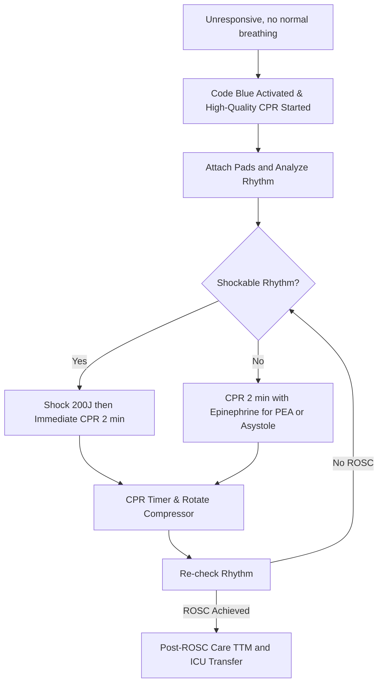

# Code Blue – Adult Cardiac Arrest (ACLS 2025) with Virtua Voorhees Addenda

**Guideline Used:**  
American Heart Association (AHA) Advanced Cardiovascular Life Support (ACLS) 2020 Guidelines (current as of July 2025)  
**Official Source:**  
https://cpr.heart.org/en/resuscitation-science/cpr-and-ecc-guidelines/adult-advanced-cardiovascular-life-support

## CARD INTERFACE LAYOUT

### Card 0 – Dynamic Action Card (Node Dependent)

```
┌─────────────────────────────────────────────────────────────┐
│ [NODE TITLE: e.g. VF/PULSELESS VT]                         │
├─────────────────────────────────────────────────────────────┤
│ IMMEDIATE ACTIONS:                                         │
│ - [Node-specific: Start CPR, Charge, Shock, Admin Meds]    │
│                                                           │
│ CPR TIMER    SHOCK COUNTER   COMPRESSION RATE              │
│  02:00         Shocks: 1      Rate: 112 BPM   🟢 GOOD      │
│ [START/STOP]  Next: 200J     (Live feedback/metronome)     │
│                                                           │
│ ☑ Checked actions  ☐ Pending   [Tap to mark]              │
│ [Meds: e.g. □ Epi after 2nd shock, □ Amio 300mg after 3rd] │
└─────────────────────────────────────────────────────────────┘
```

### Card 1 – Static Assessment/Differential

```
┌─────────────────────────────────────────────────────────────┐
│ CAUSES & DIFFERENTIAL (H's & T's)                          │
├─────────────────────────────────────────────────────────────┤
│ 🩸 Hypovolemia  🫁 Hypoxia   💧 Hypo/Hyper-K+                │
│ 🧊 Hypothermia  🪒 H+        ⚡ Thrombosis (MI/PE)            │
│ 💉 Toxins       💓 Tamponade 🫁 Tension Pneumothorax         │
│                                                           │
│ HISTORY: Witnessed? Bystander CPR? DNR? Initial rhythm?    │
└─────────────────────────────────────────────────────────────┘
```

### Card 2 – Static Physical Exam/Medication

```
┌─────────────────────────────────────────────────────────────┐
│ PHYSICAL EXAM & MEDICATIONS                                 │
├─────────────────────────────────────────────────────────────┤
│ ABCDE, airway/breath sounds/ETCO2/SpO2, pulse checks        │
│                                                           │
│ 💊 EPI 1mg IV/IO q3–5min  | 💡 AMIO 300mg > 150mg           │
│ 🔢 LIDOCAINE: 1–1.5mg/kg IV/IO (if no amio available)       │
│                                                           │
│ CONTRAINDICATIONS: None in arrest, benefit > risk           │
└─────────────────────────────────────────────────────────────┘
```

## FLOWCHART (Bottom Panel – Mermaid Algorithm)



## NODE-TO-DYNAMIC CARD PROMPT MAPPING (WITH INTERACTIVES)

| **Step (Node)**                    | **Dynamic Card Prompt/Question**                                                                 | **Interactive Components**                                        |
|-------------------------------------|--------------------------------------------------------------------------------------------------|-------------------------------------------------------------------|
| Initial Assessment                  | "Is the patient unresponsive, with no normal breathing or only gasping?"                         | [Yes/No] button                                                   |
| Activate Code / Start CPR           | "Begin high-quality CPR. Activate Code Blue team?"                                               | [Start CPR], [Activate Code], [Start Timer]                       |
| Attach Pads – Rhythm Check          | "Attach defibrillator/AED. Is a shockable rhythm detected (VF/pulseless VT)?"                    | [Analyze Rhythm], [Shockable/Non-shockable toggle]                |
| Shock Delivered (if shockable)      | "Deliver shock at 200J biphasic. Immediately resume CPR for 2min. Was shock delivered?"          | [Shock Delivered], [Resume CPR], [Shock Counter]                  |
| Non-Shockable Rhythm (PEA/Asystole) | "No shock advised. Resume CPR for 2min. Administer epinephrine 1mg IV/IO?"                       | [Epi Given], [Timer], [Dose Tracker]                              |
| CPR Cycle Timer                     | "Continue CPR. 2-min timer started. Rotate compressor at next cycle?"                             | [Timer], [Compressor Rotated]                                     |
| Rhythm Recheck (post-cycle)         | "Pause compressions <10 sec. Recheck rhythm: shockable or not?"                                  | [Rhythm Check], [Resume CPR], [Shock Delivered]                   |
| Administer Epinephrine              | "Give epinephrine 1mg IV/IO every 3–5min as soon as possible for non-shockable rhythm?"          | [Mark Dose Given], [Medication Countdown]                         |
| Advanced Airway / ETCO2 Monitoring  | "Consider advanced airway. Confirm with ETCO₂. Continue compressions?"                           | [Airway Placed], [ETCO2 Value Entry]                              |
| Refractory VF/pulseless VT          | "Still in VF/pulseless VT after multiple shocks? Give amiodarone 300mg IV/IO (then 150mg)?"      | [Mark Amio Given], [Medication Tracker]                           |
| Reversible Causes (H's & T's)       | "Evaluate/treat reversible causes (H's & T's): Hypoxia? Hypovolemia? Hyper-K+? Tamponade? MI?"   | [Expand H's/T's], [Checklist for probable causes]                 |
| ROSC Achieved                       | "Has return of spontaneous circulation (ROSC) been achieved?"                                    | [ROSC Yes/No], [Timer Stop], [Start Post-ROSC Workflow]           |
| Post-Cardiac Arrest Care            | "Begin post–cardiac arrest care: manage airway, oxygenate, initiate hypothermia protocol (TTM)?" | [Begin TTM], [Show Post-ROSC Steps], [Initiate ICU Transfer]      |
| Virtua ICU Transfer Criteria        | "Patient stable for Virtua Voorhees ICU? Initiate transfer protocols and continuous monitoring?" | [Initiate Transfer], [ICU Criteria Checklist], [Bed Request]      |

**Interactive Highlights:**  
- Compression rate: tap to record, color/feedback
- Shock delivered: tap to increment
- CPR cycle timer: start/stop/reset, rotate compressor prompt
- Medication: tap to mark as given, timers
- H's & T's: expand/collapse, checklist

## VIRTUA VOORHEES ICU/TTM ADDENDA

- **Post-ROSC Care:** Targeted temperature management 32–36°C as rapidly as feasible, per guideline.
- **Virtua ICU Admission:** Initiate transfer when stable, TTM and telemetry en route.
- **Quality Metrics:** Track time to first shock, CPR duration, medication timing, ROSC.

## REFERENCE (GUIDELINE & SOURCE)
American Heart Association. 2020 AHA Guidelines for CPR and ECC, Adult ACLS Algorithm.  
https://cpr.heart.org/en/resuscitation-science/cpr-and-ecc-guidelines/adult-advanced-cardiovascular-life-support

**All steps follow current guidelines, are mapped to actionable prompts, and are optimized for rapid bedside clinical use.**
