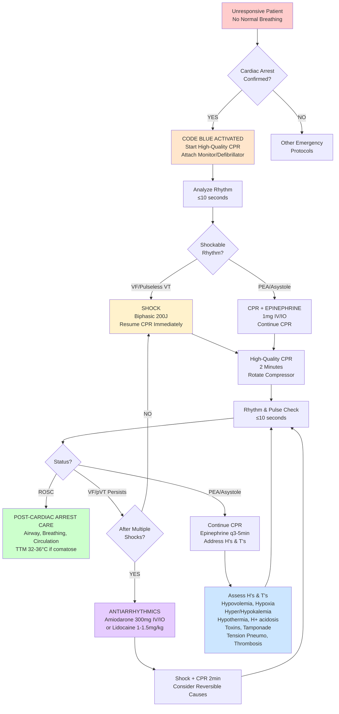

# Code Blue – Adult Cardiac Arrest (ACLS 2025) with Virtua Voorhees Addenda

**Primary Guideline:** American Heart Association (AHA) Advanced Cardiovascular Life Support (ACLS) 2020 Guidelines (Current through 2025)
**Official Source:** https://cpr.heart.org/en/resuscitation-science/cpr-and-ecc-guidelines/adult-advanced-cardiovascular-life-support
**Supporting Evidence:** 2023 AHA Focused Update on Adult Advanced Cardiovascular Life Support

## ENHANCED MERMAID FLOWCHART ALGORITHM

## STREAMLINED DYNAMIC CARD SYSTEM

### Card 0 – Unresponsive Patient Assessment (Node A → B)
┌─────────────────────────────────────────┐
│ 🚨 UNRESPONSIVE PATIENT                 │
├─────────────────────────────────────────┤
│ 📊 Initial assessment:                  │
│ • Check responsiveness                  │
│ • Look for normal breathing (not gasping)│
│ • Check pulse (≤10 seconds)            │
│                                         │
│ 🚀 If cardiac arrest confirmed:         │
│ • Activate Code Blue team              │
│ • Start high-quality CPR immediately   │
│                                         │
│ ❓ Cardiac arrest confirmed?            │
│                                         │
│ 🔘 YES → Start CPR & attach monitor    │
│ 🔘 NO → Assess for other emergencies   │
│                                         │
│ [Next: Based on Selection ▶]            │
└─────────────────────────────────────────┘

### Card 1A – Start CPR & Monitor (Node C → D)
┌─────────────────────────────────────────┐
│ 💓 HIGH-QUALITY CPR INITIATED           │
├─────────────────────────────────────────┤
│ ⚙️ CPR parameters:                      │
│ • Rate: 100-120/min                    │
│ • Depth: 2-2.4 inches (5-6 cm)        │
│ • Complete recoil between compressions │
│ • Minimize interruptions (<10 seconds) │
│                                         │
│ 🔌 Attach monitor/defibrillator         │
│ 🫁 Give oxygen, establish IV/IO access  │
│                                         │
│ [Next: Rhythm analysis ▶]              │
│                                         │
│ [◀ Previous: Initial Assessment]       │
└─────────────────────────────────────────┘

### Card 1B – Other Emergencies (Node Z - Final)
┌─────────────────────────────────────────┐
│ 🔍 NON-CARDIAC ARREST EMERGENCY         │
├─────────────────────────────────────────┤
│ 🎯 Assess for:                          │
│ • Respiratory distress/failure         │
│ • Severe bradycardia or tachycardia    │
│ • Shock states                         │
│ • Other medical emergencies            │
│                                         │
│ 📋 Follow appropriate protocols:        │
│ • Bradycardia algorithm if HR <60      │
│ • Tachycardia algorithm if HR >150     │
│ • Airway management as needed          │
│                                         │
│ ✅ ALTERNATIVE PROTOCOL ACTIVE         │
│                                         │
│ [◀ Previous: Initial Assessment]       │
└─────────────────────────────────────────┘

### Card 2A – Rhythm Analysis (Node D → E)
┌─────────────────────────────────────────┐
│ 📈 ANALYZE CARDIAC RHYTHM               │
├─────────────────────────────────────────┤
│ 🔍 Rhythm identification:               │
│ • VF/Pulseless VT (shockable)          │
│ • Asystole (non-shockable)             │
│ • PEA (non-shockable)                  │
│                                         │
│ ⏱️ Minimize interruptions <10 seconds   │
│                                         │
│ ❓ Shockable rhythm?                    │
│                                         │
│ 🔘 YES → Deliver shock                 │
│ 🔘 NO → Continue CPR + epinephrine     │
│                                         │
│ [◀ Previous] [Next: Based on Selection ▶]│
└─────────────────────────────────────────┘

### Card 3A – Shock Delivery (Node F → H)
┌─────────────────────────────────────────┐
│ ⚡ DEFIBRILLATION - VF/PULSELESS VT     │
├─────────────────────────────────────────┤
│ ⚙️ Shock parameters:                    │
│ • Energy: 200J biphasic (120-200J range)│
│ • Single shock strategy                │
│ • Clear patient before shock           │
│                                         │
│ 🚀 Immediately after shock:            │
│ • Resume CPR for 2 minutes            │
│ • Do not check pulse/rhythm           │
│                                         │
│ [Next: 2-minute CPR cycle ▶]          │
│                                         │
│ [◀ Previous: Rhythm Analysis]          │
└─────────────────────────────────────────┘

### Card 3B – CPR + Epinephrine (Node G → H)
┌─────────────────────────────────────────┐
│ 💊 CPR + EPINEPHRINE (NON-SHOCKABLE)    │
├─────────────────────────────────────────┤
│ 💉 Epinephrine dosing:                  │
│ • 1mg IV/IO immediately                │
│ • Repeat every 3-5 minutes             │
│ • Continue throughout resuscitation    │
│                                         │
│ 💓 Continue high-quality CPR:           │
│ • 2-minute cycles                      │
│ • Rotate compressor q2min              │
│                                         │
│ [Next: 2-minute CPR cycle ▶]          │
│                                         │
│ [◀ Previous: Rhythm Analysis]          │
└─────────────────────────────────────────┘

### Card 4A – 2-Minute CPR Cycle (Node H → I)
┌─────────────────────────────────────────┐
│ ⏱️ 2-MINUTE CPR CYCLE                   │
├─────────────────────────────────────────┤
│ 🔄 During CPR cycle:                    │
│ • Maintain quality compressions        │
│ • Establish advanced airway if needed  │
│ • Give medications as scheduled        │
│ • Consider reversible causes (H's & T's)│
│                                         │
│ 🔁 At 2-minute mark:                   │
│ • Rotate compressor                    │
│ • Brief pulse/rhythm check <10 seconds │
│                                         │
│ [Next: Rhythm reassessment ▶]          │
│                                         │
│ [◀ Previous: Treatment Selection]      │
└─────────────────────────────────────────┘

### Card 5A – Rhythm Reassessment (Node I → J)
┌─────────────────────────────────────────┐
│ 🔄 RHYTHM & PULSE CHECK                 │
├─────────────────────────────────────────┤
│ 📊 Brief assessment <10 seconds:        │
│ • Check monitor rhythm                 │
│ • Check pulse if organized rhythm      │
│ • Look for signs of ROSC               │
│                                         │
│ 💊 If still in arrest:                 │
│ • Give epinephrine q3-5min             │
│ • Consider antiarrhythmics if VF/pVT   │
│                                         │
│ ❓ Current status?                      │
│                                         │
│ 🔘 ROSC → Post-cardiac arrest care     │
│ 🔘 VF/pVT → Shock + consider amiodarone│
│ 🔘 ASYSTOLE/PEA → CPR + epinephrine   │
│                                         │
│ [◀ Previous] [Next: Based on Selection ▶]│
└─────────────────────────────────────────┘

### Card 6A – ROSC Achieved (Node K - Final)
┌─────────────────────────────────────────┐
│ ✅ RETURN OF SPONTANEOUS CIRCULATION    │
├─────────────────────────────────────────┤
│ 🎯 Immediate priorities:                │
│ • Confirm ROSC (pulse, BP, waveform)   │
│ • Optimize airway and breathing        │
│ • Support circulation/BP               │
│ • 12-lead ECG                          │
│                                         │
│ 📊 Target parameters:                   │
│ • SBP >90 mmHg or MAP >65 mmHg         │
│ • SpO₂ 92-98%                          │
│                                         │
│ 🏥 Post-cardiac arrest care:            │
│ • TTM 32-36°C if comatose              │
│ • ICU admission for monitoring         │
│ • Neurologic assessment                │
│ • Consider coronary angiography        │
│                                         │
│ ✅ POST-ROSC PROTOCOL COMPLETE         │
│                                         │
│ [◀ Previous: Rhythm Reassessment]      │
└─────────────────────────────────────────┘

### Card 6B – Refractory VF/pVT (Node L → N → O)
┌─────────────────────────────────────────┐
│ ⚡ REFRACTORY VF/PULSELESS VT           │
├─────────────────────────────────────────┤
│ 💉 Antiarrhythmic options:              │
│ • Amiodarone: 300mg IV/IO (first dose) │
│   Then 150mg for second dose           │
│ • Lidocaine: 1-1.5mg/kg IV/IO          │
│   (if amiodarone unavailable)          │
│                                         │
│ 🔄 Continue cycle:                      │
│ • Shock → CPR 2min → reassess          │
│ • Treat reversible causes              │
│ • Consider vector change               │
│                                         │
│ [Next: Continue CPR cycles ▶]          │
│                                         │
│ [◀ Previous: Rhythm Reassessment]      │
└─────────────────────────────────────────┘

### Card 6C – Persistent Asystole/PEA (Node M → P)
┌─────────────────────────────────────────┐
│ 📉 PERSISTENT ASYSTOLE/PEA              │
├─────────────────────────────────────────┤
│ 💊 Continue medications:                │
│ • Epinephrine 1mg q3-5min              │
│ • No role for atropine                 │
│                                         │
│ 🔍 Aggressively treat H's & T's:       │
│ • Hypovolemia, Hypoxia, H⁺ (acidosis) │
│ • Hypo/hyperkalemia, Hypothermia       │
│ • Toxins, Tamponade, Tension pneumo    │
│ • Thrombosis (pulmonary/coronary)      │
│                                         │
│ 🚨 Consider:                            │
│ • Needle thoracostomy                  │
│ • Pericardiocentesis                   │
│ • Fluid resuscitation                  │
│                                         │
│ [Next: Continue CPR cycles ▶]          │
│                                         │
│ [◀ Previous: Rhythm Reassessment]      │
└─────────────────────────────────────────┘

## VIRTUA VOORHEES CODE BLUE ADDENDA

### **Enhanced CPR Quality Program:**
- **Real-time CPR feedback** devices on all Code Blue carts
- **Compression depth/rate monitoring** with audio/visual feedback
- **Chest compression fraction target** >80% throughout resuscitation
- **Compressor rotation** every 2 minutes with timer alerts

### **Medication Protocols - Virtua Specific:**
**Epinephrine:**
- **Standard dose:** 1mg IV/IO push every 3-5 minutes
- **High-dose NOT recommended** (no survival benefit)
- **Continue until ROSC** or resuscitation terminated

**Antiarrhythmics (Refractory VF/pVT):**
- **Amiodarone preferred:** 300mg IV/IO, then 150mg
- **Lidocaine alternative:** 1-1.5mg/kg IV/IO (if no amiodarone)
- **Give after failed defibrillation** attempts

### **Advanced Airway Management:**
- **Bag-mask ventilation preferred initially** during active CPR
- **Supraglottic airway** (LMA, i-gel) if bag-mask inadequate
- **Endotracheal intubation** by experienced provider without CPR interruption
- **Continuous waveform capnography** to confirm placement and monitor CPR quality

### **H's and T's - Reversible Causes Protocol:**
**4 H's:**
- **Hypovolemia:** IV fluid bolus, blood products
- **Hypoxia:** Optimize ventilation, increase FiO₂
- **Hydrogen ions (Acidosis):** Consider sodium bicarbonate
- **Hypo/Hyperkalemia:** Treat electrolyte abnormalities

**4 T's:**
- **Toxins:** Antidotes, decontamination
- **Tamponade:** Emergency pericardiocentesis
- **Tension Pneumothorax:** Needle decompression
- **Thrombosis:** Consider thrombolytics, embolectomy

### **Virtua Post-ROSC Care Protocol:**
**Immediate (First 20 minutes):**
- **Airway security:** Intubation if not already done
- **Hemodynamic support:** Target SBP >90 mmHg
- **12-lead ECG:** STEMI protocol if indicated
- **Laboratory studies:** ABG, electrolytes, lactate

**Early (First 6 hours):**
- **Targeted Temperature Management:** 32-36°C for 24 hours if comatose
- **ICU transfer:** Continuous monitoring and support
- **Neurological assessment:** Pupillary response, GCS
- **Family communication:** Prognosis discussion

### **Quality Improvement Metrics:**
- **Response time:** Code Blue team arrival <3 minutes
- **First shock time:** <2 minutes for shockable rhythms
- **CPR quality:** Compression fraction >80%
- **ROSC rates:** Track by rhythm and response time
- **Survival to discharge:** Neurologically intact survival

### **Team Communication Protocol:**
- **Closed-loop communication:** Repeat back all orders
- **Team leader designated:** Usually senior physician/attending
- **Role assignments:** Clear responsibilities for each team member
- **Time keeper:** Track intervals, medications, procedures
- **Family liaison:** Designated person for family updates

### **Special Considerations:**
**Hypothermic Patients:**
- Continue resuscitation until core temp >32°C
- Medications may be ineffective until rewarmed
- Consider extracorporeal rewarming

**Pregnancy (>20 weeks):**
- Left lateral displacement of uterus
- Consider perimortem cesarean if no ROSC in 4 minutes

**COVID-19 Patients:**
- Don appropriate PPE before entering room
- Minimize number of providers
- Use mechanical CPR device if available
- HEPA filter for ventilation

## REFERENCE GUIDELINES
- **2020 AHA Guidelines for CPR and Emergency Cardiovascular Care**
- **2023 AHA Focused Update on Adult Advanced Cardiovascular Life Support**
- **ILCOR Consensus on Science with Treatment Recommendations**
- **Virtua Health System Code Blue Protocol v2025**

**This protocol reflects current evidence-based ACLS guidelines optimized for high-quality resuscitation care delivery at Virtua Voorhees with integrated quality improvement and post-arrest care protocols.**
