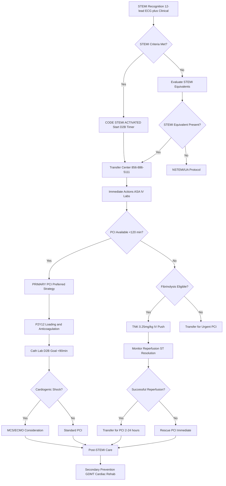

# Code STEMI – ST-Elevation Myocardial Infarction with Virtua Voorhees Addenda

**Guideline Used:**  
American College of Cardiology/American Heart Association (ACC/AHA) 2022 Guidelines for the Management of Patients with Acute Coronary Syndromes  
**Official Source:**  
https://www.ahajournals.org/doi/10.1161/CIR.0000000000001080

**Note:** The 2025 ACC/AHA Guidelines referenced are not yet published. Current evidence-based care follows the 2022 ACS Guidelines and 2021 Coronary Revascularization Guidelines.

## CARD INTERFACE LAYOUT

### Card 0 – Dynamic Action Card (Node Dependent)

```
┌─────────────────────────────────────────────────────────────┐
│ CODE STEMI ACTIVATED                                        │
├─────────────────────────────────────────────────────────────┤
│ 🚨 DOOR-TO-BALLOON TIMER: 25:00                            │
│ Target: <90 minutes (PCI-capable)                           │
│ Target: <120 minutes (transfer required)                    │
│                                                           │
│ ┌─────────────────────────────────┐                        │
│ │     STEMI CRITERIA MET          │                        │
│ │ ☑ ST elevation ≥1mm (2+ leads)  │ [Verify on ECG]       │
│ │ ☐ New LBBB (Sgarbossa criteria) │ [Check criteria]      │
│ │ ☐ Posterior MI (V1-V3 depression)│ [Confirm V7-V9]      │
│ │ ☐ STEMI equivalent identified   │ [Review equivalents]  │
│ │                                │                        │
│ │ Lead Territory: Anterior V1-V4  │                        │
│ │ Suspected Vessel: LAD           │                        │
│ └─────────────────────────────────┘                        │
│                                                           │
│ 📞 TRANSFER CENTER: 856-886-5111    [CALL STEMI ALERT]     │
│                                                           │
│ IMMEDIATE ACTIONS:                                         │
│ ☑ 12-lead ECG (<10 min)  ☑ IV access x2 (18G)            │
│ ☑ ASA 324mg chewed      ☐ Labs ordered                    │
│ ☐ Transfer Center called ☐ Portable CXR                   │
└─────────────────────────────────────────────────────────────┘
```

### Card 1 – Static Assessment/Differential

```
┌─────────────────────────────────────────────────────────────┐
│ STEMI RECOGNITION & PATHOPHYSIOLOGY                        │
├─────────────────────────────────────────────────────────────┤
│ 📊 ECG CRITERIA (ACC/AHA 2022):                           │
│ Men <40y: V2-V3 ≥2.5mm, others ≥1mm                       │
│ Men ≥40y: V2-V3 ≥2mm, others ≥1mm                         │
│ Women: V2-V3 ≥1.5mm, others ≥1mm                          │
│ (2+ contiguous leads required)                             │
│                                                           │
│ 🎯 STEMI EQUIVALENTS:                                      │
│ • De Winter's Sign: ST depression V1-V6, tall T waves     │
│ • Posterior STEMI: ST depression V1-V3, tall R waves      │
│ • Hyperacute T waves: Broad, asymmetric                   │
│ • Modified Sgarbossa (LBBB): Concordant ≥1mm              │
│                                                           │
│ CORONARY TERRITORIES:                                      │
│ • V1-V4: LAD (anterior)  • V5-V6,I,aVL: LCX (lateral)     │
│ • II,III,aVF: RCA (inferior) • aVR elevation: Left main   │
│                                                           │
│ HIGH-RISK FEATURES:                                        │
│ Anterior location, HR >100/<60, SBP <100, Killip II-IV    │
│ Age >75, DM, Prior MI                                     │
│                                                           │
│ CRITICAL HISTORY: Symptom onset time, chest pain          │
│ character, contraindications to treatment                  │
└─────────────────────────────────────────────────────────────┘
```

### Card 2 – Static Physical Exam/Medication

```
┌─────────────────────────────────────────────────────────────┐
│ PHYSICAL EXAM & MEDICATIONS                                 │
├─────────────────────────────────────────────────────────────┤
│ EXAM: BP both arms, HR/rhythm, heart sounds, rales/JVD     │
│ KILLIP CLASS: I(no CHF-6%), II(rales-17%), III(edema-38%) │
│ IV(shock-81%)                                              │
│                                                           │
│ 💊 ANTIPLATELET (Choose P2Y12):                            │
│ • ASA 162-325mg chewed, then 81mg daily                    │
│ • Ticagrelor: 180mg load, 90mg BID (preferred)            │
│ • Prasugrel: 60mg load, 10mg daily (avoid >75y, <60kg)    │
│ • Clopidogrel: 600mg load, 75mg daily (if others CI)      │
│                                                           │
│ 💊 ANTICOAGULATION:                                        │
│ Primary PCI: UFH 70-100 units/kg bolus (max 10,000)       │
│ Bivalirudin: 0.75mg/kg bolus, 1.75mg/kg/hr infusion      │
│                                                           │
│ 💊 FIBRINOLYTIC (if no PCI <120min):                       │
│ TNK 0.25mg/kg IV push (max 25mg), single bolus            │
│                                                           │
│ ⚠️ FIBRINOLYTIC CONTRAINDICATIONS:                         │
│ Absolute: Prior ICH, stroke <6mo, major trauma <3wks      │
│ Relative: Age >75, uncontrolled HTN >180/110              │
│                                                           │
│ ADJUNCT: Metoprolol 25mg PO, Atorvastatin 80mg PO         │
│ CONTACTS: Transfer Center 856-886-5111                     │
└─────────────────────────────────────────────────────────────┘
```

## FLOWCHART (Bottom Panel – Mermaid Algorithm)



## NODE-TO-DYNAMIC CARD PROMPT MAPPING (WITH INTERACTIVES)

| **Step (Node)**                    | **Dynamic Card Prompt/Question**                                                                 | **Interactive Components**                                        |
|-------------------------------------|--------------------------------------------------------------------------------------------------|-------------------------------------------------------------------|
| STEMI Recognition                   | "12-lead ECG shows STEMI criteria. Activate Code STEMI immediately?"                             | [Activate Code STEMI], [Start D2B Timer], [ECG Review]            |
| STEMI Criteria Assessment           | "Confirm STEMI criteria: ST elevation ≥1mm in 2+ contiguous leads?"                             | [Criteria Checklist], [Territory Identification], [Lead Analysis] |
| Code STEMI Activation               | "Code STEMI activated. Door-to-balloon timer started. Contact Transfer Center?"                  | [Call Transfer Center], [Timer Display], [Team Notification]      |
| STEMI Equivalent Evaluation         | "No classic STEMI pattern. Evaluate for STEMI equivalents (De Winter, posterior)?"              | [Equivalent Checklist], [Posterior Leads], [Sgarbossa Criteria]   |
| Transfer Center Contact             | "Contact Transfer Center for cath lab activation and coordination?"                              | [Call 856-886-5111], [STEMI Alert], [ETA Confirmation]            |
| Immediate Actions                   | "Complete immediate STEMI interventions: ASA, IV access, labs, ECG?"                            | [Action Checklist], [Medication Given], [Lab Orders]              |
| PCI Availability Assessment         | "Primary PCI available within 120 minutes from first medical contact?"                          | [PCI Timeline], [Transport Coordination], [Facility Capabilities] |
| Primary PCI Pathway                 | "Primary PCI strategy selected. Administer dual antiplatelet and anticoagulation?"              | [DAPT Loading], [UFH Dosing], [Cath Lab Prep]                     |
| Fibrinolysis Eligibility            | "PCI not available <120min. Patient eligible for fibrinolytic therapy?"                         | [Contraindication Screen], [Risk Assessment], [Time Calculation]  |
| P2Y12 and Anticoagulation          | "Administer P2Y12 inhibitor loading dose and anticoagulation for PCI?"                          | [P2Y12 Selection], [Dosing Calculator], [Allergy Check]           |
| TNK Administration                  | "Administer tenecteplase 0.25mg/kg IV push immediately?"                                        | [Weight-Based Dosing], [TNK Preparation], [Administration Log]    |
| Cath Lab Transfer                   | "Transfer to cath lab for primary PCI. Door-to-balloon goal <90 minutes?"                       | [Transport Team], [D2B Tracking], [Cath Lab Coordination]         |
| Reperfusion Monitoring              | "Monitor for successful reperfusion: ST resolution, symptom relief?"                            | [Serial ECGs], [Pain Assessment], [Reperfusion Markers]           |
| Cardiogenic Shock Assessment        | "Evaluate for cardiogenic shock: hypotension, poor perfusion, elevated lactate?"                | [Shock Screen], [Hemodynamics], [MCS Consideration]               |
| Rescue PCI Decision                 | "Failed fibrinolysis. Proceed with rescue PCI immediately?"                                     | [Failure Criteria], [Urgent Transfer], [PCI Activation]           |
| Post-STEMI Care                     | "Initiate post-STEMI care: secondary prevention, monitoring, rehabilitation?"                   | [GDMT Checklist], [Risk Stratification], [Discharge Planning]     |

**Interactive Highlights:**  
- Door-to-balloon timer: real-time tracking with milestone alerts
- ECG territory mapping: automated vessel identification
- Weight-based medication calculator: safety-verified dosing
- Transfer Center integration: one-tap activation with status updates
- Contraindication screening: interactive safety assessment

## VIRTUA VOORHEES CARDIAC INTERVENTION ADDENDA

- **Transfer Center Access:** 24/7 coordination at 856-886-5111 for emergent cardiac catheterization
- **PCI Capabilities:** Door-to-balloon <90 minutes for on-site procedures, <120 minutes for transfers
- **Cardiogenic Shock Protocol:** Early mechanical circulatory support consideration, ECMO capabilities
- **Quality Metrics:** D2B times, reperfusion success rates, 30-day outcomes tracking

## REFERENCE (GUIDELINE & SOURCE)
American College of Cardiology/American Heart Association. 2022 AHA/ACC/HFSA Guideline for the Management of Heart Failure.  
https://www.ahajournals.org/doi/10.1161/CIR.0000000000001080

**Additional Reference:**  
2021 ACC/AHA/SCAI Guideline for Coronary Artery Revascularization  
https://www.ahajournals.org/doi/10.1161/CIR.0000000000000965

**All steps follow current ACC/AHA guidelines for STEMI management with integrated transfer coordination and optimized for time-critical cardiac intervention.**
