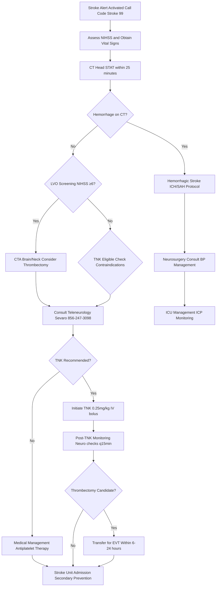

# Code Stroke – Acute Ischemic Stroke with Virtua Voorhees Addenda

**Guideline Used:**  
American Heart Association/American Stroke Association (AHA/ASA) 2019 Guidelines for the Early Management of Patients with Acute Ischemic Stroke  
**Official Source:**  
https://www.ahajournals.org/doi/10.1161/STR.0000000000000211

## CARD INTERFACE LAYOUT

### Card 0 – Dynamic Action Card (Node Dependent)

```
┌─────────────────────────────────────────────────────────────┐
│ NIH STROKE SCALE ASSESSMENT                                 │
├─────────────────────────────────────────────────────────────┤
│ 🕐 DOOR-TO-NEEDLE TIMER: 45 minutes remaining               │
│ Target: <60 minutes from arrival                            │
│                                                           │
│ ┌─────────────────────────────────┐                        │
│ │    NIH STROKE SCALE CALCULATOR  │                        │
│ │ 1a. Level of Consciousness: 1   │ [Tap to modify]        │
│ │ 1b. LOC Questions:         0   │ [Tap to modify]        │
│ │ 1c. LOC Commands:          1   │ [Tap to modify]        │
│ │ 2. Best Gaze:              2   │ [Tap to modify]        │
│ │ 3. Visual Fields:          1   │ [Tap to modify]        │
│ │ 4. Facial Palsy:           2   │ [Tap to modify]        │
│ │ 5a. Motor Left Arm:        1   │ [Tap to modify]        │
│ │ 5b. Motor Right Arm:       0   │ [Tap to modify]        │
│ │ 6a. Motor Left Leg:        1   │ [Tap to modify]        │
│ │ 6b. Motor Right Leg:       0   │ [Tap to modify]        │
│ │ 7. Limb Ataxia:            0   │ [Tap to modify]        │
│ │ 8. Sensory:                1   │ [Tap to modify]        │
│ │ 9. Language:               1   │ [Tap to modify]        │
│ │ 10. Dysarthria:            1   │ [Tap to modify]        │
│ │ 11. Extinction/Inattention: 0  │ [Tap to modify]        │
│ │                                │                        │
│ │ TOTAL NIHSS SCORE: 11          │                        │
│ │ SEVERITY: Moderate Stroke       │                        │
│ └─────────────────────────────────┘                        │
│                                                           │
│ 📞 SEVARO TELENEUROLOGY - ONE-TAP DIAL:                    │
│ Virtua Voorhees: 856-247-3098    [CALL NOW]               │
│ Response time: <45 seconds                                 │
│                                                           │
│ TNK ELIGIBILITY: ☑ Eligible based on current assessment   │
│ ⚠️ CRITICAL: Hold anticoagulants until ICH ruled out      │
└─────────────────────────────────────────────────────────────┘
```

### Card 1 – Static Assessment/Differential

```
┌─────────────────────────────────────────────────────────────┐
│ STROKE TYPES & PATHOPHYSIOLOGY                             │
├─────────────────────────────────────────────────────────────┤
│ 🧠 ISCHEMIC (87%):                                         │
│ • LVO: ICA, MCA M1/M2, ACA, PCA, Basilar                   │
│ • Small vessel: Lacunar, deep penetrating arteries         │
│ • Cardioembolic: A-fib (most common), valvular disease     │
│ • Cryptogenic: Unknown etiology, consider PFO              │
│                                                           │
│ 🔴 HEMORRHAGIC (13%):                                       │
│ • ICH: Hypertensive, AVM, amyloid angiopathy               │
│ • SAH: Aneurysmal rupture, traumatic, AVM                  │
│                                                           │
│ FAST-ED Assessment:                                        │
│ F - Facial droop    A - Arm weakness                       │
│ S - Speech issues   T - Time of onset                      │
│ E - Eyes (gaze/field) D - Dizziness/ataxia                │
│                                                           │
│ CRITICAL HISTORY:                                          │
│ • Last known normal time (EXACT)                           │
│ • Current medications (anticoagulants)                     │
│ • Functional baseline (mRS score)                          │
│                                                           │
│ RISK FACTORS: A-fib (5x), HTN (3-5x), DM (2-3x)          │
└─────────────────────────────────────────────────────────────┘
```

### Card 2 – Static Physical Exam/Medication

```
┌─────────────────────────────────────────────────────────────┐
│ NEUROLOGICAL EXAM & TNK PROTOCOL                            │
├─────────────────────────────────────────────────────────────┤
│ VITAL SIGNS:                                               │
│ • BP: <185/110 for TNK (labetalol 10-20mg IV)              │
│ • HR/Rhythm: Screen for A-fib                              │
│ • Temp: <38°C (treat hyperthermia)                         │
│ • Glucose: 140-180 mg/dL (avoid <60 mg/dL)                 │
│                                                           │
│ NEURO EXAM: Mental status, CN, Motor (0-5), Sensory       │
│                                                           │
│ 💊 TENECTEPLASE (TNK): 0.25 mg/kg IV bolus (max 25mg)      │
│ • Single push over 5 seconds, no infusion                  │
│ • Dedicated IV line, flush before/after                    │
│ • Use within 4 hours of reconstitution                     │
│                                                           │
│ ⚠️ ABSOLUTE CONTRAINDICATIONS:                              │
│ Active bleeding, Recent ICH (<3mo), Head trauma (<14d)     │
│                                                           │
│ ⚠️ RELATIVE CONTRAINDICATIONS:                              │
│ Age >80, NIHSS >25, BP >185/110, Glucose <50/>400         │
│                                                           │
│ POST-TNK: Neuro checks q15min x2hr, BP <180/105           │
│ No anticoagulants x24hr, ICU monitoring                   │
│                                                           │
│ CONTACTS: Transfer Center 856-886-5111                     │
└─────────────────────────────────────────────────────────────┘
```

## FLOWCHART (Bottom Panel – Mermaid Algorithm)



## NODE-TO-DYNAMIC CARD PROMPT MAPPING (WITH INTERACTIVES)

| **Step (Node)**                    | **Dynamic Card Prompt/Question**                                                                 | **Interactive Components**                                        |
|-------------------------------------|--------------------------------------------------------------------------------------------------|-------------------------------------------------------------------|
| Stroke Alert Activation            | "Stroke symptoms identified. Activate Code Stroke 99 immediately?"                               | [Activate Code], [Start Timer], [Alert Team]                      |
| NIHSS Assessment                    | "Complete NIH Stroke Scale assessment. Current total score and severity?"                        | [NIHSS Calculator], [Score Tracker], [Severity Display]           |
| CT Head Imaging                     | "CT Head completed within 25 minutes. Any signs of hemorrhage visible?"                          | [Hemorrhage Yes/No], [Image Review], [Radiologist Contact]        |
| Hemorrhage Decision                 | "Hemorrhagic stroke confirmed on CT. Initiate ICH/SAH management protocol?"                      | [ICH Protocol], [SAH Protocol], [Neurosurgery Consult]            |
| LVO Screening                       | "NIHSS ≥6 suggesting large vessel occlusion. Order CTA brain and neck?"                          | [Order CTA], [LVO Assessment], [Thrombectomy Alert]                |
| TNK Eligibility Assessment          | "Patient within 4.5 hour window. Complete TNK contraindication screening?"                       | [Contraindication Checklist], [Eligibility Status], [Time Check]  |
| Teleneurology Consultation          | "Contact Sevaro teleneurology for expert stroke consultation?"                                   | [Call Sevaro 856-247-3098], [Patient Summary], [NIHSS Ready]      |
| TNK Decision                        | "Teleneurology consultation complete. Proceed with TNK administration?"                          | [Administer TNK], [Calculate Dose], [Prepare Bolus]               |
| TNK Administration                  | "TNK 0.25mg/kg administered as single IV bolus. Begin monitoring protocol?"                      | [Mark TNK Given], [Start Monitoring], [Neuro Check Timer]         |
| Medical Management                  | "TNK not indicated. Begin standard medical management with antiplatelet therapy?"                | [Aspirin 325mg], [Medical Protocol], [Stroke Unit Orders]         |
| Post-TNK Monitoring                 | "Post-thrombolytic monitoring active. Any neurological changes or bleeding signs?"               | [Neuro Check q15min], [BP Monitoring], [Bleeding Assessment]      |
| Thrombectomy Evaluation             | "Patient eligible for mechanical thrombectomy within treatment window?"                          | [EVT Criteria], [Transfer Coordination], [Time Calculator]         |
| Stroke Unit Admission               | "Admit to stroke unit for ongoing care and secondary stroke prevention?"                         | [Admission Orders], [Prevention Protocol], [Rehab Assessment]      |
| ICH Management                      | "Hemorrhagic stroke requires neurosurgical evaluation and intensive monitoring?"                 | [Neurosurgery Stat], [ICH Protocol], [ICP Monitoring]             |

**Interactive Highlights:**  
- NIHSS Calculator: tap individual components, real-time scoring and severity
- Door-to-needle timer: countdown with milestone alerts at 30/45/60 minutes
- TNK dosing calculator: weight-based with safety verification
- Sevaro teleneurology: one-tap dialing with consultation documentation
- Contraindication checklist: interactive safety screening with alerts

## VIRTUA VOORHEES STROKE CENTER ADDENDA

- **Teleneurology Access:** 24/7 Sevaro consultation at 856-247-3098 with <45 second response
- **Transfer Protocols:** Regional comprehensive stroke center coordination via Transfer Center 856-886-5111
- **Quality Metrics:** Door-to-needle <60 minutes, door-to-groin <90 minutes for mechanical thrombectomy
- **Stroke Unit Care:** Dedicated nursing, early mobilization, PT/OT/Speech therapy evaluation

## REFERENCE (GUIDELINE & SOURCE)
American Heart Association/American Stroke Association. 2019 Guidelines for the Early Management of Patients with Acute Ischemic Stroke.  
https://www.ahajournals.org/doi/10.1161/STR.0000000000000211

**Additional Reference:**  
2018 Guidelines for the Early Management of Patients with Acute Ischemic Stroke  
https://www.ahajournals.org/doi/10.1161/STR.0000000000000158

**All steps are evidence-based per current AHA/ASA stroke guidelines with integrated teleneurology support and optimized for time-critical stroke care delivery.**
