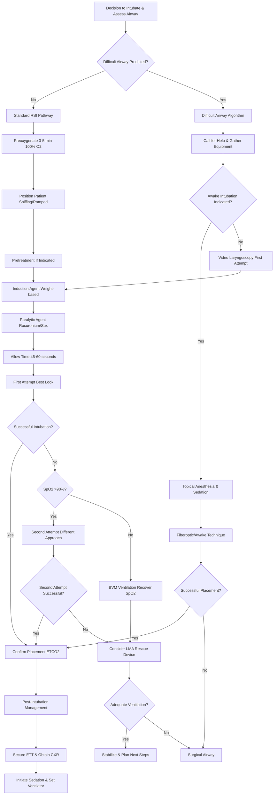

# RSI & Advanced Airway Protocol with Virtua Voorhees Addenda

**Guideline Used:**  
Difficult Airway Society (DAS) 2015 Guidelines for Management of Unanticipated Difficult Intubation in Adults  
American Society of Anesthesiologists (ASA) 2022 Practice Guidelines for Management of the Difficult Airway  
**Official Sources:**  
https://das.uk.com/guidelines/das-intubation-guidelines  
https://pubs.asahq.org/anesthesiology/article/136/1/31/116654/2022-American-Society-of-Anesthesiologists

## CARD INTERFACE LAYOUT

### Card 0 – Dynamic Action Card (Node Dependent)

```
┌─────────────────────────────────────────────────────────────┐
│ RAPID SEQUENCE INTUBATION                                   │
├─────────────────────────────────────────────────────────────┤
│ 🚨 RSI CHECKLIST - 7 P's                                   │
│ ☑ Preparation - Equipment ready                             │
│ ☑ Preoxygenation - 3-5 min 100% O2                         │
│ ☐ Pretreatment - Consider medications                       │
│ ☐ Paralysis with induction                                  │
│ ☐ Positioning - Sniffing position                           │
│ ☐ Placement with confirmation                               │
│ ☐ Post-intubation management                                │
│                                                           │
│ Patient Weight: 80 kg    Mallampati: II                    │
│                                                           │
│ ┌─────────────────────────────────┐                        │
│ │     MEDICATION CALCULATOR        │                        │
│ │ INDUCTION:                      │ [Tap to select]        │
│ │ • Etomidate: 24 mg (0.3 mg/kg)  │ [CALCULATE]           │
│ │ • Ketamine: 120 mg (1.5 mg/kg)  │ [CALCULATE]           │
│ │                                │                        │
│ │ PARALYTIC:                      │                        │
│ │ • Rocuronium: 96 mg (1.2 mg/kg) │ [ADMINISTER]          │
│ │ • Sux: 120 mg (1.5 mg/kg)      │ [ADMINISTER]          │
│ │                                │                        │
│ │ SpO2: 98%  Timer: 03:45         │                        │
│ └─────────────────────────────────┘                        │
│                                                           │
│ ⚠️ DIFFICULT AIRWAY PREDICTORS: 2 identified              │
│ Backup plan: LMA → Surgical airway ready                   │
└─────────────────────────────────────────────────────────────┘
```

### Card 1 – Static Assessment/Difficult Airway

```
┌─────────────────────────────────────────────────────────────┐
│ RSI INDICATIONS & DIFFICULT AIRWAY ASSESSMENT              │
├─────────────────────────────────────────────────────────────┤
│ 🚨 INDICATIONS FOR INTUBATION:                             │
│ • Failure to protect airway (GCS ≤8)                       │
│ • Failure to oxygenate (SpO2 <90% despite O2)              │
│ • Failure to ventilate (PaCO2 >50, pH <7.30)               │
│ • Expected clinical deterioration                           │
│                                                           │
│ LEMON Difficult Airway Assessment:                         │
│ L - Look externally (facial trauma, obesity, beard)        │
│ E - Evaluate 3-3-2 (mouth opening, hyomental distance)     │
│ M - Mallampati (Class I-IV visibility assessment)          │
│ O - Obstruction/Obesity (BMI >35, neck circumference)      │
│ N - Neck mobility (C-spine, limited ROM)                   │
│                                                           │
│ CONTRAINDICATIONS:                                         │
│ Absolute: Total upper airway obstruction                   │
│ Relative: Severe hemodynamic instability, known allergy    │
│                                                           │
│ PRETREATMENT OPTIONS (3 min before):                       │
│ • Fentanyl 3 mcg/kg: Blunts sympathetic response           │
│ • Lidocaine 1.5 mg/kg: May decrease ICP                    │
│ • Atropine 0.02 mg/kg: Pediatric <1 year only              │
└─────────────────────────────────────────────────────────────┘
```

### Card 2 – Static Physical Exam/Medications

```
┌─────────────────────────────────────────────────────────────┐
│ AIRWAY EXAMINATION & MEDICATIONS                            │
├─────────────────────────────────────────────────────────────┤
│ PHYSICAL ASSESSMENT:                                       │
│ • Inter-incisor distance >3cm, TMJ mobility                │
│ • Thyromental distance >6cm, neck circumference            │
│ • Mallampati Class I-IV, tongue size, dental assessment    │
│                                                           │
│ 💊 INDUCTION AGENTS:                                        │
│ • Etomidate 0.3 mg/kg (hemodynamically stable)             │
│ • Ketamine 1-2 mg/kg (shock, asthma, bronchospasm)         │
│ • Propofol 1-2 mg/kg (status epilepticus, ↑ICP)           │
│                                                           │
│ 💊 PARALYTIC AGENTS:                                        │
│ • Rocuronium 1.2 mg/kg (preferred, reversible)             │
│ • Succinylcholine 1.5 mg/kg (faster onset)                 │
│   CI: Hyperkalemia, burns >48h, crush injury               │
│                                                           │
│ POST-INTUBATION SEDATION:                                  │
│ • Propofol 5-80 mcg/kg/min infusion                        │
│ • Fentanyl 25-200 mcg/hr infusion                          │
│ • Midazolam 1-10 mg/hr infusion                            │
│                                                           │
│ VENTILATOR: TV 6-8 mL/kg IBW, PEEP 5, Rate 12-20          │
│                                                           │
│ CONFIRMATION: ETCO2 (gold standard), bilateral sounds      │
│ BACKUP CONTACTS: Anesthesia ext. 5555, ENT ext. 6666       │
└─────────────────────────────────────────────────────────────┘
```

## FLOWCHART (Bottom Panel – Mermaid Algorithm)



## NODE-TO-DYNAMIC CARD PROMPT MAPPING (WITH INTERACTIVES)

| **Step (Node)**                    | **Dynamic Card Prompt/Question**                                                                 | **Interactive Components**                                        |
|-------------------------------------|--------------------------------------------------------------------------------------------------|-------------------------------------------------------------------|
| Decision to Intubate                | "Clinical indications for intubation identified. Proceed with airway management?"               | [Confirm Indication], [Assessment Checklist], [Team Notification] |
| Difficult Airway Assessment         | "Complete LEMON assessment. Is this predicted to be a difficult airway?"                        | [LEMON Checklist], [Mallampati Score], [Risk Calculator]          |
| Standard RSI Pathway                | "Standard RSI pathway selected. Begin 7 P's checklist preparation?"                             | [7 P's Checklist], [Equipment Check], [Team Brief]                |
| Difficult Airway Algorithm          | "Difficult airway predicted. Call for expert help and gather additional equipment?"             | [Call Anesthesia], [Advanced Equipment], [Backup Plan]            |
| Preoxygenation                      | "Begin preoxygenation with 100% O2 for 3-5 minutes. SpO2 target >95%?"                         | [Start Timer], [SpO2 Monitor], [Apneic O2 Setup]                  |
| Patient Positioning                 | "Position patient in sniffing position or ramp. Optimize laryngeal view?"                       | [Position Check], [Pillow Placement], [C-spine Precautions]       |
| Pretreatment Decision               | "Consider pretreatment medications 3 minutes before induction. Indicated?"                      | [Fentanyl Option], [Lidocaine Option], [Atropine Pediatric]       |
| Awake Intubation Assessment         | "Awake fiberoptic intubation indicated for difficult airway management?"                        | [Awake Technique], [Topical Anesthesia], [Sedation Protocol]      |
| Induction Agent Selection           | "Select and administer induction agent based on clinical scenario?"                             | [Etomidate Stable], [Ketamine Shock], [Propofol Seizure]          |
| Paralytic Administration            | "Administer paralytic agent and allow adequate time for onset?"                                 | [Rocuronium Preferred], [Succinylcholine Fast], [Onset Timer]     |
| First Intubation Attempt            | "Proceed with first intubation attempt using best visualization technique?"                     | [Video Laryngoscopy], [Direct Laryngoscopy], [Bougie Ready]       |
| Intubation Success Assessment       | "ETT placement successful? Confirm with ETCO2 and clinical assessment?"                         | [ETCO2 Confirmation], [Bilateral Sounds], [Chest Rise]            |
| Failed Attempt Protocol             | "First attempt unsuccessful. SpO2 adequate for second attempt?"                                 | [SpO2 Check], [BVM Ventilation], [Different Technique]            |
| Second Attempt Strategy             | "Modify technique for second attempt: different blade, operator, or approach?"                  | [Change Operator], [Video Scope], [External Manipulation]         |
| Rescue Device Insertion             | "Consider LMA or other rescue device for ventilation and oxygenation?"                         | [LMA Insertion], [I-gel Device], [Combitube Option]               |
| Surgical Airway Decision            | "Cannot intubate, cannot ventilate scenario. Proceed with surgical airway?"                    | [Cricothyrotomy], [Call Surgery], [Surgical Kit Ready]            |
| Post-Intubation Management          | "Successful intubation confirmed. Begin post-intubation sedation and ventilator setup?"        | [Sedation Protocol], [Ventilator Settings], [Tube Security]       |

**Interactive Highlights:**  
- Real-time medication calculator: weight-based dosing with safety checks
- RSI timer: tracks preoxygenation and attempt intervals
- LEMON assessment: interactive difficult airway prediction tool
- Equipment checklist: tap to confirm availability and function
- Failed airway protocol: emergency action prompts and contact information

## VIRTUA VOORHEES AIRWAY MANAGEMENT ADDENDA

- **Expert Backup:** Anesthesia team available 24/7 via ext. 5555 for difficult airway consultation
- **Surgical Support:** ENT/General Surgery backup via ext. 6666 for emergency surgical airways
- **Equipment Standards:** Video laryngoscopy first-line, fiberoptic bronchoscope available in ED
- **Quality Metrics:** First-pass success rates, time to successful intubation, complication tracking

## REFERENCE (GUIDELINE & SOURCE)
Difficult Airway Society. 2015 Guidelines for Management of Unanticipated Difficult Intubation in Adults.  
https://das.uk.com/guidelines/das-intubation-guidelines

**Additional Reference:**  
American Society of Anesthesiologists. 2022 Practice Guidelines for Management of the Difficult Airway.  
https://pubs.asahq.org/anesthesiology/article/136/1/31/116654/2022-American-Society-of-Anesthesiologists

**All steps follow current DAS and ASA guidelines for airway management with integrated backup protocols and optimized for emergency department rapid sequence intubation.**
