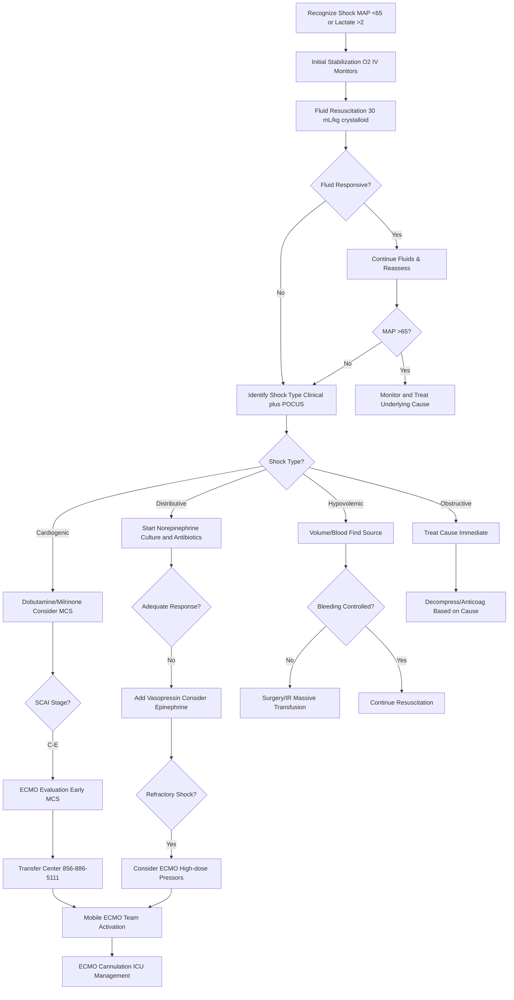

# Shock & ECMO Protocols with Virtua Voorhees Addenda

**Guideline Used:**  
Surviving Sepsis Campaign 2021 Guidelines, American Heart Association Scientific Statement on Cardiogenic Shock 2020, Extracorporeal Life Support Organization (ELSO) Guidelines 2022  
**Official Sources:**  
https://www.survivingsepsis.org/guidelines/adult-patients  
https://www.ahajournals.org/doi/10.1161/CIR.0000000000000782  
https://www.elso.org/guidelines.aspx

## CARD INTERFACE LAYOUT

### Card 0 – Dynamic Action Card (Node Dependent)

```
┌─────────────────────────────────────────────────────────────┐
│ SHOCK PROTOCOL ACTIVATED                                    │
├─────────────────────────────────────────────────────────────┤
│ 🚨 SHOCK TYPE: Cardiogenic (SCAI Stage D)                  │
│ Time from recognition: 45 minutes                          │
│                                                           │
│ ┌─────────────────────────────────┐                        │
│ │   IMMEDIATE STABILIZATION       │                        │
│ │ ☑ IV access x2 large bore       │ [Complete]             │
│ │ ☑ Fluid bolus 30 mL/kg started  │ [Track progress]       │
│ │ ☑ Labs sent (lactate, CBC, BMP) │ [View results]         │
│ │ ☑ Blood cultures x2 obtained    │ [Before antibiotics]  │
│ │ ☐ Arterial line placement       │ [Order/Place]          │
│ │ ☐ Central line if needed        │ [Assess need]          │
│ │                                │                        │
│ │ Fluid given: 1500mL/2400mL     │                        │
│ │ ████████████░░░░ 63%           │                        │
│ └─────────────────────────────────┘                        │
│                                                           │
│ 📞 TRANSFER CENTER: 856-886-5111  [ACTIVATE MOBILE ECMO]   │
│                                                           │
│ BEDSIDE ASSESSMENT:                                        │
│ ☑ RUSH exam (heart, IVC, lungs, abd)                      │
│ ☑ Passive leg raise test                                   │
│ ☐ Check for obvious bleeding                               │
│ ☐ ECG for STEMI/arrhythmia                                 │
│ ☐ CXR portable STAT                                        │
│                                                           │
│ ⚡ Early recognition + treatment = survival                │
└─────────────────────────────────────────────────────────────┘
```

### Card 1 – Static Assessment/Shock Types

```
┌─────────────────────────────────────────────────────────────┐
│ SHOCK TYPES & PATHOPHYSIOLOGY                              │
├─────────────────────────────────────────────────────────────┤
│ 🔴 DISTRIBUTIVE (Low SVR, High/Normal CO):                 │
│ • Septic: Infection + organ dysfunction, lactate >2        │
│ • Anaphylactic: IgE-mediated, epinephrine first-line      │
│ • Neurogenic: Spinal cord injury T6+, bradycardia         │
│                                                           │
│ 💙 CARDIOGENIC (Low CO, High SVR):                         │
│ • Acute MI: Large anterior STEMI, mortality 40-50%        │
│ • Mechanical: Acute MR, VSD, tamponade                    │
│ • Arrhythmic: VT/VF, complete heart block                 │
│                                                           │
│ 🩸 HYPOVOLEMIC (Low CO, High SVR):                         │
│ • Hemorrhagic: Trauma, GI bleeding, ruptured AAA          │
│ • Non-hemorrhagic: Dehydration, burns, third spacing      │
│                                                           │
│ 🫁 OBSTRUCTIVE (Low CO, Variable SVR):                     │
│ • Tension pneumothorax: Immediate decompression needed     │
│ • Massive PE: RV strain, consider thrombolysis            │
│ • Cardiac tamponade: Beck's triad, pericardiocentesis     │
│                                                           │
│ SCAI CARDIOGENIC SHOCK STAGES:                             │
│ A: At risk | B: Beginning | C: Classic | D: Deteriorating │
│ E: Extremis (arrest, profound refractory shock)           │
│                                                           │
│ CLINICAL PEARLS:                                          │
│ Mixed shock common, early shock may have normal BP        │
│ Lactate clearance guides resuscitation, ScvO2 <70% = ↓DO2 │
└─────────────────────────────────────────────────────────────┘
```

### Card 2 – Static Physical Exam/Medications

```
┌─────────────────────────────────────────────────────────────┐
│ PHYSICAL EXAM & MEDICATIONS                                 │
├─────────────────────────────────────────────────────────────┤
│ RAPID ASSESSMENT (<2 min):                                 │
│ Vitals: MAP >65 goal, HR/rhythm, RR, temp, SpO2           │
│ Perfusion: GCS, cap refill <3s, skin temp, UOP            │
│ Volume: JVD, lung sounds, edema, IVC by ultrasound        │
│                                                           │
│ RUSH ULTRASOUND: Heart, IVC, lungs, abdomen, aorta        │
│                                                           │
│ 💊 VASOPRESSORS/INOTROPES:                                 │
│ • Norepinephrine (1st line): 2-30 mcg/min, α>β effects    │
│ • Epinephrine (2nd line): 1-20 mcg/min, β>α at low doses  │
│ • Vasopressin (adjunct): 0.03-0.04 units/min fixed dose   │
│ • Dobutamine (cardiogenic): 2.5-20 mcg/kg/min, pure β     │
│ • Milrinone (cardiogenic): 0.375-0.75 mcg/kg/min, PDE-3   │
│                                                           │
│ 💊 FLUID RESUSCITATION:                                    │
│ Crystalloids: LR/NS 30 mL/kg bolus, reassess each liter   │
│ Blood products: PRBCs Hgb >7 (>10 cardiac), PLT <50K     │
│                                                           │
│ 💊 MOBILE ECMO PROTOCOL:                                   │
│ Activation: Refractory shock, cardiac arrest, bridge      │
│ Contraindications: Age >75 (rel), unwitnessed arrest      │
│ Pre-ECMO: Heparin 50-100 units/kg, platelets, PRBCs      │
│                                                           │
│ 📞 VIRTUA ECMO: Transfer Center 856-886-5111              │
│ Request: "Mobile ECMO evaluation"                          │
│ Have ready: Demographics, diagnosis, current support       │
└─────────────────────────────────────────────────────────────┘
```

## FLOWCHART (Bottom Panel – Mermaid Algorithm)



## NODE-TO-DYNAMIC CARD PROMPT MAPPING (WITH INTERACTIVES)

| **Step (Node)**                    | **Dynamic Card Prompt/Question**                                                                 | **Interactive Components**                                        |
|-------------------------------------|--------------------------------------------------------------------------------------------------|-------------------------------------------------------------------|
| Shock Recognition                   | "Signs of shock identified: hypotension, tachycardia, or elevated lactate. Begin protocol?"     | [Activate Shock Protocol], [Start Timer], [Initial Assessment]    |
| Initial Stabilization               | "Complete initial stabilization: oxygen, IV access, monitors, and vital signs?"                 | [O2 Applied], [IV Access x2], [Monitor Connected], [VS Recorded]  |
| Fluid Resuscitation                | "Administer 30 mL/kg crystalloid bolus rapidly. Monitor response to fluid challenge?"           | [Calculate Volume], [Fluid Tracker], [Response Assessment]        |
| Fluid Responsiveness Assessment     | "Assess fluid responsiveness: improved BP, HR, perfusion, or urine output?"                     | [Response Yes/No], [Hemodynamic Tracker], [PLR Test]              |
| Shock Type Identification           | "Identify shock type using clinical assessment and point-of-care ultrasound?"                   | [RUSH Exam], [Shock Type Selector], [POCUS Findings]              |
| Distributive Shock Management       | "Distributive shock identified. Start norepinephrine and obtain cultures before antibiotics?"   | [Start Norepi], [Culture Orders], [Antibiotic Selection]          |
| Cardiogenic Shock Assessment        | "Cardiogenic shock confirmed. Determine SCAI stage and consider mechanical support?"            | [SCAI Calculator], [Echo Orders], [MCS Evaluation]                |
| Hypovolemic Shock Treatment         | "Hypovolemic shock identified. Continue volume resuscitation and identify bleeding source?"     | [Volume Calculator], [Bleeding Assessment], [Transfusion Protocol]|
| Obstructive Shock Intervention      | "Obstructive shock identified. Perform immediate intervention based on specific cause?"         | [Needle Decompression], [Pericardiocentesis], [Anticoagulation]   |
| Vasopressor Escalation              | "Inadequate response to first-line therapy. Add vasopressin or consider epinephrine?"          | [Add Vasopressin], [Epinephrine Option], [Dose Calculator]        |
| SCAI Stage Assessment               | "Cardiogenic shock SCAI Stage C-E identified. Evaluate for ECMO or mechanical support?"        | [SCAI Staging Tool], [MCS Options], [ECMO Criteria]               |
| Refractory Shock Management         | "Refractory shock despite optimal medical therapy. Consider ECMO evaluation?"                   | [ECMO Checklist], [Contraindication Screen], [Transfer Center]    |
| Mobile ECMO Activation              | "Contact Transfer Center for mobile ECMO team evaluation and potential cannulation?"           | [Call 856-886-5111], [ECMO Request], [Patient Summary]            |
| ECMO Cannulation Preparation        | "Mobile ECMO team en route. Prepare for cannulation: anticoagulation, positioning?"           | [Heparin Protocol], [Positioning], [ICU Coordination]             |
| Bleeding Control Assessment         | "Ongoing bleeding identified in hypovolemic shock. Activate massive transfusion protocol?"     | [MTP Activation], [Surgery Consult], [IR Consultation]            |

**Interactive Highlights:**  
- Shock index calculator: real-time calculation with severity assessment
- Vasopressor dosing calculator: weight-based with conversion tables
- Fluid balance tracker: visual progress bars and targets
- ECMO activation checklist: inclusion/exclusion criteria screening
- SCAI shock staging tool: automated classification with management prompts

## INTERACTIVE ELEMENTS

### Shock Index Calculator
```
┌─────────────────────────────────────────┐
│        SHOCK INDEX CALCULATOR           │
├─────────────────────────────────────────┤
│ Heart Rate: [120] bpm                   │
│ Systolic BP: [85] mmHg                  │
│                                         │
│ SHOCK INDEX: 1.41                       │
│ (HR ÷ SBP)                             │
│                                         │
│ Interpretation: 🔴 SEVERE SHOCK         │
│ • Normal: 0.5-0.7                       │
│ • Mild shock: 0.7-1.0                   │
│ • Moderate: 1.0-1.3                     │
│ • Severe: >1.3                          │
│                                         │
│ Modified SI: 2.10 (HR ÷ MAP)           │
│                                         │
│ [RECALCULATE] [TREND GRAPH]             │
└─────────────────────────────────────────┘
```

### Vasopressor Calculator
```
┌─────────────────────────────────────────┐
│      VASOPRESSOR DOSING GUIDE           │
├─────────────────────────────────────────┤
│ Patient Weight: [80] kg                 │
│                                         │
│ NOREPINEPHRINE (mcg/min → mL/hr)       │
│ Concentration: 8mg/250mL                │
│                                         │
│ Dose (mcg/min) | Rate (mL/hr)          │
│ 5              | 9.4                    │
│ 10             | 18.8                   │
│ 15             | 28.1                   │
│ 20             | 37.5                   │
│                                         │
│ Current: [15] mcg/min = 28.1 mL/hr     │
│                                         │
│ [CALCULATE OTHER PRESSORS]              │
│ [CONVERSION TABLE]                      │
└─────────────────────────────────────────┘
```

### ECMO Activation Checklist
```
┌─────────────────────────────────────────┐
│      ECMO ACTIVATION CHECKLIST          │
├─────────────────────────────────────────┤
│ INCLUSION CRITERIA:                     │
│ ☑ Age <75 years                        │
│ ☑ Refractory shock despite support     │
│ ☑ Potentially reversible cause         │
│ ☑ Good baseline function               │
│                                         │
│ EXCLUSION CRITERIA:                     │
│ ☐ Unwitnessed arrest >10 min          │
│ ☐ Severe neurologic injury             │
│ ☐ Terminal illness                     │
│ ☐ Contraindication to anticoag        │
│                                         │
│ CURRENT STATUS:                         │
│ • MAP: 52 mmHg                         │
│ • Pressors: Norepi 25, Vaso 0.04      │
│ • Lactate: 6.2 (rising)               │
│ • ScvO2: 55%                           │
│                                         │
│ 📞 ACTIVATE MOBILE ECMO                 │
│ Transfer Center: 856-886-5111           │
│ [CALL NOW] [PRE-BRIEF TEAM]            │
└─────────────────────────────────────────┘
```

## VIRTUA VOORHEES SHOCK & ECMO ADDENDA

- **Mobile ECMO Program:** 24/7 activation via Transfer Center 856-886-5111 with specialized transport team
- **Mechanical Circulatory Support:** Impella, IABP, and VA-ECMO capabilities with cardiothoracic surgery backup
- **Shock Team Response:** Multidisciplinary team including critical care, cardiology, and pharmacy consultation
- **Quality Metrics:** Time to vasopressor initiation, lactate clearance, 30-day survival tracking

## REFERENCE (GUIDELINE & SOURCE)
Surviving Sepsis Campaign. 2021 Guidelines for Management of Sepsis and Septic Shock.  
https://www.survivingsepsis.org/guidelines/adult-patients

**Additional References:**  
American Heart Association Scientific Statement on Cardiogenic Shock 2020  
https://www.ahajournals.org/doi/10.1161/CIR.0000000000000782

Extracorporeal Life Support Organization (ELSO) General Guidelines 2022  
https://www.elso.org/guidelines.aspx

**All steps follow current evidence-based guidelines for shock management with integrated mobile ECMO capabilities and optimized for early recognition and intervention.**
