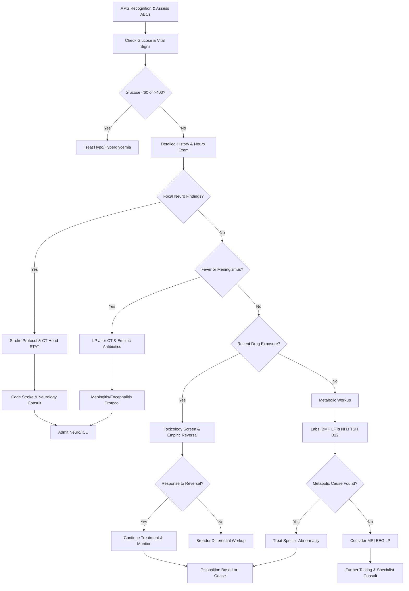

# Altered Mental Status – RRT Protocol with Virtua Voorhees Addenda

**Guideline Used:**  
American Academy of Neurology (AAN) Practice Guidelines, Emergency Neurological Life Support (ENLS) 2020, American Delirium Society Clinical Practice Guidelines 2018, Society for Academic Emergency Medicine (SAEM) Clinical Practice Guidelines for Altered Mental Status  
**Official Sources:**  
https://www.aan.com/Guidelines/  
https://www.neurocriticalcare.org/enls  
https://americandeliriumsociety.org/clinical-practice-guidelines

## CARD INTERFACE LAYOUT

### Card 0 – Dynamic Action Card (Node Dependent)

```
┌─────────────────────────────────────────────────────────────┐
│ ALTERED MENTAL STATUS RRT                                   │
├─────────────────────────────────────────────────────────────┤
│ ⏱️ BASELINE MENTAL STATUS: Alert and oriented              │
│ Current GCS: 11 (E3 V3 M5) | Change: Acute over 2 hours    │
│                                                           │
│ ┌─────────────────────────────────┐                        │
│ │     IMMEDIATE ACTIONS           │                        │
│ │ ☑ Fingerstick glucose checked   │ [142 mg/dL - Normal]   │
│ │ ☑ Oxygen applied if needed      │ [SpO2 95% on RA]       │
│ │ ☑ IV access established         │ [18G left AC]          │
│ │ ☑ Continuous monitoring         │ [Connected]            │
│ │ ☐ Naloxone ready at bedside    │ [Prepare]              │
│ │ ☐ Thiamine 100mg IV given      │ [Order]                │
│ │ ☐ D50 available if needed      │ [At bedside]           │
│ │ ☐ Head CT ordered              │ [STAT order]           │
│ │                                │                        │
│ │ FAST-ED Score: 3 (LVO possible) │                        │
│ └─────────────────────────────────┘                        │
│                                                           │
│ VITALS: BP 168/94, HR 78, RR 16, SpO2 95%, T 37.1°C       │
│                                                           │
│ QUICK NEURO SCREEN:                                        │
│ ☑ Pupils equal reactive  ☑ Right facial droop             │
│ ☑ Right arm weakness     ☐ Neck stiffness                 │
│                                                           │
│ 🚨 RED FLAGS PRESENT: Acute onset, focal signs            │
│ 📞 Code Stroke activated, Sevaro: 856-247-3098            │
└─────────────────────────────────────────────────────────────┘
```

### Card 1 – Static Assessment/Differential

```
┌─────────────────────────────────────────────────────────────┐
│ CAUSES OF ALTERED MENTAL STATUS                             │
├─────────────────────────────────────────────────────────────┤
│ 🧠 NEUROLOGICAL:                                            │
│ • Vascular: Ischemic stroke, ICH, SAH, subdural hematoma   │
│ • Infectious: Meningitis, encephalitis, brain abscess      │
│ • Seizure: Status epilepticus, non-convulsive, post-ictal  │
│ • Mass effect: Brain tumor, hydrocephalus, increased ICP   │
│                                                           │
│ 💊 TOXIC/METABOLIC:                                         │
│ • Medications: Opioids, benzos, anticholinergics, steroids │
│ • Metabolic: Hypoglycemia, hyperglycemia, hyponatremia     │
│ • Endocrine: Myxedema coma, thyroid storm, adrenal crisis  │
│                                                           │
│ 🫁 HYPOXIC/HYPERCAPNIC:                                     │
│ • Respiratory: Hypoxemia, hypercapnia, CO poisoning        │
│ • Cardiovascular: Arrhythmia, hypotension, HTN emergency   │
│                                                           │
│ 🔥 INFECTIOUS/WITHDRAWAL:                                   │
│ • Systemic: Sepsis, UTI (elderly), pneumonia, bacteremia   │
│ • Withdrawal: Alcohol, benzodiazepine, opioid, SSRI        │
│                                                           │
│ CRITICAL HISTORY ELEMENTS:                                 │
│ Baseline mental status, time course, recent medications,   │
│ substance use, illness/fever, head trauma, seizure history │
│                                                           │
│ RED FLAGS: Acute onset + headache, focal signs, fever +    │
│ AMS, recent head trauma, anticoagulation use              │
└─────────────────────────────────────────────────────────────┘
```

### Card 2 – Static Physical Exam/Medications

```
┌─────────────────────────────────────────────────────────────┐
│ PHYSICAL EXAM & MEDICATIONS                                 │
├─────────────────────────────────────────────────────────────┤
│ NEUROLOGICAL EXAMINATION:                                  │
│ • Mental status: GCS, orientation, attention, memory       │
│ • Cranial nerves: Pupils, eye movements, facial symmetry   │
│ • Motor: Strength 0-5 scale, tone, reflexes, Babinski     │
│ • Sensory: Response to stimuli, withdrawal to pain         │
│ • Meningeal signs: Neck stiffness, Kernig's, Brudzinski's  │
│                                                           │
│ KEY PHYSICAL FINDINGS:                                     │
│ Pupils (pinpoint = opioids), tongue laceration (seizure),  │
│ neck stiffness (meningitis), asterixis (hepatic/uremic)    │
│                                                           │
│ 💊 EMPIRIC TREATMENTS:                                      │
│ • Thiamine 100mg IV (before glucose, prevents Wernicke's)  │
│ • Dextrose 50% 25-50mL IV (if glucose <60 mg/dL)          │
│ • Naloxone 0.4-2mg IV (start low, may precipitate withdrawal)│
│ • Flumazenil 0.2mg IV (caution: seizure risk in chronic users)│
│                                                           │
│ 💊 ANTIBIOTICS (if meningitis suspected):                  │
│ <50y: Ceftriaxone 2g IV q12h + Vancomycin 15-20mg/kg q8-12h│
│ >50y: Add Ampicillin 2g IV q4h (Listeria coverage)        │
│ HSV concern: Add Acyclovir 10mg/kg IV q8h                  │
│                                                           │
│ 💊 SEIZURE MANAGEMENT:                                      │
│ Lorazepam 2-4mg IV, Levetiracetam 1000-1500mg IV,         │
│ Fosphenytoin 20mg PE/kg IV (if benzos fail)               │
│                                                           │
│ INCREASED ICP: HOB 30°, Mannitol 0.5-1g/kg, Neuro consult │
└─────────────────────────────────────────────────────────────┘
```

## FLOWCHART (Bottom Panel – Mermaid Algorithm)



## NODE-TO-DYNAMIC CARD PROMPT MAPPING (WITH INTERACTIVES)

| **Step (Node)**                    | **Dynamic Card Prompt/Question**                                                                 | **Interactive Components**                                        |
|-------------------------------------|--------------------------------------------------------------------------------------------------|-------------------------------------------------------------------|
| AMS Recognition                     | "Altered mental status identified. Assess ABCs and ensure airway protection?"                   | [ABC Assessment], [GCS Calculator], [Baseline Comparison]         |
| Glucose and Vital Signs Check       | "Check fingerstick glucose immediately and obtain complete vital signs?"                        | [Glucose Check], [Vital Signs], [Temperature Assessment]          |
| Hypoglycemia/Hyperglycemia Treatment| "Blood glucose abnormal (<60 or >400 mg/dL). Treat immediately?"                              | [D50 Administration], [Insulin Protocol], [Glucose Monitoring]    |
| Detailed History and Neuro Exam     | "Complete focused neurological examination and targeted history from family/witnesses?"         | [GCS Scoring], [Neuro Checklist], [History Questionnaire]         |
| Focal Neurological Assessment       | "Focal neurological deficits present suggesting stroke or structural lesion?"                   | [FAST-ED Screen], [Stroke Scale], [Focal Signs Checklist]         |
| Stroke Protocol Activation          | "Stroke suspected based on presentation. Activate Code Stroke and order emergent CT?"          | [Code Stroke], [CT Head Order], [Time Documentation]              |
| Fever/Meningismus Evaluation        | "Fever or meningeal signs present suggesting CNS infection?"                                    | [Temperature Check], [Meningeal Signs], [Infection Risk]          |
| Neurology Consultation             | "Stroke confirmed or high suspicion. Contact neurology and consider advanced imaging?"          | [Neuro Consult], [CTA Orders], [Teleneurology Contact]           |
| Lumbar Puncture Decision            | "CNS infection suspected. Perform LP after ruling out increased ICP with CT?"                  | [CT Review], [LP Checklist], [Contraindication Screen]           |
| Drug Exposure Assessment            | "Recent medication changes or substance use history. Consider toxicological cause?"             | [Med Reconciliation], [Tox Screen], [Exposure Timeline]          |
| Meningitis/Encephalitis Protocol    | "CNS infection confirmed. Begin appropriate antimicrobial therapy immediately?"                | [Antibiotic Selection], [Steroid Protocol], [Isolation Orders]   |
| Empirical Reversal Trial            | "Suspected overdose or poisoning. Administer empirical reversal agents?"                       | [Naloxone Protocol], [Flumazenil Caution], [Response Monitor]    |
| Metabolic Workup                    | "No obvious cause identified. Complete comprehensive metabolic and endocrine evaluation?"       | [Lab Orders], [Metabolic Panel], [Endocrine Tests]               |
| Response to Reversal Assessment     | "Administered reversal agent. Significant clinical improvement noted?"                          | [Response Scale], [GCS Trend], [Duration Monitor]                |
| Broader Differential Evaluation     | "No response to initial treatments. Expand differential and diagnostic workup?"                 | [Differential Tool], [Advanced Imaging], [Specialist Consult]    |
| Disposition Planning                | "Cause identified and treated. Determine appropriate level of care and monitoring?"            | [Disposition Criteria], [ICU vs Floor], [Follow-up Planning]     |

**Interactive Highlights:**  
- GCS calculator: real-time scoring with trend monitoring and severity classification
- CAM-ICU delirium screen: structured assessment tool with automated scoring
- Empiric treatment selector: clinical suspicion-based medication recommendations
- FAST-ED stroke screen: automated stroke recognition with LVO prediction
- Toxicology reversal guide: agent-specific antidotes with dosing and monitoring

## INTERACTIVE ELEMENTS

### Glasgow Coma Scale Calculator
```
┌─────────────────────────────────────────┐
│      GLASGOW COMA SCALE (GCS)           │
├─────────────────────────────────────────┤
│ EYE OPENING (E):                        │
│ ● To voice (3 points)                   │
│                                         │
│ VERBAL RESPONSE (V):                    │
│ ● Inappropriate words (3 points)        │
│                                         │
│ MOTOR RESPONSE (M):                     │
│ ● Localizes pain (5 points)             │
│                                         │
│ TOTAL GCS: 11/15                        │
│ Severity: MODERATE                      │
│                                         │
│ Clinical Significance:                  │
│ • 13-15: Mild injury                    │
│ • 9-12: Moderate injury                 │
│ • 3-8: Severe injury                    │
│                                         │
│ Baseline GCS: 15 | Change: -4 points    │
│ Trend: ↓ Declining over 2 hours         │
│                                         │
│ [REASSESS] [TREND] [ALERT TEAM]         │
└─────────────────────────────────────────┘
```

### CAM-ICU Delirium Assessment
```
┌─────────────────────────────────────────┐
│    CONFUSION ASSESSMENT METHOD (CAM)     │
├─────────────────────────────────────────┤
│ Feature 1: Acute Onset/Fluctuation      │
│ ● YES (Required for delirium)           │
│ Acute change from baseline over hours    │
│                                         │
│ Feature 2: Inattention                  │
│ ● YES (Required for delirium)           │
│ SAVEAHAART test: 4 errors (>2 abnormal) │
│                                         │
│ Feature 3: Disorganized Thinking        │
│ ● YES                                   │
│ Questions: 2/4 incorrect                │
│ Commands: Unable to follow               │
│                                         │
│ Feature 4: Altered Consciousness        │
│ ○ NO                                    │
│ RASS = 0 (alert and calm)               │
│                                         │
│ RESULT: 🔴 POSITIVE FOR DELIRIUM        │
│ (Features 1 AND 2 + either 3 OR 4)     │
│                                         │
│ Subtype: Hyperactive delirium           │
│                                         │
│ [INTERVENTIONS] [REASSESS] [DOCUMENT]    │
└─────────────────────────────────────────┘
```

### Empiric Treatment Decision Support
```
┌─────────────────────────────────────────┐
│      EMPIRIC TREATMENT GUIDE            │
├─────────────────────────────────────────┤
│ Clinical Clues & Treatments:            │
│                                         │
│ ☑ OPIOID OVERDOSE:                      │
│ Clues: Pinpoint pupils, respiratory ↓   │
│ → Naloxone 0.4-2mg IV                   │
│ [ADMINISTERED] Response: Partial         │
│                                         │
│ ☑ ALCOHOL HISTORY:                      │
│ Risk: Wernicke encephalopathy           │
│ → Thiamine 100mg IV (before glucose)    │
│ [ADMINISTER NOW]                        │
│                                         │
│ ☐ CONFIRMED HYPOGLYCEMIA:               │
│ Glucose <60 mg/dL confirmed             │
│ → D50 25-50mL IV push                   │
│ [NOT INDICATED]                         │
│                                         │
│ ☐ KNOWN BENZODIAZEPINE OD:              │
│ ⚠️ HIGH RISK: Seizures in chronic users │
│ → Flumazenil 0.2mg IV (extreme caution) │
│ [RISK ASSESSMENT]                       │
│                                         │
│ ☑ SUSPECTED MENINGITIS:                 │
│ Fever + AMS, age >50                    │
│ → Antibiotics + Dexamethasone           │
│ [PROTOCOL ACTIVE]                       │
│                                         │
│ [UPDATE ASSESSMENT] [LOG RESPONSE]       │
└─────────────────────────────────────────┘
```

## VIRTUA VOORHEES ALTERED MENTAL STATUS ADDENDA

- **Stroke Team Integration:** Seamless transition to Code Stroke protocol with Sevaro teleneurology at 856-247-3098
- **Rapid Laboratory Services:** STAT glucose, electrolytes, and toxicology screens with <60 minute turnaround
- **Neurology Consultation:** 24/7 access to neurological expertise via Transfer Center 856-886-5111
- **Advanced Imaging:** MRI, CT perfusion, and EEG capabilities with urgent interpretation for complex cases

## REFERENCE (GUIDELINE & SOURCE)
American Academy of Neurology Practice Guidelines for the Evaluation of Dementia and Cognitive Impairment.  
https://www.aan.com/Guidelines/

**Additional References:**  
Emergency Neurological Life Support (ENLS) Altered Mental Status Protocol 2020  
https://www.neurocriticalcare.org/enls

American Delirium Society Clinical Practice Guidelines 2018  
https://americandeliriumsociety.org/clinical-practice-guidelines

Society for Academic Emergency Medicine Clinical Decision Rules for Altered Mental Status  
https://www.saem.org/about-saem/academies-interest-groups-affiliates2/cdem/for-students/online-education/m4-curriculum/group-m4-approach-to-complaints/altered-mental-status

**All steps follow current evidence-based guidelines for altered mental status evaluation with integrated stroke recognition, toxicological assessment, and optimized for rapid identification of reversible causes requiring immediate intervention.**
