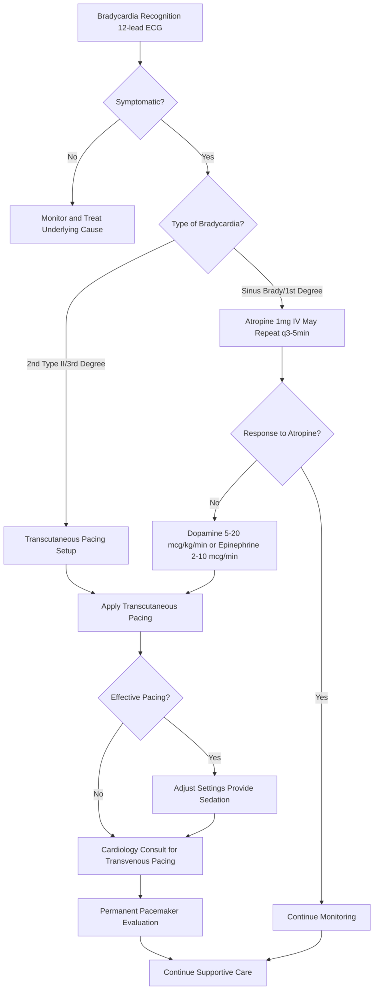

# Bradycardia – RRT Protocol with Virtua Voorhees Addenda

**Guideline Used:**  
American Heart Association/American College of Cardiology (AHA/ACC) 2020 Advanced Cardiovascular Life Support (ACLS) Guidelines, 2018 AHA/ACC/HRS Guideline on the Evaluation and Management of Patients with Bradycardia  
**Official Sources:**  
https://www.ahajournals.org/doi/10.1161/CIR.0000000000000916  
https://www.ahajournals.org/doi/10.1161/CIR.0000000000000628

## CARD INTERFACE LAYOUT

### Card 0 – Dynamic Action Card (Node Dependent)

```
┌─────────────────────────────────────────────────────────────┐
│ BRADYCARDIA RRT ACTIVATED                                   │
├─────────────────────────────────────────────────────────────┤
│ ⏱️ TIME OF ONSET: 45 minutes ago                           │
│ Duration: Progressive over hours | Symptomatic: Yes         │
│                                                           │
│ ┌─────────────────────────────────┐                        │
│ │     IMMEDIATE ACTIONS           │                        │
│ │ ☑ 12-lead ECG obtained          │ [3rd degree AV block]  │
│ │ ☑ Continuous telemetry          │ [Monitoring active]    │
│ │ ☑ IV access x2                 │ [18G bilateral]        │
│ │ ☑ Transcutaneous pads applied   │ [Anterior-posterior]   │
│ │ ☐ Atropine 1mg ready           │ [Drawn up]             │
│ │ ☐ Dopamine infusion prepared    │ [Rate support]         │
│ │ ☐ Transvenous pacing kit        │ [On standby]           │
│ │                                │                        │
│ │ Current Rhythm: Complete Heart Block│                     │
│ │ Atrial Rate: 75 | Ventricular: 38   │                    │
│ └─────────────────────────────────┘                        │
│                                                           │
│ VITALS: HR 38 regular, BP 92/58, RR 18, SpO2 96% RA       │
│                                                           │
│ SYMPTOMATIC FEATURES:                                      │
│ ☑ Dizziness/lightheadedness  ☑ Fatigue/weakness           │
│ ☐ Syncope/near-syncope       ☐ Chest pain                 │
│ ☐ Shortness of breath        ☐ Altered mental status      │
│                                                           │
│ 🚨 HIGH-RISK BLOCK → Prepare for pacing                   │
└─────────────────────────────────────────────────────────────┘
```

### Card 1 – Static Assessment/Differential

```
┌─────────────────────────────────────────────────────────────┐
│ BRADYCARDIA DIFFERENTIAL & CAUSES                           │
├─────────────────────────────────────────────────────────────┤
│ 🔵 SINUS BRADYCARDIA:                                       │
│ • Physiologic: Athletic conditioning, sleep, vagal stimulation│
│ • Pathologic: Sick sinus syndrome, hypothyroidism, ↑ICP    │
│                                                           │
│ 🔵 ATRIOVENTRICULAR BLOCKS:                                │
│ • 1st degree: PR >200ms, usually benign, monitor           │
│ • 2nd degree Type I (Wenckebach): Progressive PR lengthening│
│ • 2nd degree Type II: Fixed PR with sudden dropped beats   │
│ • 3rd degree (Complete): AV dissociation, escape rhythm    │
│                                                           │
│ UNDERLYING CAUSES:                                         │
│ • Medications: Beta-blockers, CCBs, digoxin, amiodarone   │
│ • Metabolic: Hyperkalemia, hypothyroidism, hypothermia     │
│ • Cardiac: Inferior MI, conduction disease, post-cardiac surgery│
│ • Other: Vasovagal response, ↑ICP, sleep apnea            │
│                                                           │
│ SYMPTOMATIC CRITERIA (Any present = treat):                │
│ • Acute altered mental status                              │
│ • Ischemic chest discomfort                                │
│ • Acute heart failure                                      │
│ • Hypotension with signs of shock                          │
│ • Syncope or near-syncope                                  │
│                                                           │
│ HIGH-RISK FEATURES (Require pacing):                       │
│ • 2nd degree Type II or 3rd degree AV block               │
│ • Wide QRS escape rhythm                                   │
│ • Pauses >3 seconds                                        │
│ • Symptomatic despite atropine                             │
└─────────────────────────────────────────────────────────────┘
```

### Card 2 – Static Physical Exam/Medications

```
┌─────────────────────────────────────────────────────────────┐
│ PHYSICAL EXAM & MEDICATIONS                                 │
├─────────────────────────────────────────────────────────────┤
│ HEMODYNAMIC ASSESSMENT:                                    │
│ • BP: Check for hypotension and pulse pressure             │
│ • Perfusion: Mental status, skin temp, capillary refill   │
│ • Volume: JVD assessment, cannon A waves in complete block │
│ • Cardiac: Variable S1 intensity in AV dissociation       │
│                                                           │
│ 💊 FIRST-LINE PHARMACOLOGIC THERAPY:                       │
│ • Atropine: 1mg IV push, may repeat q3-5min (max 3mg total)│
│   - Blocks vagal tone, ↑SA node firing rate               │
│   - Ineffective in heart transplant patients              │
│   - Limited effect in 3rd degree AV block                 │
│                                                           │
│ 💊 CHRONOTROPIC INFUSIONS:                                 │
│ • Dopamine: 5-20 mcg/kg/min IV (preferred)                │
│   - Beta effects predominate at lower doses               │
│   - Monitor for tachyarrhythmias                          │
│ • Epinephrine: 2-10 mcg/min IV infusion                   │
│   - Potent chronotrope, monitor for ischemia              │
│ • Isoproterenol: 2-10 mcg/min IV (avoid in ischemia)     │
│   - Pure beta agonist, avoid if CAD                       │
│                                                           │
│ 💊 TRANSCUTANEOUS PACING:                                  │
│ • Indications: Symptomatic bradycardia, failed meds       │
│ • Technique: Anterior-posterior pad placement              │
│ • Settings: Start 30mA, increase by 10mA until capture    │
│ • Rate: 80 ppm for adults                                 │
│ • Sedation: Fentanyl 25-50mcg, midazolam 1-2mg           │
│                                                           │
│ TRANSVENOUS PACING (Cardiology consult):                  │
│ • Indications: 2nd degree Type II, 3rd degree block       │
│ • Temporary bridge to permanent pacemaker                  │
│ • Transfer Center: 856-886-5111                           │
│                                                           │
│ MEDICATION ALERTS: Atropine paradox in 2nd degree Type II,│
│ avoid in suspected digitalis toxicity, check electrolytes  │
└─────────────────────────────────────────────────────────────┘
```

## FLOWCHART (Bottom Panel – Mermaid Algorithm)



## NODE-TO-DYNAMIC CARD PROMPT MAPPING (WITH INTERACTIVES)

| **Step (Node)**                    | **Dynamic Card Prompt/Question**                                                                 | **Interactive Components**                                        |
|-------------------------------------|--------------------------------------------------------------------------------------------------|-------------------------------------------------------------------|
| Bradycardia Recognition             | "Bradycardia identified on monitor/ECG (<60 bpm). Obtain 12-lead ECG and assess symptoms?"      | [ECG Acquisition], [HR Monitor], [Rhythm Analysis]                |
| Symptomatic Assessment              | "Evaluate for symptoms related to bradycardia requiring immediate intervention?"                 | [Symptom Checklist], [Mental Status], [Perfusion Assessment]      |
| Asymptomatic Monitoring             | "Patient asymptomatic with bradycardia. Monitor and identify/treat underlying causes?"          | [Cause Investigation], [Monitoring Protocol], [Med Review]        |
| Bradycardia Type Classification     | "Symptomatic bradycardia present. Classify type: sinus, AV block, or other conduction issue?"   | [ECG Analysis], [Block Classification], [Risk Stratification]     |
| Atropine Administration             | "Sinus bradycardia or 1st degree block. Administer atropine 1mg IV push?"                      | [Atropine Protocol], [Dose Tracking], [Response Monitor]         |
| High-Risk Block Management          | "2nd degree Type II or 3rd degree block identified. Prepare transcutaneous pacing?"            | [Pacing Setup], [Pad Placement], [Emergency Pacing]              |
| Atropine Response Evaluation        | "Atropine administered. Adequate response with HR improvement and symptom resolution?"          | [HR Trending], [Symptom Assessment], [Duration Monitor]          |
| Chronotropic Infusion Initiation    | "Inadequate response to atropine. Begin dopamine or epinephrine infusion?"                     | [Infusion Calculator], [Drug Selection], [Titration Protocol]    |
| Transcutaneous Pacing Application   | "Apply transcutaneous pacing pads and initiate electrical pacing?"                             | [Pacing Setup], [Threshold Testing], [Capture Confirmation]      |
| Pacing Effectiveness Assessment     | "Transcutaneous pacing initiated. Effective electrical and mechanical capture achieved?"        | [Capture Assessment], [Pacing Parameters], [Patient Comfort]     |
| Pacing Optimization                 | "Adjust pacing settings and provide sedation for patient comfort?"                             | [Settings Adjustment], [Sedation Protocol], [Comfort Score]      |
| Transvenous Pacing Consultation     | "Transcutaneous pacing established. Contact cardiology for transvenous pacing evaluation?"     | [Cardiology Consult], [Transfer Planning], [Temporary Bridge]    |
| Permanent Pacemaker Evaluation      | "Temporary pacing in place. Evaluate need for permanent pacemaker implantation?"               | [Pacemaker Criteria], [EP Consultation], [Admission Planning]    |
| Continued Monitoring                | "Bradycardia stabilized with appropriate intervention. Continue monitoring and supportive care?"| [Telemetry Monitoring], [Parameter Tracking], [Disposition]      |

**Interactive Highlights:**  
- Pacing threshold calculator: automated testing with capture confirmation
- Atropine dosing tracker: cumulative dose monitoring with maximum limits
- Chronotropic infusion calculator: weight-based dosing with hemodynamic monitoring
- AV block classifier: ECG analysis tool with risk stratification
- Transcutaneous pacing comfort scale: pain assessment with sedation recommendations

## INTERACTIVE ELEMENTS

### Transcutaneous Pacing Setup
```
┌─────────────────────────────────────────┐
│    TRANSCUTANEOUS PACING CONTROLLER     │
├─────────────────────────────────────────┤
│ CURRENT SETTINGS:                       │
│ Rate: 80 ppm [▲▼]                       │
│ Output: 70 mA [▲▼]                      │
│ Mode: Demand (synchronous)               │
│ Sensitivity: 2 mV                       │
│                                         │
│ CAPTURE ASSESSMENT:                     │
│ ☑ Electrical: Pacing spikes visible    │
│ ☑ Mechanical: Palpable pulse           │
│ ☑ Hemodynamic: BP improved             │
│                                         │
│ THRESHOLD TESTING:                      │
│ Threshold: 55 mA                        │
│ Safety margin: 1.5x = 82 mA            │
│ Current output: 70 mA (adequate)        │
│                                         │
│ PATIENT COMFORT:                        │
│ Pain score: 7/10                        │
│ Sedation given:                         │
│ • Fentanyl 50mcg IV                     │
│ • Midazolam 2mg IV                      │
│ Current comfort: 4/10 (improved)        │
│                                         │
│ [TEST THRESHOLD] [ADJUST] [SEDATE]      │
└─────────────────────────────────────────┘
```

### AV Block Classification Tool
```
┌─────────────────────────────────────────┐
│      AV BLOCK CLASSIFICATION AID        │
├─────────────────────────────────────────┤
│ ECG Analysis:                           │
│                                         │
│ 1. PR INTERVAL:                         │
│    ○ Normal (120-200ms)                 │
│    ○ Prolonged but constant (>200ms)    │
│    ○ Progressive lengthening            │
│    ● Variable/no relationship           │
│                                         │
│ 2. P-QRS RELATIONSHIP:                  │
│    ○ 1:1 conduction                     │
│    ○ Progressive until dropped QRS      │
│    ○ Fixed ratio with dropped QRS       │
│    ● Complete dissociation              │
│                                         │
│ 3. QRS WIDTH:                           │
│    ○ Narrow (<120ms)                    │
│    ● Wide (≥120ms)                     │
│                                         │
│ 4. ESCAPE RHYTHM:                       │
│    ● Present (ventricular)              │
│    Rate: 38 bpm                         │
│                                         │
│ DIAGNOSIS: 3rd Degree (Complete) AV Block│
│ Risk Level: 🔴 HIGH                     │
│                                         │
│ RECOMMENDATION:                         │
│ • Immediate transcutaneous pacing       │
│ • Cardiology consultation              │
│ • Transvenous pacing evaluation         │
│                                         │
│ [CONFIRM DIAGNOSIS] [PACING PROTOCOL]    │
└─────────────────────────────────────────┘
```

### Chronotropic Support Calculator
```
┌─────────────────────────────────────────┐
│    CHRONOTROPIC INFUSION CALCULATOR     │
├─────────────────────────────────────────┤
│ Patient Weight: [75] kg                 │
│ Current HR: 42 bpm                      │
│ Target HR: >60 bpm                      │
│                                         │
│ DOPAMINE (Preferred):                   │
│ Starting dose: 5 mcg/kg/min             │
│ = 375 mcg/min = 22.5 mL/hr             │
│ (400mg/250mL concentration)             │
│                                         │
│ Current dose: 10 mcg/kg/min             │
│ = 750 mcg/min = 45 mL/hr               │
│ Response: HR 42→54 (↑12 bpm)           │
│                                         │
│ EPINEPHRINE (Alternative):              │
│ Starting dose: 2 mcg/min                │
│ = 2 mL/hr (1mg/250mL)                  │
│ Maximum: 10 mcg/min                     │
│                                         │
│ MONITORING PARAMETERS:                  │
│ • HR trend: ↑ Improving                 │
│ • BP: 92/58→98/62 mmHg                 │
│ • Ectopy: None observed                 │
│ • Ischemia: No chest pain              │
│                                         │
│ Recommendation: ↑ Dopamine to 15 mcg/kg/min│
│                                         │
│ [CALCULATE] [TITRATE] [MONITOR]         │
└─────────────────────────────────────────┘
```

## VIRTUA VOORHEES BRADYCARDIA MANAGEMENT ADDENDA

- **Cardiology Consultation:** 24/7 access via Transfer Center 856-886-5111 for high-grade blocks and pacing decisions
- **Electrophysiology Services:** Temporary and permanent pacemaker placement with interventional cardiology backup
- **Critical Care Integration:** ICU monitoring for patients requiring transcutaneous pacing or chronotropic support
- **Quality Metrics:** Time to atropine administration, pacing success rates, appropriate cardiology consultation rates

## REFERENCE (GUIDELINE & SOURCE)
American Heart Association/American College of Cardiology. 2020 ACLS Guidelines.  
https://www.ahajournals.org/doi/10.1161/CIR.0000000000000916

**Additional References:**  
2018 AHA/ACC/HRS Guideline on the Evaluation and Management of Patients with Bradycardia  
https://www.ahajournals.org/doi/10.1161/CIR.0000000000000628

2017 HRS Expert Consensus Statement on Cardiovascular Implantable Electronic Devices  
https://www.hrsonline.org/clinical-guidance/device-based-therapy

**All steps follow current AHA/ACC ACLS guidelines for bradycardia management with integrated pacing protocols and optimized for rapid identification of high-risk conduction blocks requiring immediate intervention.**
