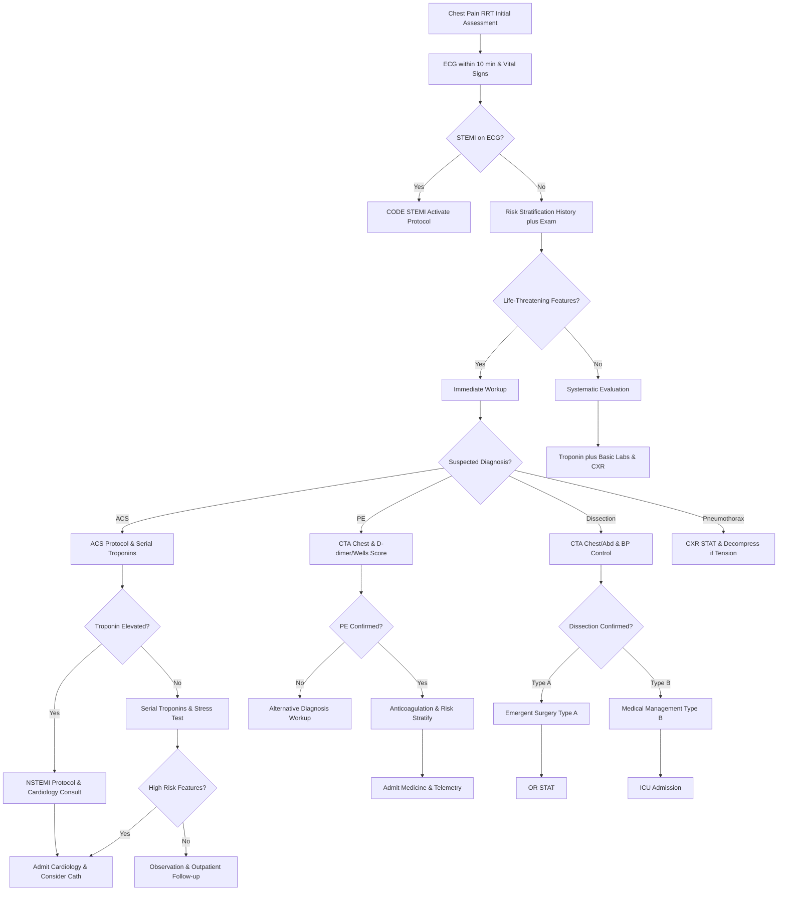

# Chest Pain Evaluation – RRT Protocol with Virtua Voorhees Addenda

**Guideline Used:**  
American Heart Association/American College of Cardiology (AHA/ACC) 2020 Guidelines for the Management of Patients with Non-ST-Elevation Acute Coronary Syndromes, European Society of Cardiology (ESC) 2020 Guidelines for the Management of Acute Coronary Syndromes  
**Official Sources:**  
https://www.ahajournals.org/doi/10.1161/CIR.0000000000000768  
https://academic.oup.com/eurheartj/article/41/2/407/5614708

## CARD INTERFACE LAYOUT

### Card 0 – Dynamic Action Card (Node Dependent)

```
┌─────────────────────────────────────────────────────────────┐
│ CHEST PAIN RAPID RESPONSE                                   │
├─────────────────────────────────────────────────────────────┤
│ ⏱️ TIME OF ONSET: 2 hours ago                              │
│ Duration: 120 minutes | Character: Substernal pressure      │
│                                                           │
│ ┌─────────────────────────────────┐                        │
│ │     IMMEDIATE ACTIONS           │                        │
│ │ ☑ 12-lead ECG within 10 minutes │ [Completed]            │
│ │ ☑ IV access established         │ [18G left AC]          │
│ │ ☑ Continuous cardiac monitoring │ [Telemetry on]         │
│ │ ☑ Aspirin 324mg chewed         │ [Given 13:45]          │
│ │ ☐ Troponin, CBC, BMP sent      │ [Order labs]           │
│ │ ☐ Portable CXR ordered         │ [Order imaging]        │
│ │ ☐ Sublingual NTG PRN           │ [If ongoing pain]      │
│ │                                │                        │
│ │ ECG: NSR, nonspecific ST-T     │                        │
│ │ [VIEW ECG] [COMPARE PRIOR]      │                        │
│ └─────────────────────────────────┘                        │
│                                                           │
│ VITAL SIGNS: BP 145/88, HR 84, RR 18, SpO2 97% RA        │
│ Pain: 7/10 → 4/10 after ASA and NTG                       │
│                                                           │
│ HIGH RISK FEATURES PRESENT:                                │
│ ☑ Known CAD/Prior MI  ☑ Diabetes  ☑ Age >65              │
│ ☐ Dynamic ECG changes ☐ Hemodynamic instability           │
└─────────────────────────────────────────────────────────────┘
```

### Card 1 – Static Assessment/Differential

```
┌─────────────────────────────────────────────────────────────┐
│ CAUSES & DIFFERENTIAL DIAGNOSIS                             │
├─────────────────────────────────────────────────────────────┤
│ 🔴 LIFE-THREATENING CAUSES:                                │
│ • ACS: STEMI/NSTEMI/Unstable angina, pressure/radiation    │
│ • PE: Sudden onset, pleuritic, dyspnea, risk factors      │
│ • Aortic dissection: Tearing pain, back radiation, BP diff │
│ • Tension pneumothorax: Unilateral, decreased sounds       │
│                                                           │
│ 🟡 URGENT CAUSES:                                          │
│ • Pericarditis: Sharp, positional, friction rub           │
│ • Myocarditis: Recent viral illness, young patients        │
│ • Esophageal rupture: Post-vomiting, subcutaneous emphysema│
│                                                           │
│ 🟢 OTHER CAUSES:                                           │
│ • GI: GERD, esophageal spasm, PUD, biliary colic          │
│ • MSK: Costochondritis, rib fracture, muscle strain       │
│ • Pulmonary: Pneumonia, pleuritis, bronchitis             │
│ • Psychiatric: Panic attack, anxiety, somatization        │
│                                                           │
│ CRITICAL HISTORY ELEMENTS:                                 │
│ Onset/duration/quality, radiation pattern, associated      │
│ symptoms, precipitating factors, response to interventions,│
│ prior cardiac history, CAD risk factors, medications       │
│                                                           │
│ RED FLAGS: Tearing pain (dissection), sudden onset (PE),   │
│ hemodynamic instability, new neurologic findings           │
└─────────────────────────────────────────────────────────────┘
```

### Card 2 – Static Physical Exam/Medications

```
┌─────────────────────────────────────────────────────────────┐
│ PHYSICAL EXAM & MEDICATIONS                                 │
├─────────────────────────────────────────────────────────────┤
│ EXAMINATION PRIORITIES:                                    │
│ • Vitals: BP both arms (>20mmHg diff = dissection)         │
│ • Cardiac: Rhythm, murmurs, S3/S4, friction rub           │
│ • Pulmonary: Equal sounds, rales, friction rub            │
│ • Vascular: Pulses, bruits, JVD                           │
│ • Chest wall: Reproducible tenderness, trauma             │
│                                                           │
│ 💊 ACS MEDICATIONS:                                         │
│ • ASA 324mg chewed immediately, then 81mg daily            │
│ • P2Y12: Ticagrelor 180mg → 90mg BID (preferred)          │
│ • Heparin: 60 units/kg bolus, 12 units/kg/hr (PTT 50-70)  │
│ • Statin: Atorvastatin 80mg PO daily                       │
│ • Beta-blocker: Metoprolol 25mg PO BID (if stable)        │
│                                                           │
│ 💊 SYMPTOM RELIEF:                                          │
│ • Nitroglycerin 0.4mg SL q5min x3 (CI: SBP <90, RV MI)    │
│ • Morphine 2-4mg IV q5-30min (Class IIb, delays P2Y12)    │
│                                                           │
│ 💊 PE TREATMENT:                                            │
│ • Heparin 80 units/kg bolus, 18 units/kg/hr infusion      │
│ • Consider thrombolysis if massive PE with shock           │
│                                                           │
│ MEDICATION ALERTS:                                         │
│ No NSAIDs if ACS suspected, avoid beta-blockers in cocaine,│
│ caution with NTG in RV infarct, hold anticoag if dissection│
│                                                           │
│ CONTACTS: Cardiology via Transfer Center 856-886-5111      │
└─────────────────────────────────────────────────────────────┘
```

## FLOWCHART (Bottom Panel – Mermaid Algorithm)



## NODE-TO-DYNAMIC CARD PROMPT MAPPING (WITH INTERACTIVES)

| **Step (Node)**                    | **Dynamic Card Prompt/Question**                                                                 | **Interactive Components**                                        |
|-------------------------------------|--------------------------------------------------------------------------------------------------|-------------------------------------------------------------------|
| Chest Pain RRT Assessment          | "Chest pain RRT activated. Begin immediate assessment and 12-lead ECG within 10 minutes?"       | [Start Assessment], [ECG Timer], [Vital Signs Monitor]            |
| ECG and Vital Signs                 | "12-lead ECG obtained and vital signs documented. Any acute ST-elevation present?"              | [ECG Interpretation], [STEMI Criteria], [Prior ECG Comparison]    |
| STEMI Recognition                   | "STEMI criteria met on ECG. Activate Code STEMI protocol immediately?"                          | [Activate Code STEMI], [Transfer to STEMI Protocol], [Timer]      |
| Risk Stratification                 | "No STEMI present. Complete risk stratification using history, exam, and HEART score?"          | [HEART Score Calculator], [Risk Factors], [Clinical Assessment]   |
| Life-Threatening Assessment         | "Evaluate for life-threatening causes: ACS, PE, dissection, tension pneumothorax?"             | [Differential Checklist], [High-Risk Features], [Urgent Workup]   |
| Immediate Workup Initiation         | "High-risk features identified. Begin immediate diagnostic workup based on suspected cause?"     | [Lab Orders], [Imaging Orders], [Treatment Initiation]            |
| Suspected Diagnosis Evaluation      | "Clinical presentation suggests specific diagnosis. Initiate targeted evaluation and treatment?" | [ACS Protocol], [PE Workup], [Dissection Imaging], [CXR STAT]     |
| ACS Protocol Implementation         | "ACS suspected based on clinical presentation. Begin dual antiplatelet and anticoagulation?"    | [ASA Given], [P2Y12 Selection], [Heparin Protocol], [Cardiology]  |
| Troponin Result Interpretation      | "Initial troponin result available. Elevated suggesting myocardial injury?"                     | [Troponin Level], [Serial Orders], [NSTEMI vs UA], [Risk Stratify]|
| PE Diagnostic Pathway               | "PE suspected based on Wells score and clinical presentation. Order CTA chest?"                 | [Wells Calculator], [D-dimer], [CTA Chest], [Risk Stratification] |
| Dissection Evaluation               | "Aortic dissection suspected based on presentation. Emergency CTA chest/abdomen/pelvis?"        | [CTA Order], [BP Control], [Type A vs B], [Surgical Consult]      |
| NSTEMI Management                   | "NSTEMI confirmed with elevated troponin. Cardiology consultation and consider catheterization?"| [Cardiology Consult], [Cath Lab], [Risk Stratification], [Admit]  |
| High-Risk Assessment                | "Negative initial troponin but high-risk features present. Serial troponins and observation?"   | [Serial Troponins], [Risk Calculator], [Observation vs Discharge]  |
| PE Treatment Initiation             | "PE confirmed on CTA. Begin anticoagulation and assess for thrombolysis candidacy?"            | [Anticoagulation], [Massive PE Assessment], [Admission Orders]     |
| Disposition Decision                | "Initial workup negative for life-threatening causes. Safe for discharge with follow-up?"      | [Discharge Criteria], [Follow-up Plans], [Return Precautions]      |

**Interactive Highlights:**  
- HEART Score calculator: real-time risk stratification with 6-week MACE prediction
- Chest pain character analyzer: symptom-based differential diagnosis tool
- Troponin trend tracker: serial values with timeline and delta calculations
- Wells Score for PE: automated risk calculation with D-dimer interpretation
- Dynamic pain scale: response to interventions with timeline tracking

## INTERACTIVE ELEMENTS

### HEART Score Calculator
```
┌─────────────────────────────────────────┐
│         HEART SCORE FOR ACS             │
├─────────────────────────────────────────┤
│ History: ● Highly suspicious (2 pts)    │
│ ECG: ● Nonspecific changes (1 pt)       │
│ Age: ● ≥65 years (2 pts)                │
│ Risk Factors: ● 2+ factors (1 pt)       │
│ Troponin: ● 1-3x normal (1 pt)          │
│                                         │
│ TOTAL SCORE: 7/10                       │
│ Risk Category: HIGH RISK                │
│ 6-week MACE Risk: 20.3%                 │
│                                         │
│ RECOMMENDATION:                         │
│ • Admit for further evaluation          │
│ • Serial troponins q6h x3               │
│ • Cardiology consultation               │
│ • Consider early invasive strategy      │
│                                         │
│ [RECALCULATE] [MANAGEMENT PROTOCOL]      │
└─────────────────────────────────────────┘
```

### Chest Pain Character Analyzer
```
┌─────────────────────────────────────────┐
│    CHEST PAIN DIFFERENTIAL TOOL         │
├─────────────────────────────────────────┤
│ CHARACTER:                              │
│ ☑ Pressure/squeezing → ACS (High prob)  │
│ ☐ Sharp/stabbing → Pericarditis         │
│ ☐ Tearing/ripping → Dissection          │
│                                         │
│ RADIATION:                              │
│ ☑ Left arm → ACS                        │
│ ☑ Jaw → ACS                             │
│ ☐ Back → Dissection/MSK                 │
│                                         │
│ ASSOCIATED SYMPTOMS:                    │
│ ☑ Diaphoresis → ACS                     │
│ ☑ Nausea → ACS                          │
│ ☐ Syncope → PE/Dissection               │
│                                         │
│ CALCULATED PROBABILITIES:               │
│ 1. ACS: 85% (High)                      │
│ 2. Pericarditis: 10% (Low)              │
│ 3. PE: 5% (Very Low)                    │
│                                         │
│ [UPDATE ASSESSMENT] [VIEW WORKUP]        │
└─────────────────────────────────────────┘
```

### Dynamic Pain Monitoring
```
┌─────────────────────────────────────────
