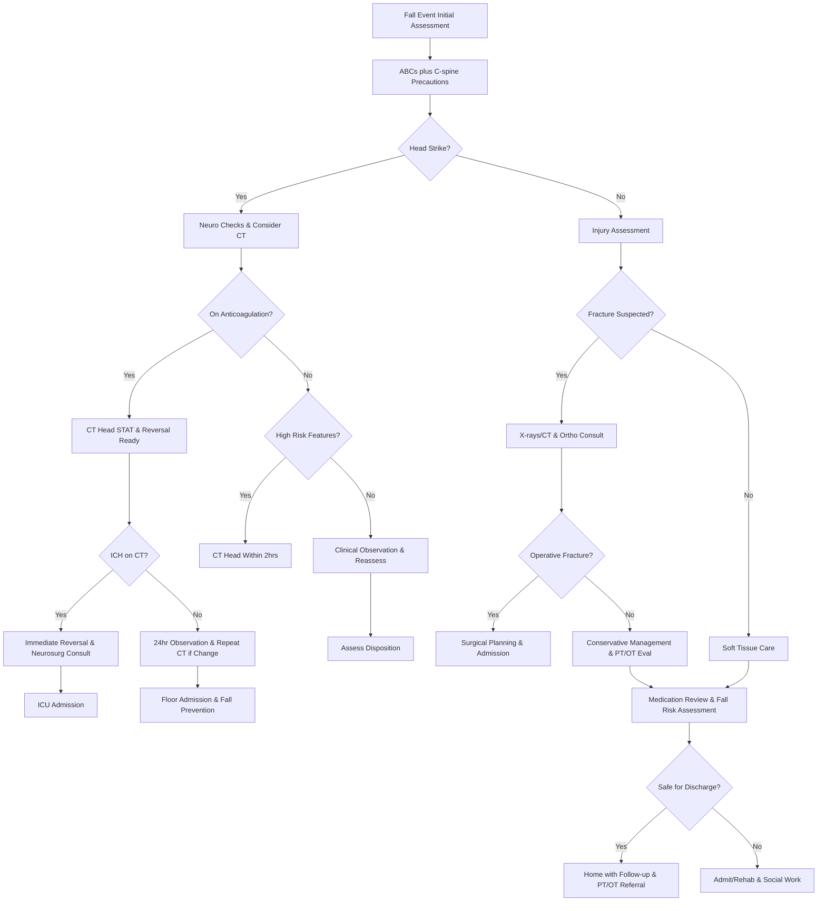

# Fall Assessment – RRT Protocol with Virtua Voorhees Addenda

**Guideline Used:**  
American Geriatrics Society/British Geriatrics Society Clinical Practice Guideline for Prevention of Falls in Older Persons 2019, NICE Clinical Guideline 161 Falls in Older People 2013, Canadian CT Head Rule 2001  
**Official Sources:**  
https://geriatricscareonline.org/ProductAbstract/american-geriatrics-societybritish-geriatrics-society-clinical-practice-guideline-for-prevention-of-falls-in-older-persons-2019-update/CL019  
https://www.nice.org.uk/guidance/cg161  
https://www.mdcalc.com/calc/588/canadian-ct-head-injury-trauma-rule

## CARD INTERFACE LAYOUT

### Card 0 – Dynamic Action Card (Node Dependent)

```
┌─────────────────────────────────────────────────────────────┐
│ FALL ASSESSMENT RRT                                         │
├─────────────────────────────────────────────────────────────┤
│ ⏱️ TIME OF FALL: 07:45 (2 hours ago)                       │
│ Witnessed: Yes - Nurse observed | Location: Bathroom        │
│                                                           │
│ ┌─────────────────────────────────┐                        │
│ │     IMMEDIATE ACTIONS           │                        │
│ │ ☑ C-spine precautions maintained │ [Complete]            │
│ │ ☑ Neuro assessment completed    │ [GCS: 15]             │
│ │ ☑ Head-to-toe examination done  │ [Document findings]   │
│ │ ☑ Medication review initiated   │ [High-risk meds]      │
│ │ ☐ CT head ordered (anticoag pt) │ [Order STAT]          │
│ │ ☐ X-rays as indicated          │ [Hip, wrist PRN]      │
│ │ ☐ PT/OT evaluation ordered     │ [Assess mobility]     │
│ │                                │                        │
│ │ VITALS: BP 156/88, HR 84 irreg │                        │
│ │ Pain: 7/10 right hip           │                        │
│ └─────────────────────────────────┘                        │
│                                                           │
│ ⚠️ ANTICOAGULATION STATUS: Warfarin, INR 3.2              │
│                                                           │
│ HIGH-RISK FEATURES PRESENT:                                │
│ ☑ Anticoagulation therapy  ☑ Head strike confirmed        │
│ ☐ Loss of consciousness    ☐ New neurological findings    │
│ ☑ Age ≥65 years            ☐ Multiple recent falls        │
└─────────────────────────────────────────────────────────────┘
```

### Card 1 – Static Assessment/Fall Risk Factors

```
┌─────────────────────────────────────────────────────────────┐
│ FALL RISK FACTORS & CAUSES                                  │
├─────────────────────────────────────────────────────────────┤
│ 🚶 INTRINSIC FACTORS:                                       │
│ • Neurological: Stroke, Parkinson's, neuropathy, dementia  │
│ • Cardiovascular: Orthostatic hypotension, arrhythmias     │
│ • Musculoskeletal: Arthritis, weakness, gait abnormalities │
│ • Sensory: Visual impairment, vestibular dysfunction       │
│                                                           │
│ 💊 HIGH-RISK MEDICATIONS:                                   │
│ 🔴 Benzodiazepines, antipsychotics, sedative-hypnotics     │
│ 🟡 Antihypertensives, diuretics, antidepressants, opioids  │
│ Polypharmacy: ≥4 medications, recent changes               │
│                                                           │
│ 🏠 ENVIRONMENTAL HAZARDS:                                   │
│ Hospital: Unfamiliar environment, poor lighting, clutter   │
│ Home: Throw rugs, stairs without rails, bathroom hazards   │
│                                                           │
│ INJURY PATTERNS:                                           │
│ • Head: Subdural hematoma, contusions (anticoag risk)      │
│ • Fractures: Hip (high mortality), wrist, vertebral        │
│ • Soft tissue: Skin tears, hematomas, lacerations          │
│                                                           │
│ CRITICAL HISTORY:                                          │
│ Time/location, witnessed vs unwitnessed, LOC, ability to   │
│ get up, previous falls, medications, baseline mobility     │
└─────────────────────────────────────────────────────────────┘
```

### Card 2 – Static Physical Exam/Management

```
┌─────────────────────────────────────────────────────────────┐
│ PHYSICAL EXAM & ACUTE MANAGEMENT                            │
├─────────────────────────────────────────────────────────────┤
│ HEAD-TO-TOE ASSESSMENT:                                    │
│ • Head/Neck: Scalp hematomas, pupils, C-spine tenderness   │
│ • Neuro: GCS, focal deficits, cerebellar signs             │
│ • CV: Orthostatic vitals, irregular rhythm, murmurs        │
│ • MSK: Hip rotation, point tenderness, ROM, skin integrity │
│                                                           │
│ SPECIAL TESTS:                                             │
│ Orthostatic vitals, Get-Up-and-Go (>12s = ↑risk)          │
│ Romberg test, vision screen                                │
│                                                           │
│ 💊 PAIN CONTROL:                                            │
│ • Acetaminophen 650-1000mg q6h (first-line)                │
│ • Tramadol 25-50mg q6h (caution: seizures)                 │
│ • Opioids sparingly (↑fall risk, delirium)                 │
│                                                           │
│ 💊 ANTICOAGULATION REVERSAL (if ICH):                       │
│ Warfarin: Vitamin K 10mg IV + 4-Factor PCC 25-50 units/kg  │
│ DOAC: Idarucizumab (dabigatran), Andexanet alfa (Xa inhib) │
│                                                           │
│ IMAGING INDICATIONS:                                       │
│ CT Head: GCS <15, anticoagulation, age >65 + head strike   │
│ X-rays: Point tenderness, deformity, inability to walk     │
│                                                           │
│ PREVENTION: Bed alarm, frequent rounding, med review       │
│ PT/OT evaluation, assistive devices, home safety           │
└─────────────────────────────────────────────────────────────┘
```

## FLOWCHART (Bottom Panel – Mermaid Algorithm)



## NODE-TO-DYNAMIC CARD PROMPT MAPPING (WITH INTERACTIVES)

| **Step (Node)**                    | **Dynamic Card Prompt/Question**                                                                 | **Interactive Components**                                        |
|-------------------------------------|--------------------------------------------------------------------------------------------------|-------------------------------------------------------------------|
| Fall Event Initial Assessment       | "Fall event reported. Begin immediate assessment: ABCs, C-spine precautions, and safety?"       | [Start Assessment], [C-spine Protocol], [Safety Measures]         |
| ABCs and C-spine Precautions        | "Complete primary survey with C-spine immobilization until cleared. Vitals stable?"            | [ABC Assessment], [C-spine Immobilization], [Vital Signs]         |
| Head Strike Assessment              | "Was there confirmed or suspected head strike during the fall?"                                 | [Head Strike Yes/No], [Witness Account], [Mechanism Assessment]   |
| Neurological Checks                 | "Begin neurological monitoring: GCS, pupils, focal signs. Baseline established?"               | [GCS Scoring], [Pupil Check], [Neuro Exam], [Monitoring Schedule] |
| Anticoagulation Status Check        | "Patient on anticoagulation therapy? Review current medications and recent INR/labs?"          | [Anticoag History], [INR Check], [Medication Review]              |
| STAT CT Head Decision               | "Anticoagulated patient with head strike. Order STAT CT head and prepare reversal agents?"     | [CT Head STAT], [Reversal Calculator], [Neurosurg Alert]          |
| High Risk Feature Assessment        | "No anticoagulation but assess for high-risk features requiring CT within 2 hours?"            | [Risk Calculator], [Canadian CT Rule], [CT Decision Tool]         |
| ICH Evaluation                      | "CT results available. Any signs of intracranial hemorrhage or mass effect?"                   | [CT Interpretation], [ICH Present/Absent], [Radiologist Consult]  |
| Immediate Reversal Protocol         | "ICH confirmed in anticoagulated patient. Begin immediate reversal protocol?"                  | [Reversal Calculator], [Vitamin K], [PCC Dosing], [Type & Screen] |
| Fracture Suspicion Assessment       | "Assess for fracture: point tenderness, deformity, inability to bear weight?"                  | [Fracture Assessment], [Pain Scale], [Mobility Test]              |
| Imaging Orders                      | "Clinical suspicion of fracture. Order appropriate imaging: X-rays, CT, or MRI?"               | [X-ray Orders], [CT Orders], [Clinical Correlation]               |
| Surgical vs Conservative            | "Fracture confirmed. Requires surgical intervention or conservative management?"                | [Ortho Consult], [Surgical Planning], [Conservative Protocol]     |
| 24-Hour Observation                 | "No ICH on initial CT but high-risk patient. Begin 24-hour neuro observation protocol?"        | [Neuro Checks q15min], [Monitoring Schedule], [Alert Parameters]  |
| Medication Review                   | "Complete comprehensive medication review for fall risk factors and drug interactions?"        | [Med Reconciliation], [Fall Risk Meds], [Polypharmacy Screen]     |
| Disposition Assessment              | "Patient stable for discharge or requires admission for ongoing monitoring/rehabilitation?"     | [Discharge Criteria], [Home Safety], [Caregiver Assessment]       |

**Interactive Highlights:**  
- Morse Fall Scale calculator: automated risk scoring with intervention recommendations
- Anticoagulation reversal calculator: weight and INR-based dosing with safety protocols
- Canadian CT Head Rule: evidence-based decision support for imaging
- Post-fall monitoring tracker: automated neuro check scheduling with alert thresholds
- Orthostatic vital signs calculator: automated interpretation with fall risk correlation

## INTERACTIVE ELEMENTS

### Morse Fall Scale Calculator
```
┌─────────────────────────────────────────┐
│      MORSE FALL SCALE                   │
├─────────────────────────────────────────┤
│ History of falling:                     │
│ ● Yes (25 points)                       │
│                                         │
│ Secondary diagnosis:                    │
│ ● Yes (15 points)                       │
│                                         │
│ Ambulatory aid:                         │
│ ● Furniture for support (30 points)     │
│                                         │
│ IV/Saline lock:                         │
│ ● Yes (20 points)                       │
│                                         │
│ Gait/Transfer:                          │
│ ● Weak (10 points)                      │
│                                         │
│ Mental status:                          │
│ ● Overestimates ability (15 points)     │
│                                         │
│ TOTAL SCORE: 115                        │
│ Risk Level: 🔴 HIGH RISK (≥51)          │
│                                         │
│ Required Interventions:                 │
│ • Bed alarm ON  • Hourly rounding       │
│ • Yellow armband  • 1:1 sitter PRN      │
│                                         │
│ [IMPLEMENT PROTOCOL] [PRINT ORDERS]      │
└─────────────────────────────────────────┘
```

### Anticoagulation Reversal Calculator
```
┌─────────────────────────────────────────┐
│   ANTICOAGULATION REVERSAL GUIDE        │
├─────────────────────────────────────────┤
│ Anticoagulant: ● Warfarin               │
│ Current INR: [3.2]  Weight: [75] kg     │
│                                         │
│ EMERGENCY REVERSAL PROTOCOL:            │
│                                         │
│ Vitamin K:                              │
│ • Dose: 10mg IV over 10 minutes         │
│ • Onset: 6-24 hours                     │
│                                         │
│ 4-Factor PCC (Kcentra):                 │
│ • INR 2-4: 25 units/kg = 1875 units     │
│ • Round to: 2000 units                  │
│ • Infuse over 10 minutes                │
│ • Recheck INR in 30 minutes             │
│                                         │
│ Alternative (if no PCC):                │
│ • FFP 15mL/kg = 1125mL (4-5 units)      │
│ • Takes longer, volume overload risk    │
│                                         │
│ Target INR: <1.4 within 30 minutes      │
│                                         │
│ [ORDER REVERSAL] [CALCULATE DOAC]        │
└─────────────────────────────────────────┘
```

### Post-Fall Neuro Monitoring
```
┌─────────────────────────────────────────┐
│      POST-FALL NEURO MONITORING         │
├─────────────────────────────────────────┤
│ Protocol: q15min x 1hr, then q1hr x 4   │
│                                         │
│ Time    GCS   Pupils   Comments         │
│ 09:45   15    PERRL    Baseline stable  │
│ 10:00   15    PERRL    Alert, oriented  │
│ 10:15   15    PERRL    No complaints    │
│ 10:30   14    PERRL    Slightly drowsy ⚠│
│ 10:45   13    Sluggish Confused - MD notified│
│                                         │
│ 🚨 CRITICAL PARAMETERS:                 │
│ • GCS decrease ≥2 points                │
│ • New focal neurological findings       │
│ • Severe headache or vomiting           │
│ • Pupil size/reactivity changes         │
│                                         │
│ Next check due: 11:00                   │
│ ⏰ [SET ALERT] [ESCALATE NOW]           │
└─────────────────────────────────────────┘
```

## VIRTUA VOORHEES FALL PREVENTION ADDENDA

- **Rapid Response Protocol:** Immediate RRT activation for all falls with high-risk features or change in neurological status
- **Anticoagulation Management:** 24/7 access to reversal agents (Vitamin K, 4-Factor PCC) with pharmacy consultation
- **Multidisciplinary Team:** PT/OT, pharmacy, social work integration for comprehensive fall risk assessment
- **Quality Metrics:** Fall rates, injury rates, time to CT for high-risk patients, appropriate reversal agent use

## REFERENCE (GUIDELINE & SOURCE)
American Geriatrics Society/British Geriatrics Society. Clinical Practice Guideline for Prevention of Falls in Older Persons 2019 Update.  
https://geriatricscareonline.org/ProductAbstract/american-geriatrics-societybritish-geriatrics-society-clinical-practice-guideline-for-prevention-of-falls-in-older-persons-2019-update/CL019

**Additional References:**  
NICE Clinical Guideline 161: Falls in Older People 2013  
https://www.nice.org.uk/guidance/cg161

Canadian CT Head Injury/Trauma Rule  
https://www.mdcalc.com/calc/588/canadian-ct-head-injury-trauma-rule

**All steps follow current evidence-based guidelines for fall assessment and management with integrated anticoagulation reversal protocols and optimized for rapid identification of high-risk patients requiring immediate intervention.**
