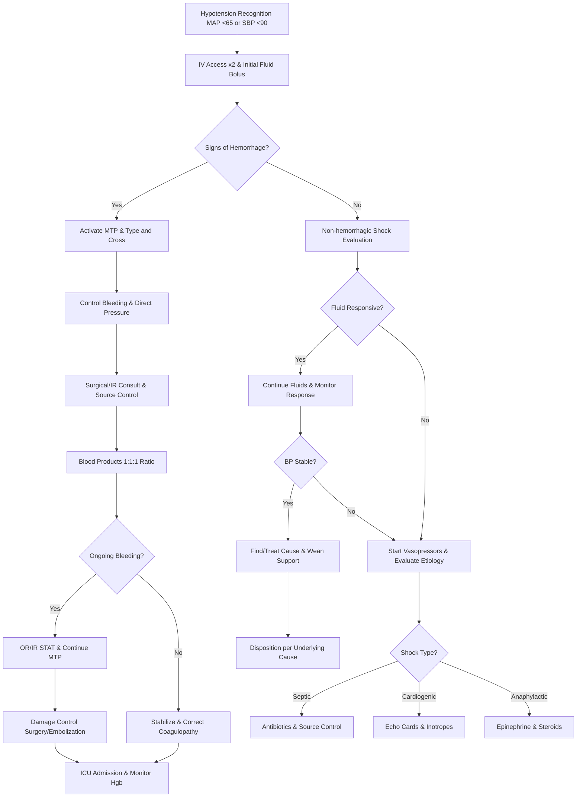

# Hypotension & Hemorrhage – RRT Protocol with Virtua Voorhees Addenda

**Guideline Used:**  
American College of Surgeons Committee on Trauma (ACS-COT) Advanced Trauma Life Support (ATLS) 2022, European Society of Anaesthesiology and Intensive Care (ESAIC) Guidelines on the Management of Severe Perioperative Bleeding 2023, Society of Critical Care Medicine (SCCM) Surviving Sepsis Campaign 2021  
**Official Sources:**  
https://www.facs.org/quality-programs/trauma/atls/  
https://ejanaesthesiology.eja-online.org/article/S0265-0215(23)00001-X/fulltext  
https://www.survivingsepsis.org/guidelines/adult-patients

## CARD INTERFACE LAYOUT

### Card 0 – Dynamic Action Card (Node Dependent)

```
┌─────────────────────────────────────────────────────────────┐
│ HYPOTENSION RRT ACTIVATED                                   │
├─────────────────────────────────────────────────────────────┤
│ ⏱️ TIME OF ONSET: 45 minutes ago                           │
│ BP Trend: 132/78 → 118/68 → 92/54 mmHg                     │
│                                                           │
│ ┌─────────────────────────────────┐                        │
│ │     IMMEDIATE ACTIONS           │                        │
│ │ ☑ Large bore IV x2 (18G)        │ [Bilateral access]     │
│ │ ☑ Fluid bolus initiated         │ [1L NS running]        │
│ │ ☑ Labs sent (CBC, BMP, lactate) │ [Pending results]      │
│ │ ☑ Blood bank notified          │ [Type & cross sent]    │
│ │ ☐ Arterial line kit ready      │ [Prepare]              │
│ │ ☐ Vasopressors at bedside      │ [Norepi ready]         │
│ │ ☐ MTP activation if needed     │ [Assess bleeding]      │
│ │                                │                        │
│ │ Fluid given: 500mL/1000mL NS   │                        │
│ │ ████████░░░░░░░░ 50%           │                        │
│ └─────────────────────────────────┘                        │
│                                                           │
│ VITALS: BP 92/54 (MAP 67), HR 112, RR 22, SpO2 94%, T 36.8°C│
│ UOP: 15 mL/hr x 2 hours (oliguria)                        │
│                                                           │
│ 🚨 SHOCK INDEX: 1.22 (HR/SBP) - MODERATE SHOCK            │
│ Normal: 0.5-0.7 | Current: Significant hemodynamic compromise│
│                                                           │
│ QUICK ASSESSMENT: ☐ Obvious bleeding ☑ Cold/clammy skin   │
└─────────────────────────────────────────────────────────────┘
```

### Card 1 – Static Assessment/Differential

```
┌─────────────────────────────────────────────────────────────┐
│ HYPOTENSION & HEMORRHAGE DIFFERENTIAL                       │
├─────────────────────────────────────────────────────────────┤
│ 🩸 HEMORRHAGIC CAUSES:                                      │
│ • GI bleeding: Upper GI (varices, ulcer), Lower GI (divert) │
│ • Surgical/trauma: Intra-abdominal, retroperitoneal        │
│ • Obstetric: Postpartum hemorrhage, placental abruption    │
│ • Coagulopathy: DIC, liver failure, anticoagulation        │
│                                                           │
│ 💧 NON-HEMORRHAGIC CAUSES:                                  │
│ • Distributive: Septic shock, anaphylaxis, neurogenic      │
│ • Cardiogenic: Acute MI, cardiomyopathy, arrhythmia       │
│ • Obstructive: Massive PE, tension pneumothorax, tamponade │
│ • Hypovolemic: Dehydration, third spacing, burns          │
│                                                           │
│ HEMORRHAGE CLASSIFICATION:                                 │
│ Class I (15% loss): HR <100, BP normal, mild symptoms      │
│ Class II (15-30%): HR 100-120, BP normal/↓PP, anxiety     │
│ Class III (30-40%): HR 120-140, BP decreased, confusion    │
│ Class IV (>40%): HR >140, BP severely ↓, lethargy         │
│                                                           │
│ CRITICAL ASSESSMENTS:                                      │
│ Vital sign trends, obvious bleeding sources, recent        │
│ procedures, anticoagulation status, focused physical exam  │
│                                                           │
│ RED FLAGS: Shock index >1.0, ongoing bleeding, altered     │
│ mental status, oliguria, anticoagulation with trauma       │
└─────────────────────────────────────────────────────────────┘
```

### Card 2 – Static Physical Exam/Medications

```
┌─────────────────────────────────────────────────────────────┐
│ PHYSICAL EXAM & MEDICATIONS                                 │
├─────────────────────────────────────────────────────────────┤
│ RAPID ASSESSMENT:                                          │
│ • FAST exam: Pericardial, RUQ, LUQ, pelvis fluid          │
│ • Abdomen: Distension, peritoneal signs, pulsatile mass    │
│ • Rectal: Gross blood, melena, tone assessment             │
│ • Skin: Pallor, diaphoresis, capillary refill >3 seconds   │
│                                                           │
│ 💊 FLUID RESUSCITATION:                                     │
│ • Crystalloids: NS/LR 30 mL/kg bolus, warm if possible     │
│ • Reassess after each liter, avoid fluid overload          │
│ • 3% saline for TBI with herniation (150-300 mL bolus)     │
│                                                           │
│ 💊 BLOOD PRODUCTS (MTP Protocol):                          │
│ • PRBCs: Target Hgb >7 (>8 if cardiac), 1 unit = ~1 g/dL  │
│ • FFP: INR >1.5 with bleeding, 15-20 mL/kg                │
│ • Platelets: Goal >50K (>100K CNS), 1 dose raises ~30K    │
│ • Cryoprecipitate: Fibrinogen <150, 10 units typical dose  │
│                                                           │
│ 💊 HEMOSTATIC MEDICATIONS:                                  │
│ • TXA: 1g IV over 10min, then 1g over 8hr (within 3hr)    │
│ • Calcium: CaCl 1g or gluconate 3g (massive transfusion)  │
│ • Vitamin K: 10mg IV slowly (warfarin reversal)           │
│ • 4-Factor PCC: 25-50 units/kg (immediate warfarin reversal)│
│                                                           │
│ 💊 VASOPRESSORS (if fluid non-responsive):                 │
│ • Norepinephrine: 2-5 mcg/min, titrate to MAP >65         │
│ • Vasopressin: 0.03-0.04 units/min fixed dose (adjunct)   │
│                                                           │
│ LINKS: → GI Bleeding Protocol, → Anemia Management,        │
│ → Shock & ECMO Protocol for refractory cases              │
└─────────────────────────────────────────────────────────────┘
```

## FLOWCHART (Bottom Panel – Mermaid Algorithm)



## NODE-TO-DYNAMIC CARD PROMPT MAPPING (WITH INTERACTIVES)

| **Step (Node)**                    | **Dynamic Card Prompt/Question**                                                                 | **Interactive Components**                                        |
|-------------------------------------|--------------------------------------------------------------------------------------------------|-------------------------------------------------------------------|
| Hypotension Recognition             | "Hypotension identified (MAP <65 or SBP <90). Begin immediate hemodynamic support?"            | [BP Trending], [Shock Index Calculator], [Baseline Comparison]    |
| IV Access and Fluid Bolus          | "Establish large bore IV access x2 and initiate crystalloid fluid resuscitation?"              | [IV Checklist], [Fluid Calculator], [Response Monitor]            |
| Hemorrhage Assessment               | "Evaluate for signs of active bleeding: obvious sources, lab trends, clinical presentation?"    | [Bleeding Checklist], [Hgb Trend], [Source Identification]        |
| MTP Activation                      | "Significant hemorrhage suspected. Activate massive transfusion protocol immediately?"          | [MTP Activation], [Blood Bank Contact], [Product Tracking]        |
| Non-hemorrhagic Evaluation          | "No obvious bleeding identified. Evaluate for distributive, cardiogenic, or obstructive shock?" | [Shock Classification], [Differential Tool], [Diagnostic Orders]   |
| Bleeding Control Measures           | "Apply direct pressure and initiate bleeding control measures while awaiting definitive care?"  | [Pressure Application], [Tourniquet Options], [Hemostatic Agents] |
| Fluid Responsiveness Assessment     | "Assess response to initial fluid bolus: improved BP, HR, perfusion, urine output?"            | [Response Checklist], [Fluid Balance], [Hemodynamic Monitoring]   |
| Surgical/IR Consultation            | "Ongoing hemorrhage requires source control. Contact surgery and/or interventional radiology?"  | [Surgery Consult], [IR Consult], [OR Availability]               |
| Blood Product Administration        | "Administer blood products in 1:1:1 ratio following massive transfusion protocol?"             | [MTP Tracker], [Product Ratios], [Lab Monitoring]                |
| Vasopressor Initiation              | "Fluid non-responsive hypotension. Begin vasopressor support with norepinephrine?"             | [Vasopressor Calculator], [Dose Titration], [MAP Targeting]      |
| Ongoing Bleeding Assessment         | "Evaluate for continued active bleeding despite initial interventions?"                         | [Bleeding Assessment], [Hemoglobin Trends], [Clinical Signs]     |
| Shock Type Classification           | "Non-hemorrhagic shock present. Determine specific etiology: septic, cardiogenic, anaphylactic?"| [Shock Classifier], [Diagnostic Workup], [Targeted Therapy]      |
| Damage Control Interventions        | "Refractory bleeding requiring immediate operative or interventional control?"                  | [OR Coordination], [Damage Control], [Embolization Planning]     |
| Coagulopathy Correction             | "Bleeding controlled. Correct coagulopathy and optimize hemostasis?"                           | [Coagulation Panel], [Factor Replacement], [Reversal Agents]     |
| Stabilization and Monitoring        | "Patient stabilized. Continue monitoring and supportive care in ICU setting?"                  | [ICU Orders], [Monitoring Parameters], [Transfusion Goals]       |

**Interactive Highlights:**  
- Massive transfusion tracker: real-time blood product ratios with automated ordering
- Shock index calculator: continuous monitoring with trend analysis and risk stratification  
- Resuscitation endpoint monitor: goal-directed therapy with multiple parameter tracking
- Fluid responsiveness predictor: dynamic assessment with passive leg raise integration
- Coagulation correction guide: targeted factor replacement based on lab values

## INTERACTIVE ELEMENTS

### Massive Transfusion Protocol Tracker
```
┌─────────────────────────────────────────┐
│    MASSIVE TRANSFUSION PROTOCOL         │
├─────────────────────────────────────────┤
│ MTP ACTIVATED: 16:45 | Duration: 23min  │
│ Blood Bank Contact: 856-247-2582        │
│                                         │
│ BLOOD PRODUCTS ADMINISTERED:            │
│ PRBCs:      ████████░░ 8/10 units      │
│ FFP:        ██████░░░░ 6/10 units      │
│ Platelets:  ██░░░░░░░░ 2/6 doses       │
│ Cryo:       ████░░░░░░ 10/20 units     │
│                                         │
│ CURRENT RATIOS:                         │
│ PRBC:FFP:PLT = 1:0.75:0.25             │
│ Target: 1:1:1 ⚠️ Need more FFP/PLT     │
│                                         │
│ NEXT MTP PACKAGE (ETA 8min):            │
│ • PRBCs: 6 units                        │
│ • FFP: 6 units (thawing)                │
│ • Platelets: 2 doses                    │
│                                         │
│ LAB MONITORING:                         │
│ Hgb: 11.2→7.8→5.8→6.9 g/dL ↑           │
│ INR: 1.1→1.5→2.1→1.8 ↓                 │
│ Platelets: 198→124→67→85K ↑             │
│                                         │
│ [ORDER ROUND] [STOP MTP] [LAB UPDATE]   │
└─────────────────────────────────────────┘
```

### Shock Index & Resuscitation Monitor
```
┌─────────────────────────────────────────┐
│        SHOCK INDEX CALCULATOR           │
├─────────────────────────────────────────┤
│ Current: HR 112, SBP 92 mmHg            │
│ SHOCK INDEX: 1.22                       │
│ Classification: 🟡 MODERATE             │
│                                         │
│ TREND (Last 2 hours):                   │
│ 14:00: 0.82 (Normal)                    │
│ 14:30: 1.05 (Mild shock)                │
│ 15:00: 1.45 (Moderate shock)            │
│ 15:30: 1.22 (Improving) ↓               │
│                                         │
│ RESUSCITATION ENDPOINTS:                │
│ ☑ MAP >65 mmHg (Current: 67)            │
│ ☐ HR <100 bpm (Current: 112) ⚠️         │
│ ☑ UOP >0.5 mL/kg/hr (Current: 0.6)      │
│ ☐ Lactate <2 mmol/L (Current: 3.2)      │
│ ☑ Mental status at baseline              │
│                                         │
│ PREDICTED OUTCOMES:                     │
│ • Need for blood products: HIGH          │
│ • ICU admission: 85%                     │
│ • 24-hour mortality: 12%                 │
│                                         │
│ [TREND ANALYSIS] [EXPORT] [ALERT TEAM]  │
└─────────────────────────────────────────┘
```

### Hemorrhage Source & Control Tracker
```
┌─────────────────────────────────────────┐
│    HEMORRHAGE SOURCE IDENTIFICATION      │
├─────────────────────────────────────────┤
│ SUSPECTED SOURCES:                      │
│                                         │
│ ☑ GI Bleeding (High probability)        │
│   • Melena present                      │
│   • NG lavage: coffee ground            │
│   • Recent NSAID use                    │
│   [LINK TO GI BLEEDING PROTOCOL]        │
│                                         │
│ ☐ Surgical Site                         │
│   • No recent procedures                │
│   • Surgical sites intact               │
│                                         │
│ ☐ Retroperitoneal                       │
│   • FAST exam negative                  │
│   • No flank ecchymosis                 │
│                                         │
│ CONTROL MEASURES:                       │
│ ☑ Direct pressure applied               │
│ ☑ GI consulted (ETA: 30min)            │
│ ☑ TXA 1g administered                   │
│ ☐ IR consulted for embolization         │
│                                         │
│ MONITORING:                             │
│ • Hgb trend: Stabilizing               │
│ • Vital signs: Improving                │
│ • Clinical bleeding: Decreased          │
│                                         │
│ [UPDATE SOURCE] [CONTROL STATUS]        │
└─────────────────────────────────────────┘
```

## VIRTUA VOORHEES HYPOTENSION & HEMORRHAGE ADDENDA

- **Massive Transfusion Protocol:** 24/7 blood bank activation with <30 minute delivery of balanced blood products
- **Interventional Radiology:** On-call IR team for emergent embolization procedures via Transfer Center 856-886-5111
- **Surgical Services:** General surgery, trauma surgery, and subspecialty backup for source control
- **Quality Metrics:** Time to blood product delivery, appropriate MTP activation, survival to discharge rates

## REFERENCE (GUIDELINE & SOURCE)
American College of Surgeons Committee on Trauma. Advanced Trauma Life Support (ATLS) Student Course Manual. 10th Edition, 2022.  
https://www.facs.org/quality-programs/trauma/atls/

**Additional References:**  
European Society of Anaesthesiology and Intensive Care Guidelines on the Management of Severe Perioperative Bleeding 2023  
https://ejanaesthesiology.eja-online.org/article/S0265-0215(23)00001-X/fulltext

Society of Critical Care Medicine Surviving Sepsis Campaign Guidelines 2021  
https://www.survivingsepsis.org/guidelines/adult-patients

**All steps follow current evidence-based guidelines for hemorrhagic shock and massive transfusion with integrated protocols for GI bleeding, anemia management, and advanced shock interventions including ECMO support for refractory cases.**
