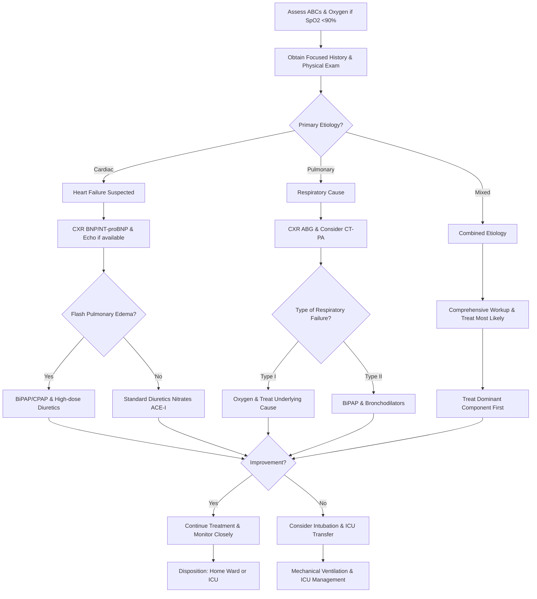

# Shortness of Breath/Hypoxia – RRT Protocol with Virtua Voorhees Addenda

**Guideline Used:**  
British Thoracic Society/Scottish Intercollegiate Guidelines Network (BTS/SIGN) 2019 British Guideline on the Management of Asthma, Global Initiative for Chronic Obstructive Lung Disease (GOLD) 2023 Report, American Thoracic Society/European Respiratory Society (ATS/ERS) 2017 Clinical Practice Guidelines for Acute Respiratory Failure  
**Official Sources:**  
https://www.brit-thoracic.org.uk/quality-improvement/guidelines/asthma/  
https://goldcopd.org/2023-gold-report-2/  
https://www.atsjournals.org/doi/10.1164/rccm.201610-2058ST

## CARD INTERFACE LAYOUT

### Card 0 – Dynamic Action Card (Node Dependent)

```
┌─────────────────────────────────────────────────────────────┐
│ RESPIRATORY DISTRESS RRT                                    │
├─────────────────────────────────────────────────────────────┤
│ ⏱️ TIME OF ONSET: 2 hours ago                              │
│ Progression: Acute over 2 hours                            │
│                                                           │
│ ┌─────────────────────────────────┐                        │
│ │     IMMEDIATE ACTIONS           │                        │
│ │ ☑ High-flow O2 initiated        │ [15L NRB mask]         │
│ │ ☑ Continuous SpO2 monitoring    │ [Connected]            │
│ │ ☑ ABG ordered STAT             │ [Drawn, pending]       │
│ │ ☑ Portable CXR ordered         │ [Completed]            │
│ │ ☐ BiPAP at bedside             │ [Setup in progress]    │
│ │ ☐ Intubation kit available     │ [RSI Protocol ready]   │
│ │ ☐ RT notified for assessment   │ [Called]               │
│ │                                │                        │
│ │ Work of Breathing: Severe       │                        │
│ │ Accessory muscles: Yes          │                        │
│ └─────────────────────────────────┘                        │
│                                                           │
│ VITALS: RR 32, SpO2 86%→89%, HR 118, BP 148/92, T 37.8°C  │
│                                                           │
│ QUICK ASSESSMENT:                                          │
│ ☐ Speaking full sentences  ☑ Tripod positioning           │
│ ☐ Central cyanosis  ☑ Accessory muscle use                │
│                                                           │
│ 🚨 CRITICAL SIGNS: RR >30, SpO2 <90% on high flow         │
└─────────────────────────────────────────────────────────────┘
```

### Card 1 – Static Assessment/Differential

```
┌─────────────────────────────────────────────────────────────┐
│ CAUSES OF SHORTNESS OF BREATH                               │
├─────────────────────────────────────────────────────────────┤
│ 🫁 RESPIRATORY CAUSES:                                      │
│ • Obstructive: Severe asthma, COPD exacerbation, pneumothorax│
│ • Restrictive: Pulmonary edema, ARDS, pleural effusion     │
│ • Vascular: Pulmonary embolism, pulmonary hypertension     │
│                                                           │
│ 💓 CARDIAC CAUSES:                                          │
│ • Pump failure: Acute heart failure, cardiogenic shock, MI │
│ • Rhythm: A-fib with RVR, other tachyarrhythmias          │
│                                                           │
│ 🩸 OTHER CAUSES:                                            │
│ • Hematologic: Severe anemia, CO poisoning                 │
│ • Metabolic: DKA, metabolic acidosis, sepsis              │
│ • Neurologic: Guillain-Barré, myasthenia gravis           │
│ • Psychological: Anxiety, hyperventilation syndrome        │
│                                                           │
│ RED FLAGS:                                                 │
│ • Sudden onset + chest pain (PE, pneumothorax)            │
│ • Orthopnea + leg swelling (heart failure)                │
│ • Fever + productive cough (pneumonia)                     │
│ • Recent travel/surgery (PE risk)                          │
│                                                           │
│ CRITICAL HISTORY: Onset (sudden vs gradual), triggers,     │
│ associated symptoms, previous episodes, current medications │
└─────────────────────────────────────────────────────────────┘
```

### Card 2 – Static Physical Exam/Medications

```
┌─────────────────────────────────────────────────────────────┐
│ PHYSICAL EXAM & MEDICATIONS                                 │
├─────────────────────────────────────────────────────────────┤
│ FOCUSED EXAM:                                              │
│ • Vitals: RR >20, SpO2 <95%, assess accessory muscle use   │
│ • General: Position, cyanosis, mental status               │
│ • Pulmonary: Wheeze (obstruction), rales (edema), absent   │
│ • Cardiac: S3/S4, murmurs, JVD assessment                 │
│ • Extremities: Edema, cyanosis, unilateral swelling       │
│                                                           │
│ 💊 OXYGEN THERAPY:                                          │
│ Target SpO2: 88-92% (COPD), >92% (non-COPD)               │
│ NC 1-6L → Simple mask 5-10L → NRB 15L → BiPAP             │
│                                                           │
│ 💊 BRONCHODILATORS:                                         │
│ • Albuterol 2.5-5mg neb q20min x3 or continuous           │
│ • Ipratropium 0.5mg neb q6h with albuterol                │
│ • Magnesium 2g IV over 20min (severe asthma)              │
│                                                           │
│ 💊 CORTICOSTEROIDS:                                         │
│ • Prednisone 40-80mg daily x5 days (asthma/COPD)          │
│ • Methylprednisolone 125mg IV q6h (severe cases)          │
│                                                           │
│ 💊 HEART FAILURE:                                           │
│ • Furosemide 40mg IV (or double home dose)                │
│ • Nitroglycerin 0.4mg SL q5min or IV 10-20mcg/min         │
│                                                           │
│ BiPAP SETTINGS: IPAP 14-25, EPAP 4-8 (COPD)               │
│ Higher EPAP 8-15 for heart failure                        │
│                                                           │
│ LINK TO RSI PROTOCOL: If BiPAP fails or contraindicated    │
└─────────────────────────────────────────────────────────────┘
```

## FLOWCHART (Bottom Panel – Mermaid Algorithm)



## NODE-TO-DYNAMIC CARD PROMPT MAPPING (WITH INTERACTIVES)

| **Step (Node)**                    | **Dynamic Card Prompt/Question**                                                                 | **Interactive Components**                                        |
|-------------------------------------|--------------------------------------------------------------------------------------------------|-------------------------------------------------------------------|
| Initial ABC Assessment              | "Patient in respiratory distress. Assess ABCs and initiate oxygen if SpO2 <90%?"               | [ABC Checklist], [O2 Delivery], [SpO2 Monitor], [Vital Signs]     |
| History and Physical Exam           | "Complete focused history and physical examination to identify primary etiology?"               | [History Checklist], [Physical Exam], [Symptom Timeline]           |
| Primary Etiology Determination      | "Based on clinical presentation, what is the most likely primary etiology?"                    | [Cardiac vs Pulmonary], [Mixed Etiology], [Differential Tool]      |
| Heart Failure Evaluation            | "Heart failure suspected. Order CXR, BNP/NT-proBNP, and echo if available?"                   | [Imaging Orders], [Lab Orders], [BNP Interpretation]               |
| Respiratory Cause Workup            | "Respiratory etiology suspected. Order CXR, ABG, and consider CT-PA for PE?"                  | [CXR Review], [ABG Orders], [PE Risk Assessment], [CT-PA Decision] |
| Combined Etiology Assessment        | "Mixed cardiac and pulmonary presentation. Begin comprehensive workup?"                        | [Comprehensive Orders], [Priority Assessment], [Treat Dominant]    |
| Flash Pulmonary Edema Decision      | "Acute cardiogenic pulmonary edema present. Initiate BiPAP/CPAP and high-dose diuretics?"     | [BiPAP Setup], [Diuretic Dosing], [Preload Reduction]             |
| Standard Heart Failure Treatment    | "Standard heart failure management. Begin diuretics, nitrates, and ACE inhibitor?"            | [Furosemide Dosing], [Nitrate Options], [ACE-I Selection]         |
| Respiratory Failure Type Assessment | "Determine type of respiratory failure based on ABG and clinical presentation?"                | [ABG Interpreter], [Type I vs II], [Treatment Selection]          |
| Type I Respiratory Failure          | "Type I (hypoxemic) respiratory failure. Optimize oxygenation and treat cause?"               | [O2 Escalation], [Underlying Cause], [PEEP Consideration]         |
| Type II Respiratory Failure         | "Type II (hypercapnic) respiratory failure. Initiate BiPAP and bronchodilators?"             | [BiPAP Settings], [Bronchodilator Protocol], [Ventilation Support]|
| Treatment Response Assessment       | "Evaluate patient response to initial interventions. Improvement noted?"                       | [Response Checklist], [Vital Trends], [ABG Follow-up]             |
| Continued Treatment                 | "Patient improving with current therapy. Continue treatment and close monitoring?"             | [Treatment Continuation], [Monitoring Schedule], [Reassessment]    |
| Escalation to Intubation           | "Inadequate response to non-invasive therapy. Consider intubation and ICU transfer?"          | [RSI Protocol Link], [Intubation Criteria], [ICU Coordination]    |
| Disposition Planning                | "Patient stable for disposition. Determine appropriate level of care?"                         | [Discharge Criteria], [Ward Admission], [ICU Transfer]            |

**Interactive Highlights:**  
- ABG interpreter: real-time acid-base analysis with oxygenation assessment
- BiPAP optimizer: settings adjustment based on patient response and comfort
- Oxygen escalation guide: stepwise approach with expected SpO2 improvements
- Respiratory failure type calculator: automated classification with treatment recommendations
- Integration with RSI protocol: seamless transition for failed non-invasive ventilation

## INTERACTIVE ELEMENTS

### ABG Interpreter
```
┌─────────────────────────────────────────┐
│         ABG INTERPRETATION              │
├─────────────────────────────────────────┤
│ pH: [7.28]     (7.35-7.45)             │
│ PaCO2: [58]    (35-45 mmHg)            │
│ PaO2: [65]     (80-100 mmHg)           │
│ HCO3: [26]     (22-28 mEq/L)           │
│ SaO2: [89]%    (>95%)                  │
│                                         │
│ PRIMARY DISORDER:                       │
│ 🔴 Respiratory Acidosis                 │
│                                         │
│ COMPENSATION:                           │
│ Partial metabolic compensation          │
│                                         │
│ OXYGENATION:                           │
│ Hypoxemia - moderate                    │
│                                         │
│ A-a Gradient: 32 (elevated)            │
│ P/F Ratio: 130 (moderate ARDS)         │
│                                         │
│ INTERPRETATION: Type II Respiratory     │
│ Failure with moderate hypoxemia         │
│                                         │
│ [CALCULATE] [TREND] [TREATMENT GUIDE]   │
└─────────────────────────────────────────┘
```

### BiPAP Optimization Tool
```
┌─────────────────────────────────────────┐
│      BiPAP SETTINGS OPTIMIZER           │
├─────────────────────────────────────────┤
│ Current Settings:                       │
│ IPAP: 15 cmH2O [▲▼]                    │
│ EPAP: 8 cmH2O  [▲▼]                    │
│ Pressure Support: 7 cmH2O               │
│ FiO2: 50%      [▲▼]                    │
│ Backup Rate: 14/min                     │
│                                         │
│ Patient Response (30 min):              │
│ • RR: 32 → 24 ✓ Improving               │
│ • SpO2: 86% → 91% ✓ Better              │
│ • pH: 7.28 → 7.32 ↑ Trending up        │
│ • PaCO2: 58 → 52 ↓ Improving            │
│                                         │
│ RECOMMENDATIONS:                        │
│ ↑ Consider IPAP 17 for better PS        │
│ ✓ EPAP adequate for oxygenation        │
│ ↓ Wean FiO2 to 40% if SpO2 stable      │
│                                         │
│ Comfort Score: 7/10 (Good tolerance)    │
│                                         │
│ [APPLY CHANGES] [REASSESS] [WEAN TRIAL] │
└─────────────────────────────────────────┘
```

### Oxygen Escalation Guide
```
┌─────────────────────────────────────────┐
│    OXYGEN DELIVERY ESCALATION           │
├─────────────────────────────────────────┤
│ Current: 15L NRB → SpO2 89%             │
│ Target: SpO2 >92% (or 88-92% if COPD)   │
│                                         │
│ ESCALATION PATHWAY:                     │
│                                         │
│ 1. ✓ Non-Rebreather 15L (Current)       │
│    FiO2: ~85-90%                        │
│                                         │
│ 2. High-Flow Nasal Cannula              │
│    Flow: 40-60L, FiO2: 60-80%          │
│    Expected SpO2: 92-95%                │
│    [SETUP HFNC]                         │
│                                         │
│ 3. BiPAP/CPAP (Current plan)            │
│    PEEP effect + ventilatory support    │
│    Expected SpO2: >92%                  │
│    [BiPAP READY]                        │
│                                         │
│ 4. ⚠️ Mechanical Ventilation             │
│    If BiPAP fails or contraindicated    │
│    [LINK TO RSI PROTOCOL]               │
│                                         │
│ Time to next escalation: 30 minutes     │
│ [CALCULATE FiO2] [SET TIMER]            │
└─────────────────────────────────────────┘
```

## VIRTUA VOORHEES RESPIRATORY DISTRESS ADDENDA

- **Respiratory Therapy Integration:** 24/7 RT coverage with BiPAP/CPAP expertise and high-flow nasal cannula capabilities
- **RSI Protocol Integration:** Seamless transition to rapid sequence intubation protocol when non-invasive ventilation fails
- **ICU Coordination:** Direct communication with critical care team for mechanical ventilation and advanced respiratory support
- **Quality Metrics:** Time to BiPAP initiation, non-invasive ventilation success rates, intubation avoidance rates

## REFERENCE (GUIDELINE & SOURCE)
British Thoracic Society/Scottish Intercollegiate Guidelines Network. 2019 British Guideline on the Management of Asthma.  
https://www.brit-thoracic.org.uk/quality-improvement/guidelines/asthma/

**Additional References:**  
Global Initiative for Chronic Obstructive Lung Disease (GOLD) 2023 Report  
https://goldcopd.org/2023-gold-report-2/

American Thoracic Society/European Respiratory Society Clinical Practice Guidelines for Acute Respiratory Failure 2017  
https://www.atsjournals.org/doi/10.1164/rccm.201610-2058ST

**All steps follow current evidence-based guidelines for acute respiratory failure management with integrated non-invasive ventilation protocols and optimized for early recognition of patients requiring escalation to mechanical ventilation via RSI protocol.**
