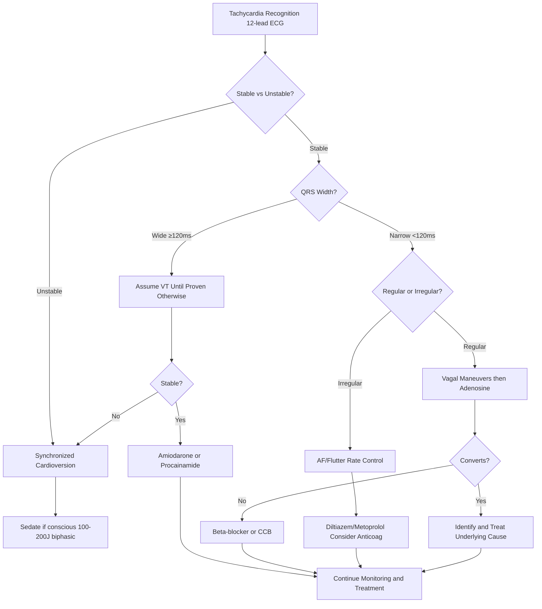

# Tachycardia – RRT Protocol with Virtua Voorhees Addenda

**Guideline Used:**  
American Heart Association/American College of Cardiology (AHA/ACC) 2020 Advanced Cardiovascular Life Support (ACLS) Guidelines, 2019 AHA/ACC/HRS Guideline for the Management of Patients with Atrial Fibrillation  
**Official Sources:**  
https://www.ahajournals.org/doi/10.1161/CIR.0000000000000916  
https://www.ahajournals.org/doi/10.1161/CIR.0000000000000665

## CARD INTERFACE LAYOUT

### Card 0 – Dynamic Action Card (Node Dependent)

```
┌─────────────────────────────────────────────────────────────┐
│ TACHYCARDIA RRT ACTIVATED                                   │
├─────────────────────────────────────────────────────────────┤
│ ⏱️ TIME OF ONSET: 30 minutes ago                           │
│ Duration: Continuous | Character: Palpitations with SOB    │
│                                                           │
│ ┌─────────────────────────────────┐                        │
│ │     IMMEDIATE ACTIONS           │                        │
│ │ ☑ 12-lead ECG obtained          │ [Completed 15:32]      │
│ │ ☑ Continuous telemetry          │ [Monitoring active]    │
│ │ ☑ IV access x2                 │ [18G bilateral]        │
│ │ ☑ Defibrillator at bedside     │ [Ready, pads on]       │
│ │ ☐ Adenosine ready (if SVT)     │ [6mg drawn up]         │
│ │ ☐ Diltiazem drawn up           │ [Rate control]         │
│ │ ☐ Synchronized cardioversion   │ [Setup if unstable]    │
│ │                                │                        │
│ │ Rhythm: Atrial Fibrillation RVR │                        │
│ │ QRS: Narrow (<120ms)            │                        │
│ └─────────────────────────────────┘                        │
│                                                           │
│ VITALS: HR 148 irregular, BP 108/72, RR 24, SpO2 94% 2L   │
│                                                           │
│ STABILITY ASSESSMENT:                                      │
│ ☐ Chest pain/pressure  ☐ Altered mental status            │
│ ☐ Signs of shock       ☑ Mild dyspnea                     │
│                                                           │
│ PATIENT STABLE → Proceed with rate control                 │
└─────────────────────────────────────────────────────────────┘
```

### Card 1 – Static Assessment/Differential

```
┌─────────────────────────────────────────────────────────────┐
│ TACHYCARDIA DIFFERENTIAL & CAUSES                           │
├─────────────────────────────────────────────────────────────┤
│ 🔴 NARROW COMPLEX (<120ms):                                │
│ • Regular: Sinus tachycardia, SVT (AVNRT/AVRT), A-flutter  │
│ • Irregular: Atrial fibrillation, A-flutter variable block │
│                                                           │
│ 🔴 WIDE COMPLEX (≥120ms):                                  │
│ • Regular: VT (until proven otherwise), SVT with aberrancy │
│ • Irregular: A-fib with aberrancy, polymorphic VT         │
│                                                           │
│ UNDERLYING CAUSES:                                         │
│ • Cardiac: Acute MI, heart failure, valvular disease       │
│ • Metabolic: Hyperthyroidism, electrolyte abnormalities    │
│ • Drugs/Toxins: Sympathomimetics, anticholinergics        │
│ • Other: PE, hypoxia, anemia, pain/anxiety, fever/sepsis   │
│                                                           │
│ STABILITY CRITERIA (UNSTABLE if ANY present):              │
│ • Hypotension (SBP <90 mmHg)                              │
│ • Acutely altered mental status                            │
│ • Signs of shock (poor perfusion, cool extremities)        │
│ • Ischemic chest discomfort                                │
│ • Acute heart failure                                      │
│                                                           │
│ CRITICAL DECISION POINTS:                                  │
│ Wide vs narrow QRS, regular vs irregular rhythm,          │
│ stable vs unstable hemodynamics, underlying cause          │
└─────────────────────────────────────────────────────────────┘
```

### Card 2 – Static Physical Exam/Medications

```
┌─────────────────────────────────────────────────────────────┐
│ PHYSICAL EXAM & MEDICATIONS                                 │
├─────────────────────────────────────────────────────────────┤
│ HEMODYNAMIC ASSESSMENT:                                    │
│ • BP: Check for hypotension, pulse pressure               │
│ • Perfusion: Mental status, skin temp, capillary refill   │
│ • Volume: JVD, lung sounds, peripheral edema              │
│ • Cardiac: Regular vs irregular, S3/S4, murmurs           │
│                                                           │
│ 💊 NARROW COMPLEX REGULAR (SVT):                           │
│ • Vagal maneuvers: Valsalva, carotid massage, ice water   │
│ • Adenosine: 6mg rapid IV push, then 12mg if no response  │
│ • Beta-blockers: Metoprolol 2.5-5mg IV q5min (max 15mg)   │
│ • CCB: Diltiazem 0.25mg/kg IV, then 0.35mg/kg if needed   │
│                                                           │
│ 💊 ATRIAL FIBRILLATION RATE CONTROL:                       │
│ • Diltiazem preferred if normal EF: Above dosing, then     │
│   5-15mg/hr infusion                                       │
│ • Metoprolol if CAD: Above dosing, caution in acute HF    │
│ • Amiodarone if low EF: 150mg IV over 10min, then infusion│
│                                                           │
│ 💊 WIDE COMPLEX STABLE VT:                                 │
│ • Amiodarone: 150mg IV over 10min, may repeat x1          │
│ • Procainamide: 20-50mg/min IV (max 17mg/kg)              │
│                                                           │
│ 💊 UNSTABLE TACHYCARDIA:                                   │
│ • Synchronized cardioversion: 100-200J biphasic           │
│ • Sedation if conscious: Midazolam 2-5mg IV               │
│                                                           │
│ MEDICATION ALERTS: No adenosine in WPW+AF, no AV blockers  │
│ in wide QRS, check electrolytes, consider dig toxicity     │
└─────────────────────────────────────────────────────────────┘
```

## FLOWCHART (Bottom Panel – Mermaid Algorithm)



## NODE-TO-DYNAMIC CARD PROMPT MAPPING (WITH INTERACTIVES)

| **Step (Node)**                    | **Dynamic Card Prompt/Question**                                                                 | **Interactive Components**                                        |
|-------------------------------------|--------------------------------------------------------------------------------------------------|-------------------------------------------------------------------|
| Tachycardia Recognition             | "Tachycardia identified on monitor/ECG. Obtain 12-lead ECG and assess stability?"              | [ECG Acquisition], [HR Monitor], [Rhythm Analysis]                |
| Stability Assessment                | "Evaluate for signs of hemodynamic instability requiring immediate cardioversion?"              | [Stability Checklist], [BP Monitor], [Mental Status Check]        |
| Synchronized Cardioversion          | "Patient unstable with tachycardia. Prepare for immediate synchronized cardioversion?"          | [Cardioversion Setup], [Sedation Protocol], [Energy Selection]    |
| QRS Width Determination             | "Patient stable. Analyze QRS width: narrow (<120ms) or wide (≥120ms)?"                         | [QRS Measurement], [Rhythm Classification], [Lead Analysis]        |
| Regular vs Irregular Assessment     | "Narrow complex tachycardia identified. Is the rhythm regular or irregular?"                   | [Rhythm Regularity], [R-R Interval], [Pattern Recognition]        |
| Wide Complex Evaluation             | "Wide complex tachycardia present. Assume VT until proven otherwise. Assess stability?"        | [VT Criteria], [Stability Reassessment], [Antiarrhythmic Prep]    |
| Vagal Maneuvers and Adenosine       | "Regular narrow complex tachycardia. Attempt vagal maneuvers, then adenosine?"                 | [Vagal Techniques], [Adenosine Administration], [Response Monitor] |
| Atrial Fibrillation Management      | "Irregular narrow complex confirmed as A-fib. Initiate rate control strategy?"                 | [Rate Control Options], [Anticoagulation Risk], [Drug Selection]  |
| SVT Conversion Assessment           | "Adenosine administered for SVT. Did the rhythm convert to sinus?"                             | [Rhythm Conversion], [Post-Conversion Care], [Underlying Cause]    |
| Alternative Rate Control            | "SVT did not convert with adenosine. Consider beta-blocker or calcium channel blocker?"        | [Metoprolol Protocol], [Diltiazem Protocol], [Contraindications]  |
| Stable VT Treatment                 | "Stable wide complex VT confirmed. Administer antiarrhythmic medication?"                      | [Amiodarone Protocol], [Procainamide Option], [Response Monitor]  |
| A-fib Rate Control Implementation   | "A-fib rate control initiated. Monitor response and consider anticoagulation?"                 | [Diltiazem Infusion], [Rate Monitoring], [CHA2DS2-VASc Score]     |
| Underlying Cause Investigation      | "Rhythm converted successfully. Investigate and treat underlying precipitating factors?"        | [Cause Checklist], [Lab Orders], [Further Testing]               |
| Continued Monitoring                | "Tachycardia controlled with appropriate therapy. Continue monitoring and supportive care?"     | [Telemetry Monitoring], [Medication Titration], [Disposition]     |

**Interactive Highlights:**  
- Rate control calculator: weight-based dosing with real-time HR trending
- Rhythm identification tool: step-by-step analysis with differential diagnosis
- Cardioversion energy selector: rhythm-specific energy recommendations
- CHA2DS2-VASc calculator: stroke risk assessment for A-fib anticoagulation
- Adenosine administration tracker: timing and response monitoring

## INTERACTIVE ELEMENTS

### Rate Control Calculator
```
┌─────────────────────────────────────────┐
│      RATE CONTROL CALCULATOR            │
├─────────────────────────────────────────┤
│ Current HR: 148 bpm                     │
│ Target HR: <110 bpm (rest)              │
│ Patient Weight: [80] kg                 │
│                                         │
│ DILTIAZEM PROTOCOL:                     │
│ Initial Bolus: 20mg (0.25mg/kg)        │
│ Time: 15:30 | Response: HR→132 (↓16)    │
│                                         │
│ Second Bolus: 28mg (0.35mg/kg)         │
│ Available at: 15:45 if HR >110          │
│                                         │
│ Continuous Infusion:                    │
│ Start: 10 mg/hr [▲▼ Adjust]            │
│ Range: 5-15 mg/hr                       │
│                                         │
│ RESPONSE TRACKING:                      │
│ 15:30: 148 bpm (baseline)               │
│ 15:45: 132 bpm (after bolus)           │
│ 16:00: 118 bpm (on infusion)           │
│ 16:15: 108 bpm ✓ Target achieved        │
│                                         │
│ [CALCULATE DOSE] [TREND HR] [TITRATE]   │
└─────────────────────────────────────────┘
```

### Rhythm Identification Tool
```
┌─────────────────────────────────────────┐
│      RHYTHM IDENTIFICATION AID          │
├─────────────────────────────────────────┤
│ Step-by-step Analysis:                  │
│                                         │
│ 1. RATE: [148] bpm ● Tachycardia       │
│                                         │
│ 2. QRS WIDTH:                           │
│    ● Narrow (<120ms)                    │
│    ○ Wide (≥120ms)                     │
│                                         │
│ 3. RHYTHM REGULARITY:                   │
│    ○ Regular                            │
│    ● Irregularly irregular              │
│                                         │
│ 4. P WAVES:                             │
│    ○ Present and consistent             │
│    ● Absent/not clearly visible        │
│    ○ Flutter waves                      │
│                                         │
│ 5. AV RELATIONSHIP:                     │
│    ○ 1:1 conduction                     │
│    ● Variable/no relationship           │
│                                         │
│ DIAGNOSIS: Atrial Fibrillation with RVR │
│                                         │
│ Confidence: 95% | [VIEW ECG STRIPS]     │
│                                         │
│ [CONFIRM DIAGNOSIS] [TREATMENT GUIDE]    │
└─────────────────────────────────────────┘
```

### Cardioversion Energy Guide
```
┌─────────────────────────────────────────┐
│    SYNCHRONIZED CARDIOVERSION GUIDE     │
├─────────────────────────────────────────┤
│ Rhythm: Atrial Fibrillation             │
│ Patient Weight: 80 kg                   │
│                                         │
│ ENERGY RECOMMENDATIONS:                 │
│                                         │
│ A-fib/A-flutter:                        │
│ • Initial: 120-200J biphasic            │
│ • If unsuccessful: 200J                 │
│ • Max: 200J biphasic                    │
│                                         │
│ SVT (if refractory to meds):            │
│ • Initial: 50-100J biphasic             │
│ • Escalate: 100-200J                    │
│                                         │
│ VT (stable, conscious):                 │
│ • Initial: 100J biphasic                │
│ • Escalate: 150J, then 200J             │
│                                         │
│ PRE-CARDIOVERSION CHECKLIST:           │
│ ☐ Synchronized mode ON                  │
│ ☐ Sedation administered                 │
│ ☐ Airway equipment ready                │
│ ☐ Team briefed                          │
│                                         │
│ Recommended: 150J biphasic               │
│                                         │
│ [PREPARE CARDIOVERSION] [SEDATE]         │
└─────────────────────────────────────────┘
```

## VIRTUA VOORHEES TACHYCARDIA MANAGEMENT ADDENDA

- **Cardiology Consultation:** 24/7 access via Transfer Center 856-886-5111 for complex arrhythmias and refractory cases
- **Electrophysiology Services:** Advanced EP studies and ablation procedures available with subspecialty referral
- **Anticoagulation Management:** Pharmacy-driven protocols for stroke prevention in atrial fibrillation patients
- **Quality Metrics:** Time to rate control, cardioversion success rates, appropriate anticoagulation initiation

## REFERENCE (GUIDELINE & SOURCE)
American Heart Association/American College of Cardiology. 2020 ACLS Guidelines.  
https://www.ahajournals.org/doi/10.1161/CIR.0000000000000916

**Additional References:**  
2019 AHA/ACC/HRS Guideline for the Management of Patients with Atrial Fibrillation  
https://www.ahajournals.org/doi/10.1161/CIR.0000000000000665

2017 AHA/ACC/HRS Guideline for the Management of Patients with Ventricular Arrhythmias  
https://www.ahajournals.org/doi/10.1161/CIR.0000000000000549

**All steps follow current AHA/ACC ACLS guidelines for tachycardia management with integrated rhythm analysis tools and optimized for rapid identification of unstable patients requiring immediate electrical cardioversion.**
