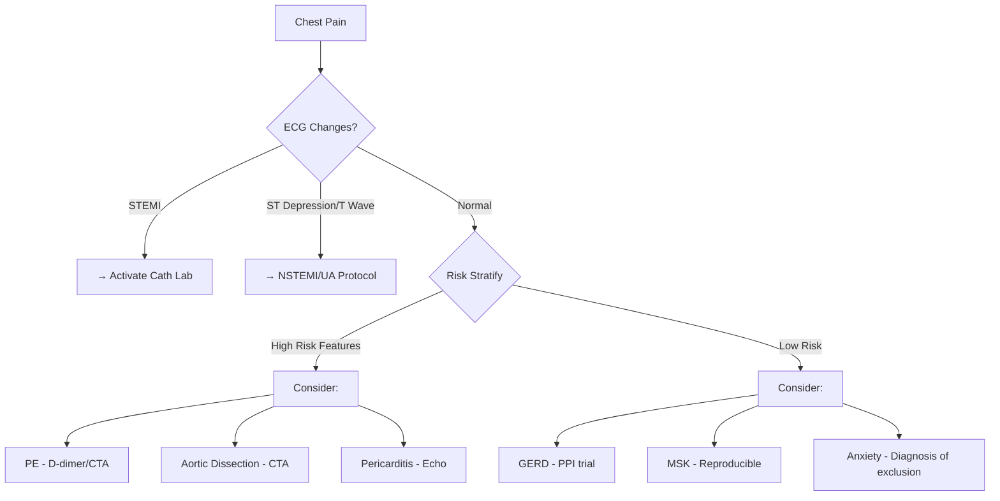

# Rapid Response Central: Networked Clinical Decision Support System
## Evidence-Based Medicine Protocols with Integrated Navigation

### Version 2.0 - Updated with 2024 Guidelines

---

## 🏥 Quick Navigation Hub

### 🚨 Symptom-Based Rapid Response
- [Chest Pain](#chest-pain-pathway) → [ACS](#acute-coronary-syndrome), [PE](#pulmonary-embolism), [Aortic Dissection](#aortic-dissection), [GERD](#gerd)
- [Shortness of Breath](#dyspnea-pathway) → [CHF](#congestive-heart-failure), [COPD](#copd-exacerbation), [Pneumonia](#pneumonia), [PE](#pulmonary-embolism)
- [Altered Mental Status](#altered-mental-status) → [Sepsis](#sepsis), [Stroke](#stroke-tia), [Hypoglycemia](#hypoglycemia), [Metabolic](#metabolic-emergencies)
- [Hypotension/Shock](#shock-pathway) → [Septic](#septic-shock), [Cardiogenic](#cardiogenic-shock), [Hypovolemic](#hypovolemic-shock), [Anaphylactic](#anaphylaxis)
- [Tachycardia](#tachycardia-pathway) → [AFib RVR](#atrial-fibrillation), [SVT](#svt), [VT](#ventricular-tachycardia), [Sinus Tach](#sinus-tachycardia)
- [Fever](#fever-pathway) → [Sepsis](#sepsis), [Pneumonia](#pneumonia), [UTI](#uti), [Meningitis](#meningitis)

### 🧪 Lab Value Triggers
- [Critical K+ >6.5](#hyperkalemia) → [Cardiac monitoring](#cardiac-emergencies), [Renal](#aki)
- [Hgb <7](#severe-anemia) → [Transfusion protocol](#transfusion), [GI Bleed](#gi-bleeding)
- [Lactate >4](#elevated-lactate) → [Sepsis](#sepsis), [Shock](#shock-pathway)
- [Troponin elevation](#elevated-troponin) → [ACS](#acute-coronary-syndrome), [PE](#pulmonary-embolism), [Myocarditis](#myocarditis)
- [pH <7.2](#severe-acidosis) → [DKA](#dka), [Sepsis](#sepsis), [Renal failure](#aki)

### 🏃 Rapid Response Team Activation Criteria
- [Single Parameter Triggers](#single-parameter-triggers)
- [Combination Triggers](#combination-triggers)
- [Clinical Concern](#clinical-concern-activation)

---

## 🚨 Symptom-Based Pathways

### Chest Pain Pathway

**Initial Assessment - OPQRST:**
- **O**nset: Sudden vs gradual
- **P**rovocation/Palliation: Exertional, positional, pleuritic
- **Q**uality: Crushing, sharp, tearing, burning
- **R**adiation: Jaw, arm, back, epigastrium
- **S**everity: 1-10 scale
- **T**ime: Duration and pattern

**Immediate Actions:**
1. **Vital signs** + continuous cardiac monitoring
2. **12-lead ECG within 10 minutes**
3. **IV access** x2 large bore if hemodynamically unstable
4. **Labs:** Troponin, CBC, BMP, PT/INR, BNP, D-dimer (if PE suspected)
5. **CXR** portable

**Differential Diagnosis Network:**



**High-Risk Features (any = urgent eval):**
- Age >65 with new symptoms
- Known CAD/previous MI
- Diabetes
- Hemodynamic instability
- New ECG changes
- Elevated troponin
- New wall motion abnormality

**Links to Specific Protocols:**
- [→ STEMI Protocol](#stemi-protocol)
- [→ NSTEMI/UA Protocol](#nstemi-ua-protocol)
- [→ Pulmonary Embolism](#pulmonary-embolism)
- [→ Aortic Dissection](#aortic-dissection)
- [→ Pericarditis](#pericarditis)

---

### Dyspnea Pathway

**Immediate Assessment:**
1. **ABCs** - Airway, Breathing, Circulation
2. **O2 saturation** - Apply O2 if <94% (or <88% if COPD)
3. **Respiratory rate** and work of breathing
4. **Auscultation** - Bilateral breath sounds

**Quick Differential Tool:**

| Finding | Consider | Next Steps |
|---------|----------|------------|
| Unilateral ↓ breath sounds | [Pneumothorax](#pneumothorax), [Pleural effusion](#pleural-effusion) | CXR → [Thoracentesis](#thoracentesis)/[Chest tube](#chest-tube) |
| Bilateral crackles | [CHF](#congestive-heart-failure), [Pneumonia](#pneumonia) | BNP, CXR, Echo |
| Bilateral wheezes | [COPD](#copd-exacerbation), [Asthma](#asthma) | ABG, nebulizers |
| Clear lungs + hypoxia | [PE](#pulmonary-embolism), [PCP](#pcp-pneumonia) | D-dimer/CTA, ABG |

**Severity Assessment:**
- **Mild:** RR 20-24, speaking full sentences, O2 sat >92% on RA
- **Moderate:** RR 25-30, speaking phrases, O2 sat 88-92%
- **Severe:** RR >30, speaking words only, O2 sat <88%, accessory muscle use
- **Life-threatening:** Exhaustion, altered mental status, silent chest

**Links to Management:**
- [→ Non-invasive ventilation (BiPAP/CPAP)](#niv-protocol)
- [→ Intubation criteria](#intubation-checklist)
- [→ Specific disease protocols](#disease-specific-protocols)

---

### Altered Mental Status

**AEIOU-TIPS Mnemonic:**
- **A**lcohol/Drugs → [Intoxication protocols](#intoxication)
- **E**ncephalopathy (hepatic, uremic) → [Check ammonia, BUN](#metabolic-encephalopathy)
- **I**nfection → [Sepsis workup](#sepsis)
- **O**xygen/CO2 → [ABG](#abg-interpretation)
- **U**remia → [Renal panel](#aki)
- **T**rauma → [Head CT](#head-trauma)
- **I**nsulin (hypo/hyperglycemia) → [Glucose protocol](#glycemic-emergencies)
- **P**sychosis → [Psychiatric emergency](#psychiatric-emergencies)
- **S**eizure/Stroke → [Neuro exam](#neurological-assessment)

**Rapid Neuro Assessment:**
1. **GCS score** (document baseline)
2. **Pupils** (size, reactivity, symmetry)
3. **Focal deficits** (facial droop, arm drift, speech)
4. **Glucose** - immediate bedside check

**Decision Tree:**
```
Altered Mental Status
├── Glucose <70 → Hypoglycemia protocol
├── Focal deficits → Stroke protocol
├── Fever + AMS → Sepsis/Meningitis workup
├── Recent fall → Head CT
└── Metabolic → Comprehensive panel + ammonia
```

---

## 🏥 Disease-Specific Protocols

### Acute Coronary Syndrome

#### STEMI Protocol
**2024 ESC/AHA Guidelines Update**

**Door-to-Device Time Goals:**
- Primary PCI: **<90 minutes** (ideal <60 min)
- Transfer for PCI: **<120 minutes**
- Fibrinolysis (if PCI unavailable): **<30 minutes**

**Immediate Management:**
1. **MONA-BA** (updated sequence):
   - **M**orphine - Only if severe pain after nitroglycerin
   - **O**xygen - Only if SpO2 <90% or respiratory distress
   - **N**itroglycerin - SL 0.4mg q5min x3 (avoid if inferior MI + RV involvement)
   - **A**spirin - 324mg chewed
   - **B**eta-blocker - Metoprolol 25mg PO (if no contraindications)
   - **A**nticoagulation - Heparin bolus + infusion

2. **Second antiplatelet:**
   - Ticagrelor 180mg PO (preferred) OR
   - Prasugrel 60mg PO (if going to cath) OR
   - Clopidogrel 600mg PO (if fibrinolysis planned)

**Links:**
- [→ Cardiogenic shock management](#cardiogenic-shock)
- [→ Post-PCI care](#post-pci-protocol)
- [→ Mechanical complications](#mechanical-complications)

#### NSTEMI/UA Protocol

**Risk Stratification - TIMI Score:**
- Age ≥65
- ≥3 CAD risk factors
- Known CAD (stenosis ≥50%)
- ASA use in past 7 days
- Severe angina (≥2 episodes in 24h)
- ST changes ≥0.5mm
- Elevated cardiac markers

**Score ≥3 = High risk → Early invasive strategy**

**Medical Management:**
1. **Dual antiplatelet therapy**
2. **Anticoagulation** (UFH, LMWH, or fondaparinux)
3. **Beta-blocker** + **ACE-I** within 24h
4. **High-intensity statin**
5. **Consider GLP-1 agonist** (2024 update for diabetics)

---

### Pulmonary Embolism

**Updated 2023 ESC Guidelines**

**Risk Stratification:**
1. **High Risk (Massive)** - Hemodynamic instability
   - [→ Thrombolysis protocol](#thrombolysis-pe)
   - [→ ECMO consideration](#ecmo-protocol)
   
2. **Intermediate-High Risk** - RV dysfunction + elevated troponin
   - [→ Consider reduced-dose thrombolysis](#reduced-dose-tpa)
   
3. **Intermediate-Low Risk** - RV dysfunction OR elevated troponin
   - [→ Anticoagulation protocol](#anticoagulation)

**PERT Team Activation Criteria:**
- Massive PE
- Submassive PE with deterioration
- Contraindication to anticoagulation
- Failed anticoagulation

**Diagnostic Pathway:**
```
Wells Score + D-dimer
├── Low risk + D-dimer negative → PE excluded
├── High risk OR D-dimer positive → CTA chest
└── Contraindication to contrast → V/Q scan
```

---

### Sepsis and Septic Shock

**Updated Surviving Sepsis Campaign 2024**

**Recognition - qSOFA ≥2:**
- Altered mental status (GCS <15)
- Respiratory rate ≥22
- Systolic BP ≤100

**1-Hour Bundle:**
1. **Measure lactate** (repeat if >2)
2. **Blood cultures** before antibiotics
3. **Broad-spectrum antibiotics**
4. **30 mL/kg crystalloid** for hypotension/lactate ≥4
5. **Vasopressors** if hypotensive during/after fluids (MAP ≥65)

**Antibiotic Selection:**
- [→ Hospital antibiogram](#antibiogram)
- [→ Source-specific recommendations](#infection-sources)

**Fluid Resuscitation:**
- **Balanced crystalloids preferred** (LR or PlasmaLyte)
- **Avoid starches**
- **Dynamic assessment** (passive leg raise, IVC ultrasound)

**Vasopressor Choice:**
1. **Norepinephrine** (first-line)
2. **Vasopressin** (add if norepi >0.25 mcg/kg/min)
3. **Epinephrine** (add for refractory shock)
4. **Consider hydrocortisone** if on multiple pressors

---

### Stroke/TIA

**2023 AHA/ASA Guidelines**

**Hyperacute Management:**

**Time Windows:**
- **0-4.5 hours:** IV tPA eligible
- **4.5-24 hours:** Thrombectomy if large vessel occlusion + salvageable tissue
- **>24 hours:** Selected patients with favorable imaging

**tPA Checklist:**
[→ Inclusion criteria](#tpa-inclusion)
[→ Exclusion criteria](#tpa-exclusion)
[→ Dosing calculator](#tpa-dosing)

**Blood Pressure Management:**
- **Pre-tPA:** <185/110
- **Post-tPA:** <180/105
- **No tPA given:** <220/120 unless end-organ damage

**Links to Related Protocols:**
- [→ Hemorrhagic transformation](#hemorrhagic-transformation)
- [→ Posterior circulation stroke](#posterior-stroke)
- [→ Stroke mimics](#stroke-mimics)

---

## 🧪 Lab Value-Triggered Protocols

### Hyperkalemia

**K+ >5.5 mEq/L**

**ECG Changes Progression:**
1. Peaked T waves (K+ 5.5-6.5)
2. PR prolongation, flattened P waves (K+ 6.5-7.5)
3. QRS widening (K+ 7.5-8.5)
4. Sine wave → VF/asystole (K+ >8.5)

**Treatment (in order):**
1. **Cardiac protection:**
   - Calcium gluconate 10% 10mL IV over 2-3 min (repeat q5min if needed)
   - Calcium chloride 10% 5-10mL if central access

2. **Shift K+ intracellularly:**
   - Regular insulin 10 units IV + D50 25g
   - Albuterol 10-20mg nebulized
   - Sodium bicarbonate 50 mEq IV (if acidotic)

3. **Remove K+ from body:**
   - Furosemide 40-80mg IV (if not anuric)
   - Sodium polystyrene sulfonate 15-30g PO/PR
   - Patiromer or sodium zirconium (non-urgent)
   - [→ Dialysis indications](#dialysis-criteria)

**Links:**
- [→ Causes of hyperkalemia](#hyperkalemia-causes)
- [→ Pseudohyperkalemia](#pseudohyperkalemia)
- [→ BRASH syndrome](#brash-syndrome)

---

### Severe Anemia

**Transfusion Thresholds (2023 AABB Guidelines):**
- **Hgb <7 g/dL:** Most patients
- **Hgb <8 g/dL:** ACS or symptomatic
- **Hgb <9 g/dL:** Active bleeding

**Massive Transfusion Protocol:**
[→ 1:1:1 ratio protocol](#mtp)
[→ TEG/ROTEM guided](#viscoelastic-testing)

**Investigation of Anemia:**
```
CBC with indices
├── MCV <80 → Iron studies, check for GI bleed
├── MCV 80-100 → Reticulocyte count
│   ├── High → Hemolysis/bleeding workup
│   └── Low → Bone marrow suppression
└── MCV >100 → B12, folate, TSH, consider MDS
```

---

### Elevated Lactate

**Interpretation:**
- **Type A (tissue hypoxia):**
  - Shock states
  - Severe anemia
  - CO poisoning
  - Regional ischemia

- **Type B (non-hypoxic):**
  - Medications (metformin, propofol)
  - Malignancy
  - Liver disease
  - Thiamine deficiency

**Management Algorithm:**
```
Lactate >4
├── Signs of shock → Sepsis bundle
├── No shock → Evaluate for:
│   ├── Mesenteric ischemia
│   ├── Medication effect
│   └── Occult hypoperfusion
└── Serial lactate q2-4h
```

---

## 🏃 Rapid Response Team Protocols

### Single Parameter Triggers

**Immediate RRT Activation:**
- HR <40 or >140
- RR <8 or >30
- SBP <90 or >200
- O2 sat <90% on supplemental O2
- Acute change in mental status
- New onset stridor

### Combination Triggers

**2+ Parameters = RRT:**
- HR 40-50 or 130-140
- RR 8-10 or 25-30
- SBP 90-100
- O2 sat 90-93% on O2
- Urine output <50mL/4h

### Clinical Concern Activation

**"Worried" Criteria:**
- Nurse/family concern
- Failure to respond to treatment
- Significant change from baseline
- "Doesn't look right"

---

## 🔗 Integrated Navigation System

### Symptom Clusters

**Chest Pain + Dyspnea:**
- [→ PE](#pulmonary-embolism) (pleuritic, sudden)
- [→ ACS](#acute-coronary-syndrome) (crushing, exertional)
- [→ Pneumonia](#pneumonia) (fever, productive cough)
- [→ Pneumothorax](#pneumothorax) (sudden, tall thin patient)

**Hypotension + Tachycardia:**
- [→ Septic shock](#septic-shock) (fever, source)
- [→ Hypovolemic shock](#hypovolemic-shock) (bleeding, dehydration)
- [→ PE](#pulmonary-embolism) (sudden onset, risk factors)
- [→ Tamponade](#cardiac-tamponade) (muffled sounds, JVD)

**Fever + AMS:**
- [→ Meningitis](#meningitis) (headache, neck stiffness)
- [→ Encephalitis](#encephalitis) (seizures, focal findings)
- [→ Sepsis](#sepsis) (hypotension, elevated lactate)
- [→ Heat stroke](#heat-stroke) (exposure, dry skin)

### Lab Value Combinations

**↑ Troponin + ↑ BNP:**
- [→ ACS](#acute-coronary-syndrome)
- [→ PE](#pulmonary-embolism)
- [→ Myocarditis](#myocarditis)
- [→ Stress cardiomyopathy](#takotsubo)

**↑ WBC + ↑ Lactate:**
- [→ Sepsis](#sepsis)
- [→ Mesenteric ischemia](#mesenteric-ischemia)
- [→ Perforated viscus](#perforation)

---

## 📊 Severity Scoring Systems

### NEWS2 (National Early Warning Score)
[→ Calculator](#news2-calculator)
[→ Response algorithm](#news2-response)

### qSOFA
[→ Sepsis screening](#qsofa-sepsis)

### APACHE IV
[→ ICU mortality prediction](#apache-iv)

### SOFA Score
[→ Organ failure assessment](#sofa-score)

---

## 💊 Medication Quick Reference

### Emergency Drugs

**Cardiac Arrest:**
- Epinephrine: 1mg IV/IO q3-5min
- Amiodarone: 300mg → 150mg
- Lidocaine: 1-1.5mg/kg → 0.5-0.75mg/kg

**Arrhythmias:**
- Adenosine: 6mg → 12mg → 12mg rapid push
- Diltiazem: 0.25mg/kg → 0.35mg/kg
- Metoprolol: 5mg IV q5min x3

**Anaphylaxis:**
- Epinephrine: 0.3-0.5mg IM (1:1000)
- Methylprednisolone: 125mg IV
- Diphenhydramine: 50mg IV

### Antidotes
[→ Complete antidote list](#antidote-reference)

---

## 🚁 Escalation Pathways

### When to Call ICU

**Immediate Transfer:**
- Intubation required/imminent
- Multiple vasopressors
- Refractory shock
- Multi-organ failure

**Urgent Consultation:**
- Single vasopressor requirement
- NIV >4 hours
- Deteriorating despite treatment
- Considering comfort care

### Code Status Clarification
[→ Goals of care discussion](#goals-of-care)
[→ Palliative care triggers](#palliative-triggers)

---

## 📱 Quick Actions

### Order Sets
- [Sepsis Bundle](#sepsis-orders)
- [ACS Orders](#acs-orders)
- [Stroke Orders](#stroke-orders)
- [DKA Orders](#dka-orders)

### Calculators
- [MELD Score](#meld)
- [CHADS-VASc](#chadsvasc)
- [Wells Criteria](#wells)
- [HEART Score](#heart)

---

## 🔄 Follow-Up Protocols

### Post-Stabilization
- [ICU admission criteria](#icu-criteria)
- [Step-down requirements](#step-down)
- [Discharge planning](#discharge-planning)

### Quality Metrics
- Door-to-needle times
- Sepsis bundle compliance
- Mortality reviews

---

*This protocol is continuously updated with the latest evidence-based guidelines. Last update: 2024. All protocols should be adapted to local institutional policies and individual patient factors. When in doubt, consult with attending physician or specialist services.*

**Emergency Contacts:**
- Code Blue: 2222
- RRT: [Hospital specific]
- Pharmacy: [Hospital specific]
- Lab Critical Values: [Hospital specific]

---

[Back to Top](#rapid-response-central-networked-clinical-decision-support-system)